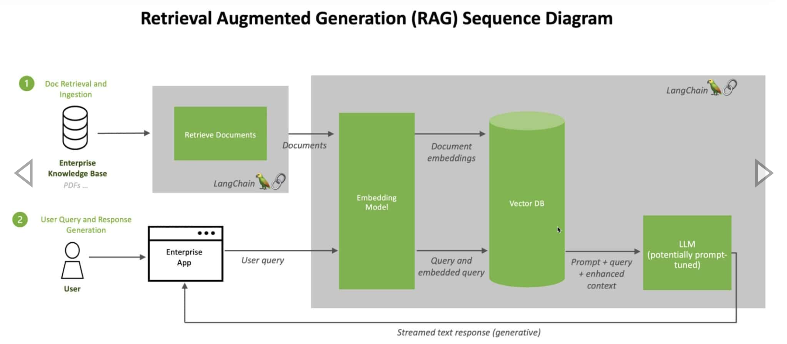

## The need for RAG

Generative AI excels at creating text responses based on LLMs where the AI is trained on a massive number of data points. The good news is that LLMs can respond to a wide variety of human queries, and the generated text is often easy to read and provides detailed responses that are broadly applicable to the questions asked of the software, often called prompts.

The bad news is that the information used to generate the response is limited to the information used to train the AI, often a generalized LLM. The **LLM’s data may be weeks, months, or years out of date** and in a corporate AI chatbot may not include specific information about the organization’s products or services. That can **lead to incorrect responses** that erode confidence in the technology among customers and employees. Moreover, retraining an LLM takes significant computing horsepower and hence, it isn't feasible to keep the model current.

## Retrieval Augmented Generation (RAG)

RAG provides a way to optimize the output of an LLM with targeted information without modifying the underlying model itself; that targeted information can be more up-to-date than the LLM as well as specific to a particular organization and industry. It is a technique for enhancing the accuracy and reliability of generative AI models with facts fetched from external sources.

### Key takeaways

- RAG is a relatively new artificial intelligence technique that can improve the quality of generative AI by allowing large language model (LLMs) to tap additional data resources without retraining
- RAG models build knowledge repositories based on the organization’s own data, and the repositories can be continually updated to help the generative AI provide timely, contextual answers
- Chatbots and other conversational systems that use natural language processing can benefit greatly from RAG and generative AI
- Implementing RAG requires technologies such as vector databases, which allow for the rapid coding of new data, and searches against that data to feed into the LLM

## How does RAG work?

In RAG, it takes the vast quantity of dynamic data an organization has (structured databases, unstructured PDFs, documents, blogs, news feeds, chat transcripts), translates them into a common format, and stores in a knowledge library that’s accessible to the generative AI system.

The data in that knowledge library is then processed into numerical representations using a special type of algorithm called an **embedded language model** and stored in a **vector database**, which can be quickly searched and used to retrieve the correct contextual information.

## RAGs and LLMs

When a user sends a prompt to the generative AI system:

- Query is transformed into a vector and used to query the vector database
- Information relevant to that question's context is retrieved
- That contextual information plus the original prompt are then fed into the LLM
- LLM generates a text response based on both outdated generalized knowledge and timely contextual information

While the process of training the generalized LLM is time-consuming and costly, updates to the RAG model are just the opposite. New data can be loaded into the embedded language model and translated into vectors on a continuous, incremental basis. In fact, the answers from the entire generative AI system can be fed back into the RAG model, improving its performance and accuracy, because, in effect, it knows how it has already answered a similar question.

An additional benefit of RAG is that by using the vector database, the generative AI can **provide the specific source of data cited in its answer**—something LLMs can’t do. Therefore, if there’s an inaccuracy in the generative AI’s output, the document that contains that erroneous information can be quickly identified and corrected, and then the corrected information can be fed into the vector database.

## Applications

### Chatbot

Questions often require specific context to deliver an accurate answer, and given that chatbot users’ expectations about relevance and accuracy are often high, it’s clear how RAG techniques apply. For many organizations, chatbots may indeed be the starting point for RAG and generative AI use.
