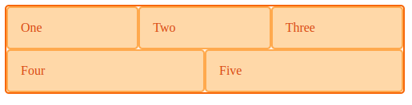

## Flexbox

Method used for space distribution between items in an interface with powerful alignment capabilities. Flexbox treats each row or column as a separate entity based on its content and the available space.

```
display: flex;
flex-direction: column;
align-items: flex-start;      Default is flex-stretch
justify-content: center;      flex-start, flex-end, space-around, space-between, space-evenly
flex-wrap: nowrap;

flex: 1 1 auto;               Grow, shrink, basis
flex-basis: auto;             Sets initial main size of flex item, else content size
flex-grow: 1;                 Cause items to stretch and take up any available space
flex-shrink: -1;              If postiive, can become smaller than flex-basis if insufficient space
```

### Wrap

When you wrap flex items, each new row/column is an independent flex line in the flex container. Space distribution happens across the flex line. If have uneven number of items, remaining items will not be aligned with the above items.

```html
<div class="wrapper">
  <div>One</div>
  <div>Two</div>
  <div>Three</div>
  <div>Four</div>
  <div>Five</div>
</div>
```

```css
.wrapper {
  width: 500px;
  display: flex;
  flex-wrap: wrap;
}
.wrapper > div {
  flex: 1 1 150px;
}
```

### Box Alignment

```css
.wrapper {
  display: flex;
  align-items: flex-end;
  min-height: 200px;
}
.box1 {
  align-self: stretch; /*Overrides default and stretch to the height of the container*/
}
.box2 {
  align-self: flex-start;
}
```



### Horizontal/Vertical Alignment

```css
.horizontal {
  display: flex;
  justify-content: center;
  align-items: center;
  align-left: auto;
  align-right: auto;
  text-align: center;
}

.vertical {
  line-height: 10px;
  align-top: auto;
  align-bottom: auto;
}

.right {
  float: right;
}
```
