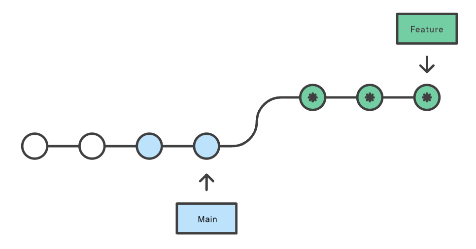

## Pushing files to new repository

```sh
$ git init <project directory>                #cd /d C:\users\daronphang

$ git branch -m master main
$ git add <--all or example.txt>
$ git status                                  #to see changes committed
$ git commit -a -m "description of changes"
$ git remote add origin <paste GIT URL>
$ git push -u origin master
```

## Reverting commit

```sh
$ git revert <commit id>
$ git add .
$ git commit -m "your changes"
```

## Resetting commit

```sh
$ git reset
$ git reset --hard HEAD # revert back to current head
$ git reset --soft HEAD
```

## Logging

```
$ git log
$ git log src/myassistant/app/api/v1/endpoint.py   # View all changes made to file
```

## Editing existing files

```sh
$ git branch                                  # check if branch is master
$ git checkout -b <new branch name>
$ git add <--all or example.txt>
$ git status                                  # to see changes committed
$ git commit -m "description of changes"
$ git push -u origin <new branch name>

$ git remote -v                               # to verify remote repository URL
$ git remote set-url origin <new repo URL>
```

## git pull

Pull command is used to fetch and download content from remote repository and immediately update local repository to match that content i.e. combination of git.fetch and git.merge. If you don't want to integrate/merge changes directly, use git fetch instead as it will download the new changes only but leaves HEAD branch and working copy files untouched.

To pull other branches from remote repo, use git fetch followed by git pull origin <new_branch_name>.

```sh
$ git pull <remote URL>
$ git pull --no-commit <remote>
$ git pull origin master --allow-unrelated-histories    # When encountered "refusing to merge unrelated histories"

$ git fetch --all # Fetch all branches in remote repo
$ git fetch <remote> <branch>

$ git pull origin <new_branch_name>
$ git pull <repo> <remotebranchname>:<localbranchname>
```

## Integrating changes from one branch to another

Integrating changes can be done via git merge or git rebase. Both commands are designed to integrate changes from one branch into another branch; however, they both do it in different ways:

- Tree structure of the history is different
- Merge creates an extra dummy commit
- Conflicts are handled differently. Rebase presents conflicts one commit at a time, while merge presents them all at once

### git merge

Merging is a **non-destructive operation** i.e. the existing branches are not changed in any way. Merge will create an extra dummy commit; this can pollute branch's history.


```sh
$ git checkout some-feature-branch
$ git merge main
```

### git rebase

Rebasing is the process of combining a sequence of commits to a new base commit, to maintain a linear project history. It moves an entire branch (feature) to begin on the tip of another branch (main). Rebase rewrites the project history by creating brand new commits for each commit in the original branch i.e. re-committing all commits of the current branch onto a different base commit. Hence, the major benefit is that you get a much cleaner project history.

Rebasing is a **destructive operation**. Hence, it is considerably difficult to revert/undo once performed. As a rule of thumb:

- **Do not rebase for public repositories**. This destroy the branch and developers will have broken/inconsistent repositories unless they use `git pull --rebase`
- Do not rebase after you have pushed your commits (or someone has pulled them). The feature branch commits after the rebase are not the same as the ones before merge



```sh
$ git fetch
$ git rebase master

$ git checkout feature
$ git rebase main
$ git rebase -i HEAD~3
```

### Example

```sh
# initial feature release
$ git add . && git commit -m "feat: initial commit"
$ echo "complete task 1" >> feature.txt
$ git add . && git commit -m "feat: complete task 1"
$ echo "complete task 2" >> feature.txt
$ git add . && git commit -m "feat: complete task 2"

# Your initial progress on feature2
$ git checkout -b feature2
$ touch feature2.txt
$ git add . && git commit -m "feat: start work on feature2"
$ echo "complete feature2 task 1" >> feature2.txt
$ git add . && git commit -m "feat: complete feature2 task 1"
$ echo "complete feature2 task 2" >> feature2.txt
$ git add . && git commit -m "feat: complete feature2 task 2"

# Your team member fixing a bug
$ git switch master
$ git checkout -b fix-feature
$ echo "fix feature bug 1" >> feature.txt
$ git add . && git commit -m "fix: fix feature bug 1"
$ echo "fix feature bug 2" >> feature.txt
$ git add . && git commit -m "fix: fix feature bug 2"
$ git switch master
$ git merge fix-feature
```

With rebase:

```sh
$ git switch feature2
$ git rebase master
```

```
97137da (HEAD -> feature2) feat: complete feature2 task 2
40295e1 feat: complete feature2 task 1
dbac4e0 feat: start work on feature2
9753f39 (master, fix-feature) fix: fix feature bug 2
124e609 fix: fix feature bug 1
ac77a58 feat: complete task 2
0a1f595 feat: complete task 1
```

With merge:

```sh
$ git switch feature2
$ git merge master
```

```
4029e57 Merge branch ‘master’ into feature2
9753f39 (master, fix-feature) fix: fix feature bug 2
124e609 fix: fix feature bug 1
40295e5 feat: complete feature2 task 2
40295e1 feat: complete feature2 task 1
dbac4e0 feat: start work on feature2
ac77a58 feat: complete task 2
0a1f595 feat: complete task 1
```

## Viewing/comparing changes

```sh
$ git branch -a # check all branches
$ git fetch # update remote repo

$ git diff <local branch> <remote>/<remote branch>
$ git diff main origin/main
$ git diff HEAD
```

```sh
$ git pull origin master
Updating 37b431a..b2615b4
$ git diff 37b431a..b2615b4

$ git reflog | grep -A1 pull | head -2
$ git diff 37b431a..b2615b4
```

## git commit amend

A convenient way to combine staged changes with the previous commit.

```sh
# make changes
$ git add .
$ git commit -m "some comment"
# make changes
$ git commit --amend
$ git push
```

## Squashing commits

Squashing commits means that you combine multiple existing commits into one. Squashing commits is the preferred way to merge a feature branch back into a main branch.

```sh
$ git add .
$ git commit -m "test1"
$ git add .
$ git commit -m "test2"

# interactive rebase
$ git rebase -i HEAD~3 # squash 3 commits

# alternative
$ git merge --squash feature-branch
```
