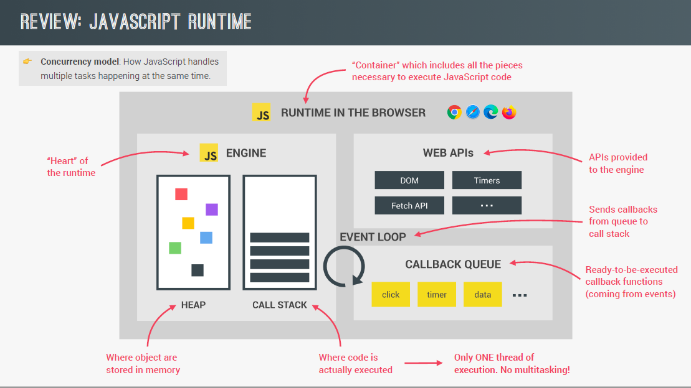

## JS Engine



## Call Stack

A mechanism for an interpreter used to keep track of multiple function calls; data can be pushed and popped and follows LIFO principle i.e. last-in-first-out. Callstack is used for memorizing which function is currently running.

Manages execution contexts including Global Execution Context and Function Execution Contexts. Primitives are stored in Global Execution Context (top level code that is not inside any function). Contains variable environment, scope chan and this keyword.

How callstack works:

-   When a script calls a function, the interpreter adds it to the callstack and starts carrying out the function.
-   Any callback functions inside the function are pushed to the callstack to the top.
-   When current function is finished, the interpreter takes it off the stack and resumes execution where it left off in the last code listing.
-   If the stack takes up more space than it had assigned to it, it results in "stack overflow" error.

## Memory Heap and Stack

Javascript engines store data in two places: memory heap and stack. All variables first point to the stack; if it is a non-primitive value, the stack contains a reference to the object in the heap. Memory of the heap is not ordered and hence, needs a reference.

### Stack (Static)

Data structure that JS uses to store static data i.e. size is known at compile time. Data includes primitive values and references (pointing to objects and functions). Engine will allocate a fixed amount of memory for each value (static memory allocation).

### Heap (Dynamic)

Much larger region for storing objects and functions. Separation is useful to make execution safer from corruption and faster. A place to store and write information as all programs are just read and write operations i.e. allocate, use and release memory.

## Garbage Collection and Memory Leaks

Javascript is a garbage-collected language i.e. if JS allocates memory for an object in a function, it will automatically clean it up once the object is not needed anymore.

Common memory leaks include global variables, event listeners and setInterval().

## Asynchronous Tasks

1. Tasks such as setting image source attribute and timers are non-blocking as they take place in web APIs environment and not in callstack.
2. Callback functions attached to the asynchronous events through addEventListener are only placed in callback queue once completed.
3. Callback functions in callback queue will wait for event loop to pick them up and put into callstack.
4. For promises, they have special callback queue known as microstasks queue which has priority over callback queue.

## Event Loop

The activity of event loop taking a callback function from callback queue and execute in the callstack is known as event loop tick. Coordinates between callstack and callback functions in callback queue.

```js
console.log('Test Start');
setTimeout(() => console.log('0 sec timer'), 0);
Promise.resolve('resolved promise 1').then(res => console.log(res));
Promise.resolve('resolved promise 2').then(res => {
  for (let i = 0; i < 1000000000; i++) {}
  console.log(res);
};
console.log('Test End');

// Test Start
// Test End
// resolved promise 1
// resolved promise 2
// 0 sec timer      Happens after microtasks queue is completed. Cannot do high precision tasks with Javascript timers.
```
