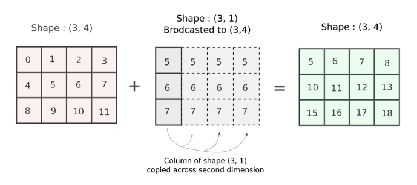

## Numpy

Fundamental package for scientific computing in Python that provides a multidimensional array object, various derived objects (masked arrays and matrices), and an assortment of routines for fast operations on arrays including mathematical, logical, shape manipulation, sorting, selecting, I/O, linear algebra, statistical operations, random simulation and more.

## Why is Numpy fast

### Contiguous memory allocation

Python's built-in sequence types (lists) is a collection of heterogeneous data types stored in non-contiguous memory locations whereas numpy arrays (ndarray object is the core of Numpy package) contains homogeneous data types stored contiguously.

### Less space required for storage

As pure OOP language, Python stores elements in lists as built-in data type (int, str) which consists of size, reference count, object type, and object value. On the other hand, numpy stores elements in arrays as binary.

### No type checking needed

Using a list requires Python compiler to perform type checking while reading it as the elements stored can be dynamic i.e. str, bool or int. Numpy requires all elements stored in an array to be homogeneous and hence, type checking can be skipped.

### C code compilation

Numpy is written in C (compiled language) and hence, code is translated to machine code and executed directly without needing an interpreter.

### Vectorization

Vectorization describes the absence of any explicit looping, indexing, etc. when implementing mathematical operations on arrays (add/subtract/multiply/divide). As all elements are numbers and the same operation is performed on all of them, the operation can be vectorized i.e. take advantage of this homogeneity of data and operation. Numpy package breaks down a task into multiple fragments and then processes all the fragments in parallel.

Numpy delegates most of these vectorized operations on such arrays to optimized, pre-compiled C code defined through function to reduce the running and execution time of code. Vectorization also means writing less code and hence, less prone to errors.

```py
import numpy as np
import timeit

# vectorization of the sum operator
print(np.sum(np.arange(15000)))

print("Time taken by vectorized sum : ", end = "")
%timeit np.sum(np.arange(15000))

# iterative sum
total = 0
for item in range(0, 15000):
    total += item
a = total
print("\n" + str(a))

print("Time taken by iterative sum : ", end = "")
%timeit a
```

### Broadcasting

Numpy provides us with a feature called Broadcasting, which defines how arithmetic operations are to be performed on arrays of unequal size. Broadcasting provides a means of vectorizing array operations so that looping occurs in C instead of Python.

Rule for broadcasting is that the ranks of the array (dimension) must be equal or either one of them is one. For scalars, can reshape into an array that meets the criteria. In reality, no new array is actually created for broadcasted array.



```py
arr_a = np.random.rand(3,4,6,2)     # random array of shape (3,4,6,2)
arr_b = np.random.rand(3,4,1,2)     # 3rd dimension has 1 and 6 but is compatible

arr_a + arr_b   # no errors

arr_a = np.random.rand(3,4,6,2)     # random array of shape (3,4,6,2)
arr_b = np.random.rand(3,5,1,2)     # 2nd dimension is not compatible

arr_a + arr_b   # op throws an error
```
