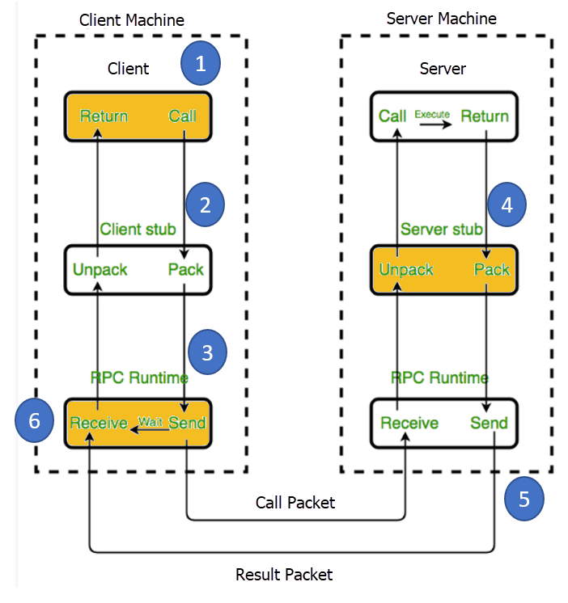

## RPC (Remote Procedure Call)

RPC is a powerful technique for constructing distributed, client-server based applications. RPC is an architectural style for distributed systems. It allows a program on one machine to call a procedure (subroutine/service) on another machine in a different address space than its own. The procedure may be on the same system or a different system connected on a network. Supports both XML-RPC and JSON-RPC.

Idea behind RPC is that a program can call and execute a subroutine just like it would call a local subroutine, but the network communication details are hidden from the user. RPC calls are defined through routines contained in the RPC protocol. It is not a transport protocol but a method of using existing communication features in a transparent way.

In RPC, each server supplies a program that is a set of remote service procedures. The combination of a host address, program number, and procedure number specifies one remote service procedure.

RPC is a request-response protocol i.e. follows client-server model:

1. Client makes a request to execute a procedure on the remote server
2. Client is suspended like a synchronous local call (blocking)
3. Procedure's parameters are passed over the network to the server-side
4. Server calls the requested dispatch routine
5. Results are transferred back to the client and client resumes execution

As the application software does not contain any communication code, it is independent of:

- Particular communications hardware and protocols used
- OS and programming language used
- Calling sequence needed to use the underlying communications software

## RPC procedure

1. Client invokes a client stub procedure with parameters that resides within the client's address space
2. Client stub marshalls (packs) the parameters into a message; marshalling includes converting the representation of the parameters into a standard format
3. Client stub passes the message to the transport layer, which sends it to the remote server
4. Server de-marshalls (unpacks) the parameters and calls the desired subroutine
5. When the procedure completes, it returns to the server stub which marshalls the return values into a message and hands it to the transport layer
6. Client stub receives and de-marshalls the return parameters and execution returns to the caller

## Terminologies

### RPC runtime

RPC run-time system is a library of subroutines and a set of services that handle the network communications in the underlying RPC mechanism. In an RPC call, both the client and server-side run-time systems' code handle binding, establishing communications over an appropriate protocol, passing call data between each other, and handling communication errors.

### Stub

For RPCs, the stub converts the methods, request types and response types into the forms used by the RPC system i.e. a piece of code that is used to convert the parameters during a RPC. It is essentially a usability feature to provide the appearance the remote method is present locally. Function of the stub is to provide transparency to the application code.

On the client slide, stub handles the interface between client's local procedure call and run-time system, marshalling and un-marshalling data, invoking the RPC run-time protocol, and carrying out binding steps.

On the server side, stub provides a similar interface between the run-time system and local manager procedures that are executed by the server.

### Binding

Dynamic binding is used to find the server at run-time when the RPC is first called. Binding consists of naming and locating.

## Benefits

### Straightforward and simple interaction

RPC uses GET to fetch information and POST for everything else. Mechanism of interaction between server and client boils down to calling an endpoint and getting a response.

### Easy-to-add functions

Can easily add another endpoint for executing a new requirement for your API.

### High performance

Lightweight payloads go easy on the network providing high performance.

## Drawbacks

### Tight coupling to the underlying system

RPC's tight coupling to the underlying system does not allow for an abstraction layer between the functions in the system and the external API. This raises security issues as it is quite easy to leak implementation details about the underlying system into the API. Works for internal microservices but not for strong external API.

### Low discoverability

There is no way to introspect the API or send a request and start understanding what function to call based on its requests.
