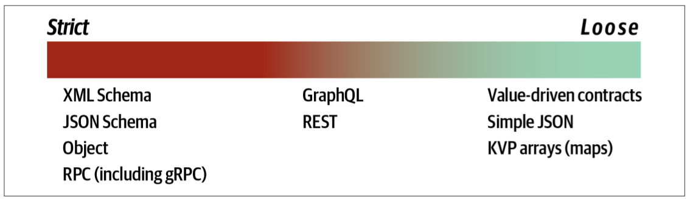

## Contracts

### Strict

A strict contract requires adherence to names, types, ordering, and all other details, leaving no ambiguity.

Many architects like strict contracts because they model the identical semantic behavior of internal method calls. However, strict contracts create brittleness in integration architecture. The more frequently they must change, the more rippling problems they cause for other services. However, architects aren’t forced to use strict contracts and should do so only when advantageous.

A common anti-pattern that some architects fall victim to is to assume that the contract provided by a service needs all other parts, and so architects include them in the contract from the outset. This is an example of **stamp coupling** and an anti-pattern in most cases, as it introduces breaking changes where they aren’t needed, making the architecture fragile yet providing little benefit.

<table>
<tr>
<th>Advantages</th>
<th>Disadvantages</th>
</tr>

<tr>
<td>Guaranteed contract fidelity</td>
<td>Tight coupling</td>
</tr>

<tr>
<td>Versioned</td>
<td>Versioned</td>
</tr>

<tr>
<td>Easier to verify at build time</td>
<td></td>
</tr>

<tr>
<td>Better documentation</td>
<td></td>
</tr>
</table>

### Loose

Loose contracts offer the least coupled integration points.

<table>
<tr>
<th>Advantages</th>
<th>Disadvantages</th>
</tr>

<tr>
<td>Highly decoupled</td>
<td>Contract management</td>
</tr>

<tr>
<td>Easier to evolve</td>
<td>Requires fitness functions</td>
</tr>
</table>
