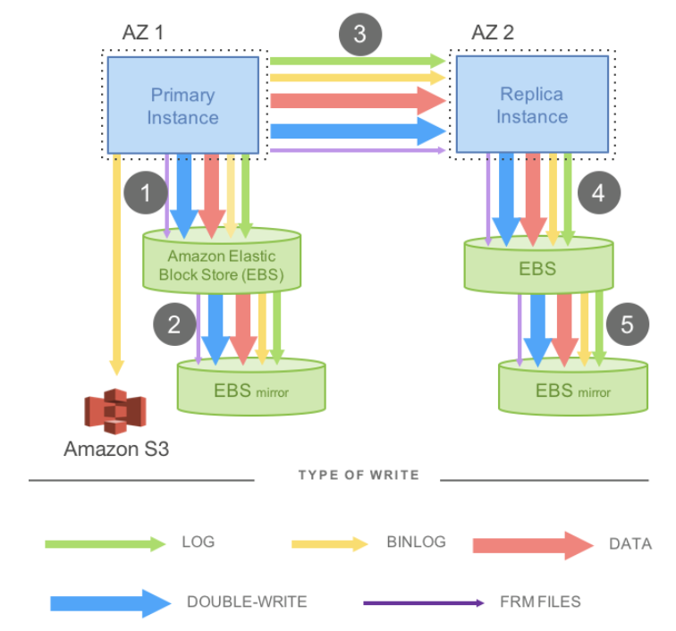
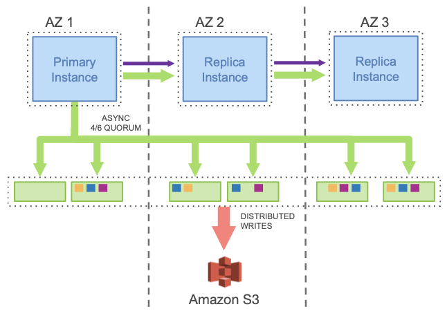
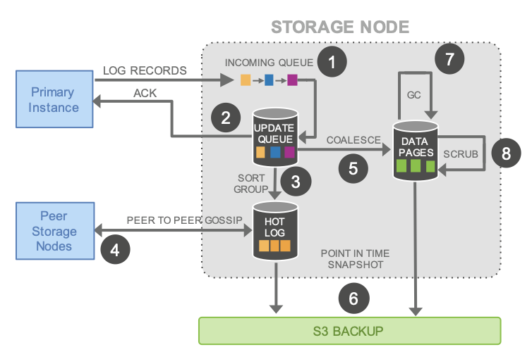
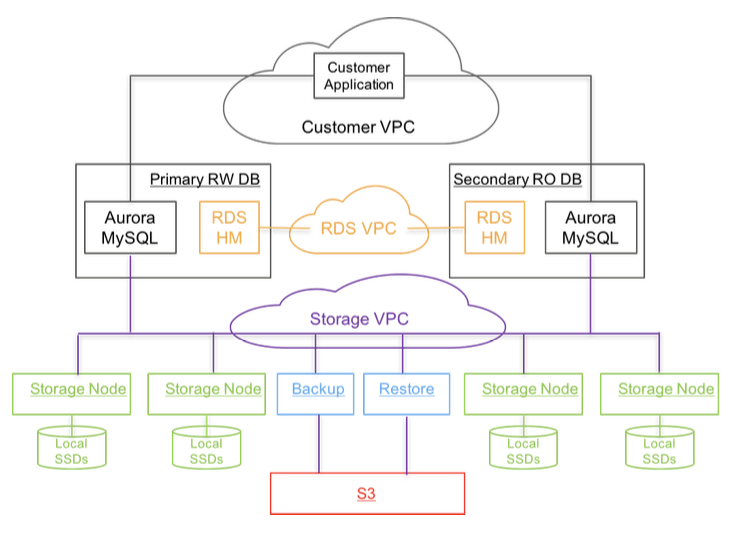
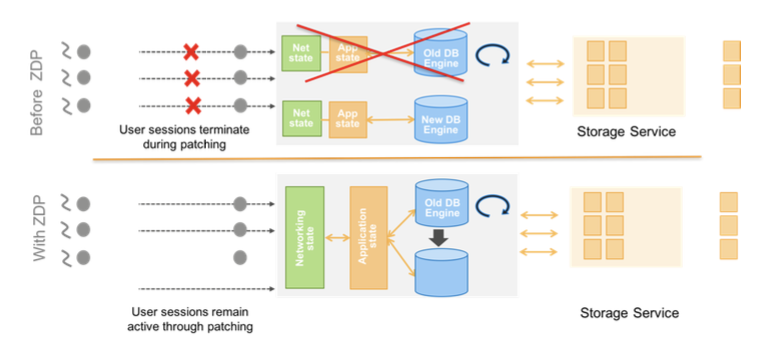

## Amazon Aurora

Amazon Aurora is a high throughput relational OLTP database that compromises neither availability nor durability in a cloud-scale environment. The big idea was to move away from the monolithic architecture of traditional databases and **decouple storage from compute**. As a result, the central constraint in high throughput data processing has moved from compute and storage to the **network**.

Aurora brings a novel architecture to the relational database to address this constraint, most notably by **pushing redo processing to a multi-tenant scale-out storage service**. This reduces network traffic, and also allows for fast crash recovery, failovers to replicas without loss of data, and fault-tolerant, self-healing storage. Consensus is also achieved using an **efficient asynchronous scheme**, avoiding expensive and chatty protocols.

### Synchronous operations

There are several situations that require synchronous operations; these result in **stalls and context switches**:

- A miss in buffer cache will result in a disk read
- Cache miss also incurs the extra penalty of evicting and flushing a dirty cache page to accommodate the new page
- Background processing such as checkpointing and dirty page writing can reduce the occurrence of this penalty, but can also cause stalls, context switches and resource contention
- Transaction commits

### Advantages over traditional databases

Amazon Aurora addresses the above issues by more aggressively leveraging the redo log across a highly-distributed cloud environment. We use a novel service-oriented architecture with a multi-tenant scale-out storage service that abstracts a virtualized segmented redo log and is loosely coupled to a fleet of database instances.

The architecture has three significant advantages over traditional approaches:

1. By building storage as an independent fault-tolerant and self-healing service across multiple data-centers, we protect the database from performance variance and transient or permanent failures at either the networking or storage tiers
2. By only writing redo log records to storage, we are able to reduce network IOPS by an order of magnitude
3. Moved complex and critical functions (backup and redo recovery) from one-time expensive operations in the database engine to continuous asynchronous operations amortized across a large distributed fleet; this yields **near-instant crash recovery without checkpointing**

## Durability at scale

### Replication and correlated failures

One approach to tolerate failures in a replicated system is to use a quorum-based voting protocol. A quorum of 3 is not sufficient as at any given time, failures may be spread independently across nodes in each of the AZ.

In Aurora, a design point was chosen to tolerate AZ+1 failures without losing data. This is achieved by replicating data 6 ways, across 3 AZs and 2 copies of each item in each AZ.

### Segmented storage

To ensure durability in this model, we need to keep the chance of two simultaneous failures (double faults) low compared to how long it takes to fix one failure (MTTR). If the chance of a double fault is too high, it could happen during an AZ failure, causing a loss of quorum.

Reducing the likelihood of failures (MTTF) becomes challenging after a certain point. Instead, our **focus should be on reducing the MTTR** to minimize the risk of a double fault occurring. This is performed by:

- Partitioning the database volume into small fixed size segments, currently 10GB in size
- These are replicated six ways into Protection Groups (PGs), so that each PG consists of six 10GB segments
- A storage volume is a concatenated set of PGs, which are implemented using EC2 with attached SSDs

A 10GB segment can be repaired in 10s on a 10Gbps network link; to see two failures in the same 10s window plus a failure of an AZ not containing either of these two independent failures is highly unlikely.

## Log is the database

### Burden of amplified writes in traditional databases

Using a traditional database on a segmented replicated storage system imposes an untenable performance burden in terms of network IOs and synchronous stalls. The high I/O volume is amplified by replication, imposing a heavy packets per second (PPS) burden. Also, the I/Os result in points of synchronization that stall pipelines and dilate latencies.

How writes work in a traditional database:

- Data pages are written to objects it exposes e.g. heap files, b-trees, etc.
- Redo log records are written to a WAL
- Each redo log record consists of the difference between the after-image and the before-image of the page that was modified
- A log record can be applied to the before-image of the page to produce its after-image
- Other data must also be written e.g. binlog, FRM files, etc.

Consider a configuration of active/pass with replication:

- The redo log, binary statement log for S3, second temporary write of data page to prevent torn pages, and metadata (FRM) files need to be written
- Steps 1, 3, and 5 are sequential and synchronous; **latency becomes additive**
- Jitter is amplified even on async writes, as one must wait for the slowest operation
- Model is viewed as a 4/4 write quorum, and is vulnerable to failures and outlier performance

### Offloading redo processing to storage

When a traditional database modifies a data page, it generates a redo log record and invokes a log applicator that applies the redo log record to the in-memory before-image of the page to produce its after-image. Transaction commit requires the log to be written, but the data page write may be deferred.

In Aurora, the only writes that cross the network are **redo log records**. No pages are ever written from the database tier, not for background writes, not for checkpointing, and not for cache eviction. Instead, the **log applicator is pushed to the storage tier** where it can be used to **generate database pages in background or on demand**. As far as the engine is concerned, the log is the database, and any pages that the storage system materializes are simply a cache of log applications.

Our approach dramatically reduces network load despite amplifying writes for replication and provides performance as well as durability. The storage service can scale out I/Os in an embarrassingly parallel fashion without impacting write throughput of the database engine.

Moving processing to a storage service also improves availability by **minimizing crash recovery time** and eliminates jitter caused by background processes such as checkpointing, background data page writing and backups:

- After a crash, traditional database must start from the most recent checkpoint and replay the log to ensure that all persisted redo records have been applied
- In Aurora, durable redo record application happens at the storage tier, continuously, asynchronously, and distributed across the fleet. Any read request for a data page may require some redo records to be applied if the page is not current

Consider the following example:

- Primary writes log records to the storage service and streams them and metadata updates to the replica instances
- IO flow batches fully ordered log records based on a common destination (e.g. PG) and delivers each batch to all 6 replicas
- Batch is persistent on disk, and database engine waits for acknowledgements from 4/6 replicas to satisfy the write quorum and consider the log records as durable
- The replicas use the redo log records to apply changes to their buffer caches

### Storage service design points

A core design tenet for our storage service is to minimize the latency of the foreground write request. We move the majority of storage processing to the background.

In Aurora, background processing has negative correlation with foreground processing. This is unlike a traditional database, where background writes of pages and checkpointing have positive correlation with the foreground load on the system.

How the storage node (EC2) works:

1. Receives log record and adds to an in-memory queue
2. Persists record on disk and acknowledge
3. Organize records and identify gaps in the log as some batches may be lost
4. Gossip with peers to fill in gaps
5. Coalesces log records into new data pages
6. Periodically stage log and new pages to S3 as backup snapshots
7. Periodically garbage collect old versions
8. Periodically validate CRC codes on pages

## Database engine

### Asynchronous processing and consensus

Since we model the database as a redo log stream, we can exploit the fact that the log advances as an **ordered sequence of changes**. In practice, each log record has an associated Log Sequence Number (LSN) that is a monotonically increasing value generated by the database.

This lets us simplify a consensus protocol for maintaining state by approaching the problem in an asynchronous fashion instead of using a protocol like 2PC:

- We continually advance these points as we receive acknowledgements for outstanding storage requests
- Storage nodes gossip with other members of their PG, looking for gaps and fill in the holes
- The runtime state maintained by the database lets us use single segment reads rather than quorum reads except on recovery when the state is lost and has to be rebuilt

The database may have multiple outstanding isolated transactions. In the event of a database crash during a transaction, before the database is allowed to access the storage volume, the storage service does its own recovery:

- The storage service determines the highest LSN for which it is durable, also known as VCL (Volume Complete LSN)
- Any log record with an LSN greater than the VCL must be truncated

Hence, asynchronous consensus is used to eliminate chatty and expensive multi-phase synchronization protocols, offline crash recovery, and checkpointing in distributed storage.

### Writes

The database continuously interacts with the storage service and maintains state to establish quorum, advance volume durability, and register transactions as committed:

- As the database receives acknowledge to establish the write quorum for each batch of log records, it advances the current VDL
- Database allocates a LSN for each log record subject to a constraint that no LSN is allocated with a value that is greater than the sum of current VDL and LSN allocation unit (set at 10 million). This ensures the database doesn't get too fear ahead of the storage system and introduces back-pressure that can throttle the incoming writes if the storage or network cannot keep up
- Each log record contains a backlink that identifies the previous log record for that PG. These backlinks can be used to track the point of completeness of the log records that have reached each segment to establish a Segment Complete LSN (SCL) that identifies the greatest LSN that is durable
- SCL is used by storage nodes during gossip to find and exchange log records they are missing

### Commits

In Aurora, transaction commits are completed asynchronously. When a client commits a transaction, the thread handling the commit request sets the transaction aside by recording its “commit LSN” as part of a separate list of transactions waiting on commit and moves on to perform other work. Worker threads do not pause for commits, they simply pull other pending requests and continue processing.

### Reads

In Aurora, as with most databases, pages are served from the buffer cache and only result in a storage IO request if the page in question is not present in the cache.

If the buffer cache is full, the system finds a victim page to evict from the cache:

- In a traditional system, if the victim is a “dirty page” then it is flushed to disk before replacement. This ensures that a subsequent fetch always results in the latest data
- In Aurora, a page in the buffer cache must always be of the latest version. A page is evicted only if its page LSN >= VDL

The database **does not need to establish consensus using a read quorum** under normal circumstances:

- When reading a page from disk, the database establishes a read-point, representing the VDL at the time the request was issued
- The database then selects a storage node that is complete with respect to the read-point

### Replicas

In Aurora, a single writer and up to 15 read replicas can all mount a single shared storage volume. As a result, read replicas add no additional costs in terms of consumed storage or disk write operations. To minimize lag, the log stream generated by the writer and sent to the storage nodes is also sent to all read replicas.

The replica obeys the following two important rules while applying log records:

1. Only log records that will be applied are those whose LSN <= VDL
2. The log records that are part of a single mini-transaction are applied atomically in the replica's cache to ensure that the replica sees a consistent view of all database objects

In practice, each replica typically lags behind the writer by a short interval (20 ms or less).

### Recovery

For traditional databases:

- A recovery protocol such as ARIES is used that depends on the presence of a WAL that can represent the precise contents of all committed transactions.
- Periodically checkpoint the database to establish points of durability in a coarse-grained fashion by flushing dirty pages to disk and writing a checkpoint record to the log
- On crash recovery the system processes the redo log records since the last checkpoint by using the log applicator to apply each log record to the relevant database page
- Redo log applicator that is used in the forward processing path and on recovery operates synchronously and in the foreground

Crash recovery can be an expensive operation. Reducing the checkpoint interval helps, but at the expense of interference with foreground transactions.

For Aurora, no tradeoff is required. The **redo log applicator is decoupled from the database and operates on storage nodes**, in parallel, and all the time in the background. Once the database starts up it performs volume recovery in collaboration with the storage service and as a result, an Aurora database can recover very quickly (generally under 10 seconds) even if it crashed while processing over 100,000 write statements per second.

The database does need to reestablish its runtime state after a crash. In this case, it contacts for each PG, a read quorum of segments which is sufficient to guarantee discovery of any data that could have reached a write quorum.

## Putting it all together

The database engine is a fork of “community” MySQL/InnoDB and diverges primarily in how InnoDB reads and writes data to disk.

In community InnoDB:

- A write operation results in data being modified in buffer pages, and the associated redo log records written to buffers of the WAL in LSN order
- On transaction commit, the WAL protocol requires only that the redo log records of the transaction are durably written to disk
- The actual modified buffer pages are also written to disk eventually through a double-write technique to avoid partial page writes

In the Aurora InnoDB variant:

- Redo log records representing the changes that must be executed atomically in each MTR (mini transaction) are organized into batches that are sharded by the PGs each log record belongs to, and these batches are written to the storage service
- The final log record of each MTR is tagged as a consistency point
- Aurora supports exactly the same isolation levels that are supported by community MySQL in the writer e.g. ANSI levels and Snapshot Isolation or consistent reads
- Aurora read replicas get continuous information on transaction starts and commits in the writer and use this information to support snapshot isolation for local transactions that are of course read-only

Aurora leverages Amazon RDS for its control plane. RDS includes an agent on the database instance called the Host Manager (HM) that monitors a cluster’s health and determines if it needs to fail over, or if an instance needs to be replaced. Each database instance is part of a cluster that consists of a single writer and zero or more read replicas.

### Zero-downtime patching (ZDP)

ZDP works by looking for an instant where there are no active transactions, and in that instant spooling the application state to local ephemeral storage (i.e. holding data in temporary storage), patching the engine and then reloading the application state.

