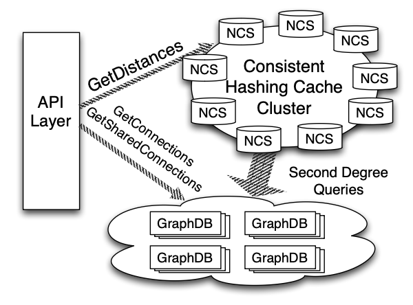
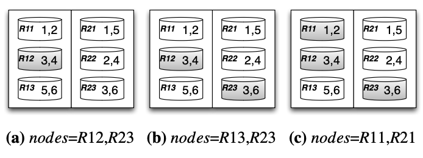

## Distributed graph at LinkedIn

Many online social networks require the ability to perform graph computations (fan-out) in the request/response loop. For LinkedIn, due to visibility and privacy business rules, members cannot see profiles more than three degrees away from them.

At LinkedIn, these graph-based metrics are computed online with our distributed graph service. This service allows application developers to perform common graph operations such as retrieving a member’s connections, computing shared connections between members, and calculating distances in the graph.

### BFS

The graph service is horizontally partitioned so that a member’s entire adjacency list is stored on one physical node. However, computing the graph distance in a naive fashion through **breadth-first traversal is intractable** as it would require time complexity of **O(n2)** distributed calls throughout the cluster; this effectively **touches every machine**.

### Two-tier architecture with caching

Instead, a **two-tier architecture** is deployed:

- Source's second degree is stored as compressed sorted arrays in the Network Cache Service (NCS) with nodes distributed using consistent hashing
- NCS communicates with key-value database of edges called GraphDB

Around 80% of the calls for distances at LinkedIn can be satisfied by NCS and thus generate no additional remote calls to GraphDB.

However, a challenge arises during a second degree cache miss. To construct a member’s second degree array:

- Scatter-gather merging occurs that deduplicates partial second degrees from each GraphDB node. As social networks are tightly interconnected, there is **significant overlap in this set merge**
- Merging performed at NCS creates a bottleneck on bandwidth and CPU resources; it is preferred to push down to the GraphDB nodes as much as possible

To maximize such merging, we want to find the optimal set of GraphDB nodes that can serve such second degree queries to reduce merging within NCS. This can be mitigated using a **greedy set cover algorithm**.



## Graph partitioning and replication

GraphDB stores members' first degree connections and its replicas. In GraphDB, members are represented as vertices, and connections as edges. It partitions this graph into a cluster of physical machines based on member IDs. A hash-based partitioning is used so that workloads are more likely to be evenly distributed.

Each partition is replicated on at least R different machines to provide failover and load balancing. Each physical machine holds P partitions.

To prevent hot spots, we randomize the set of partitions co-located physically. If two partitions are stored on the same machine in one replica, they will be stored on different machines in other replicas.

## Network Cache Service

The API layer diverts GetDistances calls to NCS. If NCS contains a valid cache for the requested source member, distances can be computed in NCS by performing array intersections. If the cache is not available, this request waits for the cache entry to be built online.

LRU is used as the caching strategy with a short TTL to provide a real-time view of the graph. These **arrays are compressed using delta compression** to further reduce memory usage.

One of the biggest challenges we face is to assemble the second degree connections quickly in real time on a cache miss. Some LinkedIn members have millions of second degree connections, yet we still need to serve GetDistances quickly. **A member’s second degree size grows exponentially compared to first degree connections**.

To compute a member’s second degree connections, we retrieve first degree connections from a single GraphDB node, then shard them into multiple GraphDB nodes to query their connections. Each GraphDB node receiving the second degree query will look up and merge its local result, removing duplicates prior to sending the results back. NCS waits until all responses return from the GraphDB nodes before merging the results into a final sorted array before compression.

Merges and deduplications are done on both in GraphDB and on NCS. In GraphDB, merging and deduplication is processed in parallel, whereas a single NCS machine merges all intermediate results into a complete sorted array that can be both CPU intensive and time consuming.

## Set cover in a distributed graph

The set cover problem is to find the minimum number of sets from L whose union contains all elements in K where:

- K = {1,2,...m}, a set of elements
- L = {S1,S2,S3...,Si}, whose union comprises K

The set cover problem is used to find the minimal set of GraphDB nodes that covers K to serve a member’s second degree query.

Set cover is known to be NP-hard, but a simple greedy heuristic algorithm offers a logarithmic ratio bound. This algorithm works by picking, at each iteration, the set Sk that covers the most remaining uncovered elements in K.

### Modified

We can take advantage of an additional property of our sets: **sets from the same GraphDB replica do not intersect with each other**. The idea is to avoid doing an intersection between K and all remaining nodes by restricting it, such that it only intersects with a much smaller subset of nodes that’s more likely to provide the best coverage.

Instead of finding the set with maximum coverage by intersecting K with each remaining set from L, we have intersections only across the replicas covering the randomly picked partition ID pk.

Assume the following:

- A distributed graph of six partitions
- Two partitions are stored on each node with two replicas
- L = {R11, R12, R13, R21, ..., R23}
- K = {1,2,3,4,6}, where each number represents the partition

An example is as follows:

1. A random partition is picked e.g. partition 3
2. Nodes = {R12, R23}; R12 is selected, C = {R12}
3. A random partition is picked e.g. partition 6
4. Nodes = {R13, R23}; R23 is selected, C = {R12, R23}
5. A random partition is picked e.g. partition 1
6. Nodes = {R11, R21}; R11 is selected, C = {R12, R23, R11}



### Pseudo

```
C ← nil
repeat
    pk ← randomly selected partition from K nodes ← map[pk]
    for node from nodes not added to C do
        Find nodek with coverage Sk maximizing | K ∩ Si |
    end for
    K ← K − Sk
    C ← C U {nodek}
until C covers all elements in K
return C
```
