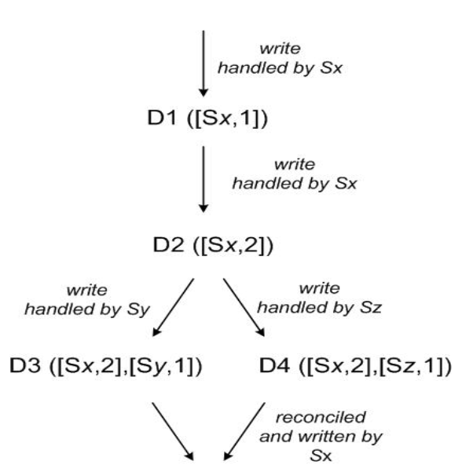

## Dynamo

Dynamo is a highly available key-value storage system built for Amazon's platform. To achieve a high level of availability, Dynamo **sacrifices consistency** under certain failure scenarios. It makes extensive use of object versioning and application-assisted conflict resolution in a manner that provides a novel interface for developers to use.

Dynamo uses a synthesis of well known techniques to achieve scalability and availability:

- Data is partitioned and replicated using consistent hashing
- Consistency is facilitated by object versioning
- Consistency among replicas during updates is maintained by a quorum-like technique and a decentralized replica synchronization protocol
- All updates reach all replicas eventually i.e. eventually consistent data store
- Employs gossip-based distributed failure detection and membership protocol

Dynamo does not focus on the problem of data integrity and security and is built for a trusted environment i.e. it is built for an infrastructure within a single administrative domain where all nodes are assumed to be trusted.

### SLA

A common approach in the industry for forming a performance oriented SLA is to describe it using average, median and expected variance. However, these metrics are not good enough if the goal is to build a system where **all customers** have a good experience, not just the majority.

To address this issue, at Amazon, SLAs are expressed and measured at the **99.9th percentile** of the distribution.

A typical SLA required of internal services that use Dynamo is that 99.9% of the read and write requests execute within 300ms.

## Architecture

<table>
<tr>
<th>Problem</th>
<th>Technique</th>
<th>Advantage</th>
</tr>
<tr>
<td>Partitioning</td>
<td>Consistent hashing</td>
<td>Incremental scalability</td>
</tr>
<tr>
<td>High availability for writes</td>
<td>Vector clocks with reconciliation during reads</td>
<td>Version size is decoupled from update rates</td>
</tr>
<tr>
<td>Handling temporary failures</td>
<td>Sloppy quorum and hinted handoff</td>
<td>Provides high availability and durability guarantee when some of the replicas are not available</td>
</tr>
<tr>
<td>Recovering from permanent failures</td>
<td>Anti-entropy using Merkle trees</td>
<td>Synchronizes divergent replicas in the background</td>
</tr>
<tr>
<td>Membership failure and detection</td>
<td>Gossip-based protocol</td>
<td>Preserves symmetry and avoids having a centralized registry for storing membership and node liveness information</td>
</tr>
</table>

### Data versioning and reconciliation

Dynamo treats the result of each modification as a new and immutable version of data. It allows for multiple versions of an object to be present in the system at the same time.

Most of the time, new versions subsume the previous versions, and the system itself can determine the authoritative version (**syntactic reconciliation**). However, version branching may happen in the presence of failures, resulting in conflicting versions of an object. Instead, the client performs the reconciliation in order to collapse/merge multiple branches of data evolution into one (**semantic reconciliation**).

A typical example of a collapse operation is “merging” different versions of a customer’s shopping cart. The shopping cart application requires that an “Add to Cart” operation can never be forgotten or rejected. If the most recent state of the cart is unavailable, and a user makes changes to an older version of the cart, that change is still meaningful and should be preserved. Using this reconciliation mechanism, an “add to cart” operation is never lost. However, deleted items can resurface.

Additionally, Dynamo uses **vector clocks** in order to capture causality between different versions of the same object. One vector clock is associated with every version of every object. One can determine whether two versions of an object are on parallel branches or have a causal ordering, by examine their vector clocks. If the counters on the first object’s clock are less-than-or-equal to all of the nodes in the second clock, then the first is an ancestor of the second and can be forgotten. Otherwise, the two changes are considered to be in conflict and require reconciliation.

An example of the use of vector clocks is as follows:

1. Client writes a new object
2. Node Sx handles request and updates its sequence number in the object's vector clock `D1([Sx,1])`
3. Client updates object
4. Node Sx handles request and updates its sequence number in the object's vector clock `D2([Sx,2])`
5. Client updates object
6. Node Sy handles request and updates its sequence number in the object's vector clock `D3([Sx,2],[Sy,1])`
7. A different client reads D2 and updates it
8. Node Sz handles request and updates its sequence number in the object's vector clock `D3([Sx,2],[Sz,1])`
9. Client reads D3 and D4 (different versions of the same object) and performs semantic reconciliation as there is no casual relation between them
10. Client updates object
11. Node Sx handles request and updates its sequence number in the object's vector clock `D5([Sx,3],[Sy,1],[Sz,1])`

### Membership and failure detection

Node outages are often transient but may last for extended intervals. A node outage rarely signifies a permanent departure and therefore should not result in rebalancing of the partition assignment or repair of the unreachable replicas.

Hence, Dynamo uses an **explicit mechanism** to initiate the addition and removal of nodes from a Dynamo ring. A gossip-based protocol propagates membership changes and maintains an eventually consistent view of membership. Each node contacts a peer chosen at random every second (random walk) and the two nodes efficiently reconcile their persisted membership change histories.

New membership is propagated as follows:

1. When a node starts for the first time, it chooses its set of tokens (vnodes) from consistent hashing ring and maps nodes to their respective token sets
2. The mapping is persisted on disk and **initially contains only the local node and its token set**
3. The mappings stored at different Dynamo nodes are reconciled during the same communication exchange that reconciles the membership change histories
4. When existing nodes are no longer in charge of handling keys falling within the new node's token range, they will offer to transfer the appropriate keys to the new node
5. Partitioning and placement information also propagates via the gossip-based protocol and each storage node is aware of the token ranges handled by its peers
