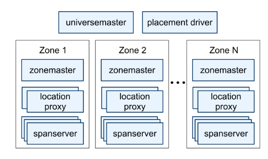
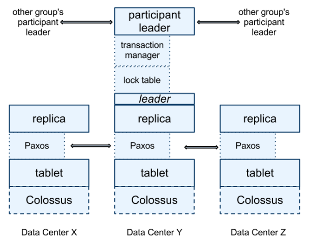
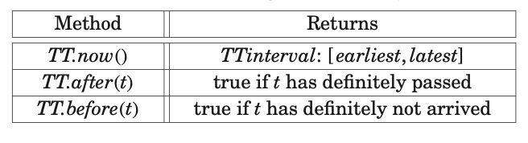

## Spanner

Spanner is Google’s scalable, multi-version, globally distributed, and synchronously replicated database.

### Features

- Sharding data across many sets of Paxos state machines in datacenters spread across the world
- Replication used for global availability and geographic locality with automatic client failover between replicas
- Automatic resharding of data as the amount of data or number of server changes
- Data can be dynamically moved between datacenters to balance resource and load

Two features that were difficult to implement in a distributed database are:

- Provides externally consistent reads and writes
- Provides globally consistent reads across the database at a timestamp

These features are enabled by the fact that Spanner **assigns globally meaningful commit timestamps to transactions**, even though transactions may be distributed. The timestamps reflect serialization order.

### Data structure

Spanner has evolved from a Bigtable-like versioned key-value store into a temporal multi-version database:

- Data is stored in schematized semi-relational tables
- Data is versioned, and each version is automatically timestamped with its commit time
- Old versions of data are subject to configurable garbage-collection policies, and applications can read data at old timestamps
- Supports general-purpose transactions, and provides an SQL-based query language

## Design

### Architecture

A Spanner deployment is called a universe i.e. development, playground and production universe.

Spanner is organized as a set of zones, where each zone is the rough analog of a deployment of Bigtable servers. Zones are the unit of administrative deployment. The set of zones is also the set of locations across which data can be replicated. A zone has one zonemaster and between one hundred and several thousand spanservers. The former assigns data to spanservers; the latter serve data to clients.

The per-zone location proxies are used by clients to locate the spanservers assigned to serve their data.

### Stack

Replication and distributed transactions are layed onto Bigtable-based implementation. Each spanserver is responsible for between 100 and 1000 instances of a data structure called a tablet.

A tablet’s state is stored in a set of B-tree-like files and a write-ahead log, all on a distributed file system called Colossus (successor of GFS).

To support replication, each spanserver implements a single Paxos state machine on top of each tablet. The Paxos state machines are used to implement a consistently replicated bag of mappings. The key-value mapping state of each replica is stored in its corresponding tablet. The set of replicas is collectively a Paxos group.

At every replica that is a leader:

- Writes must initiate the Paxos protocol from it
- A spanserver implements a lock table to implement concurrency control. The lock table contains the state for **two-phase locking**: it maps ranges of keys to lock states
- A spanserver implements a transaction manager to support distributed transactions

Distributed transactions is managed as follows:

- The transaction manager is used to implement a participant leader; other replicas are called participant slaves
- If a transaction involves only one Paxos group, the transaction manager is bypassed since the lock table and Paxos together provide transactionality
- If a transaction involves more than one Paxos group, those groups’ leaders coordinate to perform **two-phase commit**. One of the participant groups is chosen as the coordinator

## TrueTime

By reifying clock uncertainty in the time API, it is possible to build distributed systems with much stronger time semantics. As a community, we should no longer depend on loosely synchronized clocks and weak time APIs in designing distributed algorithms.

TrueTime explicitly represents time as a TTinterval, which is an **interval with bounded time uncertainty**.

### GPS and atomic clocks

The underlying time references used by TrueTime are GPS and atomic clocks. TrueTime uses two forms of time reference because they have different failure modes:

- GPS reference-source vulnerabilities include antenna and receiver failures, local radio interference, and GPS system outages
- Atomic clocks can fail in ways uncorrelated to GPS and each other, and over long periods of time can drift significantly due to frequency error

### Time master machines and daemons

TrueTime is implemented by a set of time master machines per datacenter and a timeslave daemon per machine:

- The majority of masters have GPS receivers with dedicated antennas; these masters are separated physically to reduce the effects of antenna failures, radio interference, and spoofing
- The remaining (armageddon) masters are equipped with atomic clocks

All masters’ time references are regularly compared against each other. Each master also cross-checks the rate at which its reference advances time against its own local clock, and evicts itself if there is substantial divergence.

Armageddon masters advertise a slowly increasing time uncertainty that is derived from conservatively applied worst-case clock drift. GPS masters advertise uncertainty that is typically close to zero.

Every daemon polls a variety of masters to reduce vulnerability to errors from any one master. Daemons apply a variant of **Marzullo’s algorithm** to detect and reject liars, and synchronize the local machine clocks to the non-liars.

To protect against broken local clocks, machines that exhibit frequency excursions larger than the worst-case bound derived from component specifications and operating environment are evicted. Correctness depends on ensuring that the worst-case bound is enforced.

Between synchronizations, a daemon advertises a slowly increasing time uncertainty, called **epsilon**. Epsilon is derived from conservatively applied worst-case local clock drift, and depends on time-master uncertainty and communication delay to the time masters.

### Epsilon (error bound) distribution

Machine statistics show that bad CPUs are 6 times more likely than bad clocks i.e. clock issues are extremely infrequent, relative to much more serious hardware problems. As a result, we believe that TrueTime’s implementation is as trustworthy as any other piece of software upon which Spanner depends.
