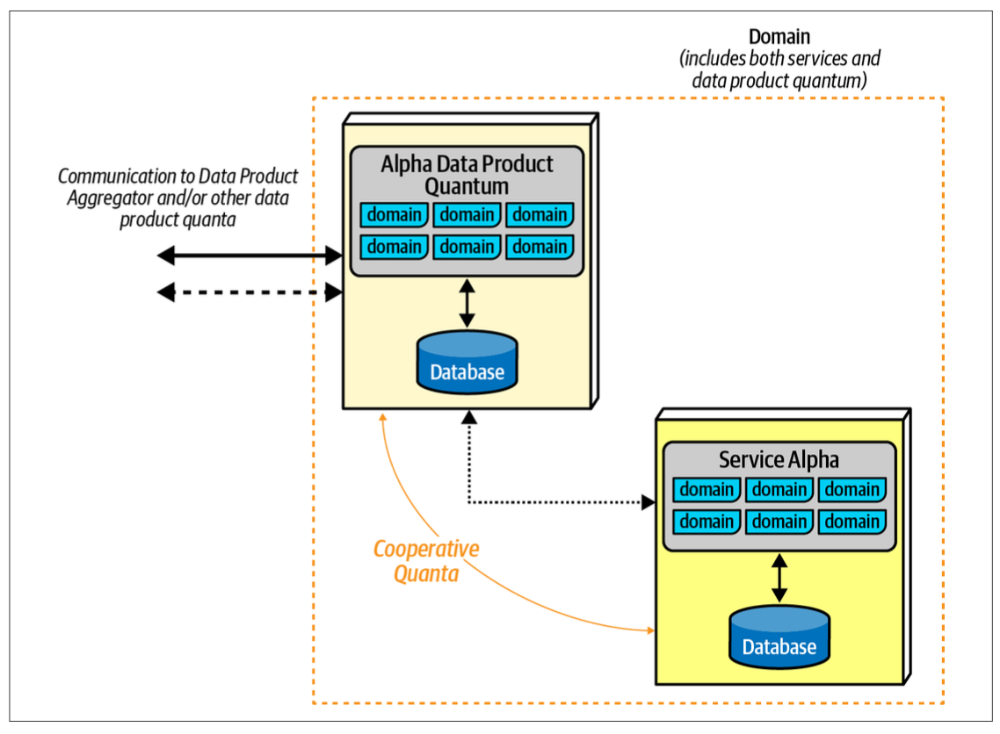

## Data Product Quantum (DTQ)

The core tenet of the data mesh overlays modern distributed architectures such as microservices. Teams build a DTQ adjacent but coupled to their service. The DPQ acts as an operationally independent but highly coupled set of behaviors and data.

## Types

### Source-aligned DPQ

Provides analytical data on behalf of the collaborating architecture quantum, typically a microservice, acting as a cooperative quantum.

### Aggregate DPQ

Aggregates data from multiple inputs, either synchronously or asynchronously.

### Fit-for-purpose DPQ

A custom-made DPQ to serve a particular requirement, which may encompass analytical reporting, business intelligence, machine learning, or other supporting capability.
