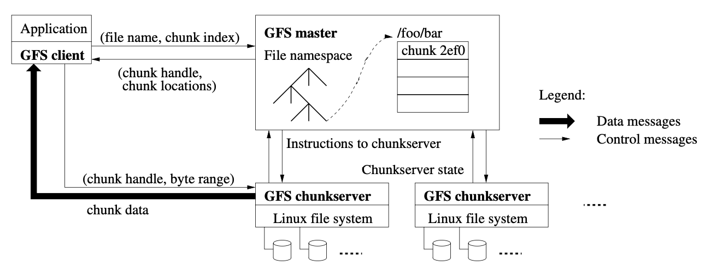
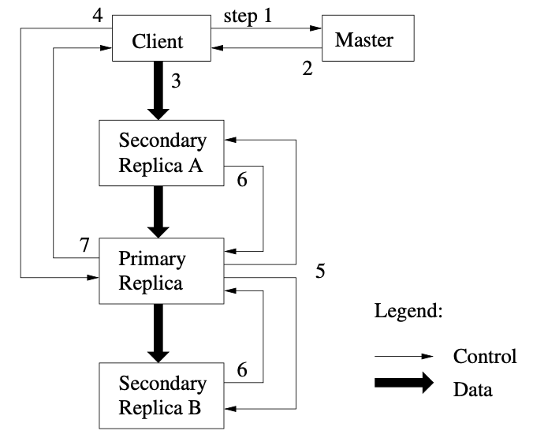

## Google File System (GFS)

GFS is a scalable distributed file system for large distributed data-intensive applications. It provides fault tolerance while running on inexpensive commodity hardware, and it delivers high aggregate performance to a large number of clients.

GFS shares many of the same goals as other distributed file systems: performance, scalability, reliability, and availability. However, its design has been driven by key observations of application workloads and technological environment. Traditional choices have been re-examined:

1. Component failures are the norm rather than the exception. The quantity and quality of components virtually guarantee that some are not functional at any given time. Problems are caused by application bugs, operating system bugs, human errors, disk failures, etc. Therefore, **constant monitoring, error detection, fault tolerance, and automatic recovery must be integral to the system**
2. Files are huge in nature, and design assumptions and parameters such as I/O operation and block sizes have to be revisited
3. Most files are mutated by appending new data rather than overwriting existing data. Once written, the files are only read, and often only sequentially. Appending becomes the focus of performance optimization and atomicity guarantees
4. Co-designing the applications and the file system API benefits the overall system by increasing flexibility

## Design

### Interface

Files are organized hierarchically in directories and identified by pathnames. GFS supports the usual operations to create, delete, open, close, read, and write files.

Additional operations for GFS include:

- **Snapshot**: Creates a copy of a file or a directory tree at low cost
- **Record append**: Allows multiple clients to append data to the same file concurrently while guaranteeing the atomicity of each individual client’s append; useful for implementing multi-way merge results and producer-consumer queues that many clients can simultaneously append to **without additional locking**

### Architecture

A GFS cluster consists of a single master and multiple chunkservers and is accessed by multiple clients.

### Reading

The process for reading a file is as follows:

1. Client translates file name and byte offset specified by the application into a chunk index within the file
2. Client sends the master a request containing the file name and chunk index; client typically asks for multiple chunks in the same request
3. Master replies with the corresponding chunk handle and location of replicas
4. Client caches this information and sends a request to the closest replica; the request specifies the chunk handle and a byte range within that chunk
5. Further reads of the same chunk require no more client-master interaction until the cached information expires or the file is reopened

### Chunks

Chunk size is one of the key design parameters. Files are divided into fixed-size chunks of 64 MB, which is much larger than typical file system block sizes. Each chunk is identified by an immutable and globally unique 64 bit chunk handle assigned by the master at the time of chunk creation.

Chunkservers store chunks on local disks as Linux files and read or write chunk data specified by a chunk handle and byte range. For reliability, each chunk is replicated on multiple chunkservers. By default, three replicas are stored.

A large chunk size offers several advantages:

- Reduces clients' need to interact with the master as reads/writes on the same chunk require only one initial request to the master for chunk location information, and most applications mostly read/write large files sequentially
- As clients are more likely to perform many operations on a given chunk, it reduces network overhead by keeping a persistent TCP connection to the chunkserver over an extended period of time
- Reduces size of metadata stored on master
- Space wastage due to internal fragmentation can be resolved with lazy space allocation

However, a disadvantage is that for smaller files consisting of a small number of chunks (e.g. one), it may create **hotspots**.

### Client

GFS client code linked into each application implements the file system API. Client communicates with the master for metadata operations, but all data-bearing communication goes directly to the chunkservers.

### Caching

Neither the client nor the chunkserver caches file data. Client caches offer little benefit because most applications stream through huge files or have working sets too large to be cached. Not having them simplifies the client and the overall system by eliminating cache coherence issues.

### Single master

The master periodically communicates with each chunkserver in **HeartBeat messages** to give it instructions and collect its state.

Clients never read and write file data through the master. Instead, a client asks the master which chunkservers it should contact. It caches this information for a limited time and interacts with the chunkservers directly for many subsequent operations.

### Metadata

The master stores three major types of metadata:

1. File and chunk namespaces
2. Mapping from files to chunks
3. Location of each chunk's replicas

All metadata is kept in the master's memory.

#### Chunk locations

The chunk location is not persisted on disk, but instead the master asks each chunkserver about its chunks at master startup and whenever a chunkserver joins the cluster. This eliminated the problem of keeping the master and chunkservers in sync as chunkservers join and leave the cluster, change names, fail, restart, etc. There is no point in trying to maintain a consistent view of this information on the master because errors on a chunkserver may cause chunks to vanish spontaneously.

#### Write-ahead operation log

The operation log contains a historical record of critical metadata changes, and serves as **logical timeline** that defines the order of concurrent operations. The first two are kept persistent by logging mutations to an operation log stored in local disk.

As operation log is critical, it must be stored reliably and not make changes visible until they are made persistent. Hence, it is replicated on multiple remote machines and respond to a client operation only after flushing the corresponding log record to disk both locally and remotely. The master batches several log records together before flushing thereby reducing the impact of flushing and replication on overall system throughput.

The master recovers its file system state by replaying the operation log. To minimize startup time, the log file is kept small by using **checkpoints** whenever the log grows beyond a certain size. The checkpoint is in a **compact B-tree** like form that can be directly mapped into memory and used for namespace lookup without extra parsing.

As building a checkpoint is slow, it is created in a separate thread so that it does not delay incoming mutations. Only the latest checkpoint and subsequent log files are needed to replay its state during recovery.

## Consistency

### Regions

The state of a file region after a data mutation depends on the type of mutation, whether it succeeds or fails, and whether there are concurrent mutations.

### Mutation guarantees

File namespace mutations are atomic and handled exclusively by the master.

Data mutations may be writes or record appends:

- Write: Causes data to be written at an application-specified file offset
- Record append: Causes data to be appended atomically at least once even in the presence of concurrent mutations, but at an offset of GFS’s choosing

The offset is returned to the client and marks the beginning of a defined region that contains the record. GFS may insert **padding or record duplicates** in between. They occupy regions considered to be inconsistent and are typically dwarfed by the amount of user data.

After a sequence of successful mutations, the mutated file region is guaranteed to be defined and contain the data written by the last mutation. GFS achieves this by:

1. Applying mutations to a chunk in the same order on all its replicas
2. Using chunk version numbers to detect stale replicas

### Dealing with failures

GFS identifies failed chunkservers by regular handshakes between master and all chunkservers and detects data corruption by checksumming. Once a problem surfaces, the data is restored from valid replicas as soon as possible. A chunk is lost irreversibly only if all its replicas are lost before GFS can react, typically within minutes.

### Applications

Practically, all applications mutate files by appending rather than overwriting. Appending is far more efficient and more resilient to application failures than random writes.

## System interactions

### Mutation

A mutation is an operation that changes the contents or metadata of a chunk such as a write or an append operation. Each mutation is performed at all the chunk’s replicas.

The process of applying a mutation is as follows:

1. Client asks the master which chunkserver holds the current lease for the chunk and locations of replicas. If none has the lease, master grants one to a replica it chooses
2. The master replies with the locations of all replicas, and the identity of primary. Client caches this data for future mutations
3. Client pushes data to all replicas in any order. Data flow and control flow are decoupled
4. Once all replicas have acknowledged receiving the data, the client sends a write request to the primary. The primary assigns consecutive serial numbers to all mutations it receives to provide the serialization from concurrent clients. It applies the mutation to its own local state in serial number order
5. The primary forwards the write request to all secondary replicas, which applies mutations in the same serial number order assigned by the primary
6. The secondaries all reply to the primary indicating that they have completed the operation
7. Primary replies to the client. Client code handles errors by retrying failed mutation

If a write by the application is large or straddles a chunk boundary, GFS client code breaks it down into multiple write operations.

### Leases

Leases are used to maintain a **consistent mutation order across replicas**. The master grants a chunk lease to the primary replica. The primary picks a serial order for all mutations to the chunk. All replicas follow this order when applying mutations. Thus, the global mutation order is defined first by the lease grant order chosen by the master, and within a lease by the serial numbers assigned by the primary.

The lease mechanism is designed to minimize management overhead at the master. A lease has an initial timeout of 60 seconds. If needed, the primary can ask for an extension of the lease, and the grants are **piggybacked** on the Heartbeat messages. The master may also revoke a lease before it expires. Also, even if the master loses connection with the primary, it can safely grant a new lease after the old lease expires.

### Data flow

By **decoupling the data flow from the control flow**, we can improve performance by scheduling the expensive data flow based on the network topology regardless of which chunkserver is the primary. Goals are to fully utilize each machine’s network bandwidth, avoid network bottlenecks and high-latency links, and minimize the latency to push through all the data.

To fully utilize each machine's network bandwidth, data is pushed **linearly** along a carefully picked chain of chunkservers in a **pipelined fashion**, rather than distributed in some other topology e.g. tree. Hence, each machine's full outbound bandwidth is used to transfer data as fast as possible, rather than divided among multiple recipients.

To avoid network bottlenecks and high-latency links, each machine forwards the data to the "closest" machine in the network topology that has not received it. Network topology is simple enough that **"distances" can be accurately estimated from IP addresses**.

To minimize latency, data transfer is **pipelined over TCP connections**. Once a chunkserver receives some data, it starts forwarding immediately. Sending the data immediately does not reduce the receive rate.

### Atomic record appends

In a traditional write, the client specifies the offset at which data is to be written. However, **concurrent writes to the same region are not serializable**: the region may end up containing data fragments from multiple clients. Clients would need additional complicated and expensive lock synchronization e.g. distributed lock manager.

In a record append, however, the client specifies only the data. GFS appends it to the file at least once atomically, at an offset of GFS's choosing, and returns that offset to the client.

An append is performed as follows:

1. The primary checks to see if append the record to the current chunk exceeds the maximum size. Record append is restricted to be at most one-fourth of the maximum chunk size to keep worst-case fragmentation at an acceptable level
2. If it exceeds, it pads the chunk to the maximum size, tells secondaries to do the same, and replies to the client indicating that the operation should be retried on the next chunk
3. If append fits within the maximum size, the primary appends the data to its replica, **tells the secondaries to write the data at the exact offset where it has**, and replies success to the client

### Snapshots

The snapshot operation makes a copy of a file or directory tree almost instantaneously, while minimizing any interruptions of ongoing mutations.

Standard copy-on-write techniques are used to implement snapshots:

1. When the master receives a snapshot request, it first revokes any outstanding leases on the chunks in the files it is about to snapshot. This ensures that any subsequent writes to these chunks will require an interaction with the master to find the lease holder
2. Master logs the operation to disk, and duplicates the file or directory tree. The newly created snapshot files point to the same chunks as the source files (reference count of 2)
3. When a client wants to write to chunk C after snapshot operation, it sends a request to the master to find the current lease holder. As the reference count for chunk C is greater than one, it picks a new chunk C' and writes data to it. All replicas are also notified to create new chunk C'

## Master operations

The master maintains all file system metadata e.g. namespace, access control information, mapping from files to chunks, chunk locations, etc. It also controls system-wide activities such as namespace operations, chunk placement decisions, chunk lease and chunk replicas management, garbage collection of orphaned chunks and unused storage, and chunk migration between chunkservers to balance load.

### Namespace management and locking

Many master operations can take a long time e.g. snapshots. Therefore, to prevent delays, we allow multiple operations to be active and use locks over regions of the namespace to ensure proper serialization.

Unlike many traditional file systems, GFS does not have a per-directory data structure that lists all the files in that directory, nor does it support aliases (symbolic links) for the same file or directory. Instead, GFS logically represents its namespace as a lookup table mapping full pathnames to metadata. With **prefix compression**, this table can be efficiently represented in memory.

Each master operation acquires a set of locks before it runs. For example, for a full pathname /d1/d2/dn/leaf, where leaf is either a file or directory, it acquires:

1. Read lock for /d1, /d1/d2, /d1/d2/dn
2. Read or write lock for /d1/d2/dn/leaf

The read lock on the directory name suffices to prevent the directory from being deleted, renamed, or snapshotted. The write locks on file names serialize attempts to create a file with the same name twice.

Since the namespace can have many nodes, read-write lock objects are allocated lazily and deleted once they are not in use. Locks are acquired in a **consistent total order to prevent deadlock**: they are first ordered by level in the namespace tree and lexicographically within the same level.

### Garbage collection with storage reclamation

GFS does not immediately reclaim the available physical storage when a file is deleted, but does so only lazily during regular garbage collection at both the file and chunk levels.

The process of deletion as follows:

1. When a file is deleted, the master logs the deletion just like other mutations
2. The file is renamed to a hidden name that includes the deletion timestamp
3. During the master's regular scan of the file system namespace, it removes such hidden files if they have existed for more than three days
4. The master also identifies stale and orphaned chunks (i.e. those not reachable from any file) and erases the metadata for those chunks
5. In Heartbeat message, each chunkserver reports a subset of the chunks it has, and the master replies with the identity of all chunks that are no longer present in the master’s metadata which can be deleted

Although distributed garbage collection is a hard problem that demands complicated solutions in the context of programming languages, it is quite simple in this case:

- All references to chunks and chunk replicas can be identified
- Any such replica not known to the master is "garbage"

The garbage collection approach to storage reclamation offers several advantages over eager deletion:

1. It is simple and reliable in a large-scale distributed system where component failures are common
2. It merges storage reclamation into the regular background activities of the master; hence, it is done in batches and cost is amortized
3. Delay in reclaiming storage provides a safety net against accidental, irreversible deletion

However, the main disadvantage is that the delay sometimes hinders user effort to fine tune usage when storage is tight. Applications that repeatedly create and delete temporary files may not be able to reuse the storage right away. These issues addressed by expediting storage reclamation if a deleted file is explicitly deleted again.

### Stale replica detection

Chunk replicas may become stale if a chunkserver fails and misses mutations to the chunk while it is down. For each chunk, the master maintains a **chunk version number** to distinguish between up-to-date and stale replicas.

Whenever the master grants a new lease on a chunk, it increases the chunk version number and informs the up-to-date replicas. The master and these replicas all record the new version number in their persistent state. This occurs before any client is notified and therefore before it can start writing to the chunk. The master will detect a stale replica when the chunkserver reports its set of chunks and their associated version numbers.

### Replication

The master state is replicated for reliability. Its operation log and checkpoints are replicated on multiple machines. A mutation to the state is considered committed only after its log record has been flushed to disk locally and **on all master replicas**.

Scalability and high availability (for reads) are currently provided by our **shadow** master mechanism.

## Data integrity via checksumming

Each chunkserver uses checksumming to detect corruption of stored data.

A chunk is broken up into 64 KB blocks. Each has a corresponding 32 bit checksum. Like other metadata, checksums are kept in memory and stored persistently with logging, separate from user data.

For reads, the chunkserver verifies the checksum of data blocks that overlap the read range before returning any data to the requester, whether a client or another chunkserver. Therefore chunkservers will **not propagate corruptions** to other machines. The master will be notified and clone the chunk from another replica. During idle periods, chunkservers can also scan and verify the contents of inactive chunks.

Checksumming has little effect on read performance:

- As most reads span at least a few blocks, we need to read and checksum only a small amount of extra data for verification
- Overhead can be reduced by aligning reads at checksum block boundaries
- Checksum lookups and comparison on the chunkserver are done without any I/O, and calculation can be overlapped with I/O

Checksum computation is heavily optimized for record append writes. New checksums are computed for any new blocks filled by the append, and they are incrementally updated to the last partial checksum block.

If a write overwrites an existing range of the chunk, we must read and verify the first and last blocks of the range being overwritten, perform the write, and finally compute and record the new checksums. Otherwise, the new checksums may hide corruption that exists in the regions not being overwritten.
