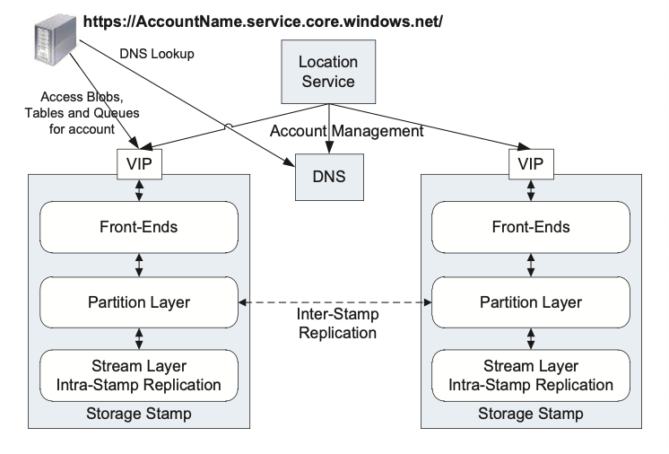
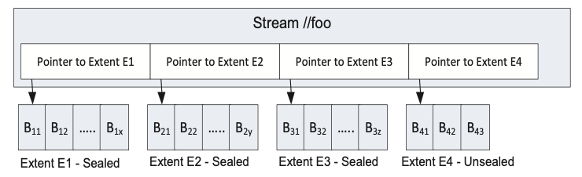

## Windows Azure Storage (WAS)

WAS is a highly available and scalable cloud storage service with strong consistency i.e. **provides all three properties of CAP theorem**. In WAS, data is stored durably using both local and geographic replication to facilitate disaster recovery. WAS storage comes in the form of Blobs (files), Tables (structured storage), and Queues (message delivery).

### Global partitioned namespace

Key goals of storage system is to provide a single global namespace that allows clients to address all of their storage in the cloud and scale to arbitrary amounts of storage needed over time. This capability can be provided by leveraging **DNS** as part of the storage namespace and breaking the storage namespace into three parts:

- **Account**: Customer account used to locate the primary storage cluster of where the data is stored
- **Partition**: Used to scale out access to data across storage nodes; atomic transactions with the same partition name is provided
- **Object**: Identifies individual objects within a partition

### Multi-tenancy and cost of storage

To reduce storage cost, many customers are served from the same shared storage infrastructure. WAS combines the workloads of many different customers with varying resource needs together so that significantly less storage needs to be provisioned at any one point in time than if those services were run on their own dedicated hardware.

## Architecture

### Storage stamp

#### Front-end (FE) layer

The FE layer consists of a set of stateless servers that take incoming requests. Upon receiving a request, an FE looks up the AccountName, authenticates and authorizes the request, then routes the request to a partition server in the partition layer (based on the PartitionName).

The system maintains a Partition Map that keeps track of the PartitionName ranges and which partition server is serving which PartitionNames. The FE servers cache the Partition Map and use it to determine which partition server to forward each request to.

The FE servers also stream large objects directly from the stream layer and cache frequently accessed data for efficiency.

#### Partition layer

The partition layer is build for:

1. Managing and understanding higher level data abstractions e.g. Blob, Table, Queue
2. Providing a scalable object namespace
3. Providing transaction ordering and strong consistency for objects
4. Storing object data on top of the stream layer
5. Caching object data to reduce disk I/O

Another responsibility of this layer is to achieve scalability by partitioning all of the data objects within a stamp. This layer manages which partition server is serving what PartitionName ranges for Blobs, Tables, and Queues.

#### Stream layer

This layer stores the bits on disk and is in charge of distributing and replicating the data across many servers to keep data durable within a storage stamp. It understands files (streams that are ordered lists of large storage chunks called extents), but it does not understand higher level object constructs.

## Replication

Intra-stamp replication provides durability against hardware failures, which occur frequently in large scale systems, whereas inter-stamp replication provides geo-redundancy against geo-disasters.

### Intra-stamp replication (stream layer)

This system provides synchronous replication and is focused on making sure all the data written into a stamp is kept durable within that stamp. Replication is done on the critical path of the customer's write requests. Once a transaction has been replicated successfully, success can be returned back to the customer.

### Inter-stamp replication (partition layer)

This system provides asynchronous replication and is focused on replicating data across stamps. Inter-stamp replication is done in the background and is off the critical path of the customer’s request.

## Stream layer

The stream layer provides an internal interface used only by the partition layer. It provides a file system like namespace and API, except that **all writes are append-only**. It allows clients to open, close, delete, rename, read, append to, and concatenate these large files, which are called streams.

### Block

This is the minimum unit of data for writing and reading. Data is written (appended) as one or more concatenated blocks to an extent, where blocks do not have to be the same size. The client does an append in terms of blocks and controls the size of each block.

The stream layer stores its **checksum validation at the block level**, one checksum per block. The whole block is read to perform the checksum validation, and it is checked on every block read.

### Extent

Extents are the unit of replication in the stream layer, and the default replication policy is to keep three replicas within a storage stamp for an extent. Each extent is stored in an NTFS file and consists of a sequence of blocks.

### Streams

A stream is an ordered list of extent pointers. Streams are appended to and can be randomly read from. Reading a stream would concatenate extents together to represent the full contiguous address space in order
e.g. E1, E2, E3, E4.

Only the last extent in the stream can be appended to. All of the prior extents in the stream are immutable.

