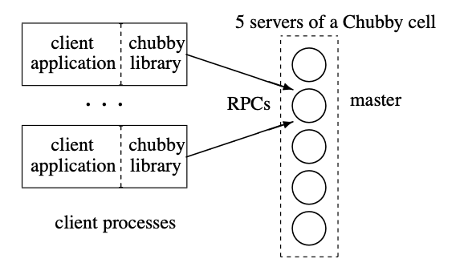
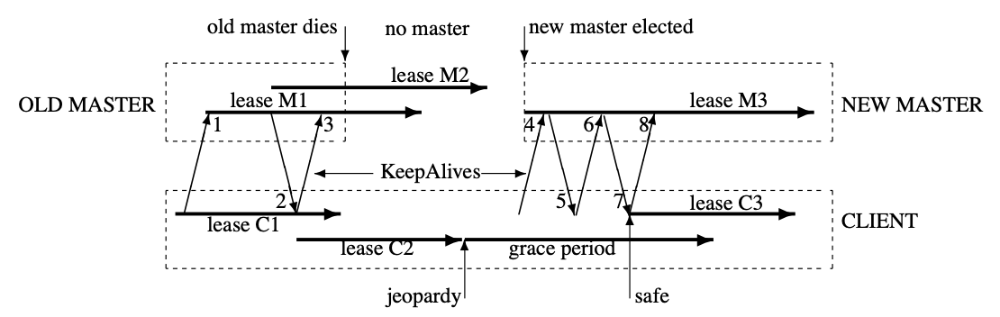

## Chubby

Chubby is a coarse-grained lock service and fault-tolerant that is intended for use within a loosely-coupled distributed system. The purpose of the lock service is to allow its clients to synchronize their activities and to agree on basic information about their environment e.g. leader election.

Locks are used for access to shared resources in a replication environment. Chubby can also be used as a well-known and available location to store a small amount of metadata e.g. service discovery. Both GFS and Bigtable has integrated Chubby into their system.

Chubby's client interface is similar to that of a simple file system that performs whole-file reads and writes, augmented with advisory locks with notification of various events such as file modification.

The primary goals included reliability, availability, and easy-to-understand semantics, as opposed to high performance i.e. throughput and storage capacity were considered secondary.

In a distributed consensus problem, the solution to the election of a primary among peers requires a solution using **asynchronous communication**. Asynchronous consensus is achieved using **Paxos protocol**. Paxos maintains safety without timing assumptions, but clocks must be introduced to ensure liveness.

## Design

Its design is based on well-known ideas that have meshed well:

- Distributed consensus among a few replicas for fault tolerance
- Consistent client-side caching to reduce server load
- timely notification of updates
- A familiar file system interface

### Rationale

Two key design decisions were employed:

1. A lock service was chosen, as opposed to a library or service for consensus
2. We chose to serve small-files to permit elected primaries to advertise themselves and their parameters, rather than building and maintaining a second service

Decisions that follow from expected use and from environment include:

- A service advertising its primary via a Chubby file may have thousands of clients. Therefore, we must allow thousands of clients to observe this file, preferably without needing many servers
- Clients and replicas of a replicated service may wish to know when the service’s primary changes; this suggests an **event notification mechanism** is preferred to avoid polling
- Even if clients need not poll files periodically, many will; caching of files is desirable
- Developers are confused with non-intuitive caching semantics; **consistent caching** is preferred
- To avoid both financial loss and jail time, we provide security mechanisms, including access control

#### Lock service

Though a library that provides distributed consensus could be built i.e. embodying Paxos, a lock server makes it easier to maintain existing program structure and communication patterns, instead of making existing servers participate in a consensus protocol, and if compatibility must be maintained during a transition period.

For example, to elect a master which then writes to an existing file server:

- One would acquire a lock to become a master
- Pass an additional integer (lock acquisition count) with the write RPC
- Add if-statement to the file server to reject the write if the acquisition count is lower than the current value (guard against delayed packets)

Also, distributed-consensus algorithms use quorums to make decisions, so they use replicas to achieve high availability. If a client system uses a lock service, even a single client can obtain a lock and make progress safely. Thus, a lock service **reduces the number of servers needed for a reliable client system to make progress**. In a loose sense, one can view the lock service as a way of providing a generic electorate that allows a client system to make decisions correctly when less than a majority of its own members are up.

#### Serving read/write of small-files

Data between components of services that elect a primary need a mechanism for advertising results. This suggests that we should allow clients to store and fetch small quantities of data i.e. read/write small files.

Although a name service could be used, the lock service itself is well-suited for this task, as this reduces the number of servers on which a client depends, and because the consistency features of the protocol are shared.

Chubby’s success as a name server owes much to its use of **consistent client caching**, rather than time-based caching. For the latter, if chosen poorly, it can lead to high DNS load or long client failover times.

#### Coarse-grained locks

Coarse-grained locks are chosen for the following reasons:

- They impose far less load on the lock server i.e. the lock-acquisition rate is weakly related to the transaction rate of client applications. Hence, performance and ability to add new servers are not a concern
- As they are acquired rarely, temporary lock server unavailability delays client less
- Brief unavailability does not cause clients to stall as opposed to fine-grained locks

However, a failover of a lock server would mean locks would need to be transferred from client to client, and this would require a costly recovery process. Hence, it is good for coarse-grained locks to survive lock server failures.

Fine-grained locks can be built on top.

### System structure and master

A Chubby cell consists of a small set of servers (typically five) known as replicas. The replicas use a distributed consensus protocol (Paxos) to elect a master. The master must obtain votes from a majority of the replicas, plus promises that those replicas will not elect a different master for an interval of a few seconds known as the **master lease**. The master lease is periodically renewed by the replicas provided the master continues to win a majority of the vote.

Clients find the master by sending master location requests to the replicas listed in the DNS. Non-master replicas respond to such requests by returning the identity of the master. Once a client has located the master, the client **directs all requests** to it either until it ceases to respond, or until it indicates that it is no longer the master.

Write requests are propagated via the consensus protocol to all replicas; such requests are acknowledged when the write has reached a majority of the replicas in the cell. Read requests are satisfied by the master alone.

The master is responsible for handling all client requests to Chubby. If the master fails, a new one is elected from the available replicas by running the election protocol, ensuring that the service remains available even in the face of server failures or network partitions.

Replica failure is managed as follows:

1. If a replica fails and does not recover for a few hours, a simple replacement system selects a fresh machine from a free pool and starts the lock server binary on it
2. It then updates the DNS tables, replacing the IP address of the failed replica with that of the new one
3. The current master polls the DNS periodically and eventually notices the change
4. Master updates the list of the cell’s members in the cell’s database; this list is kept consistent across all the members via the normal replication protocol
5. Once the new replica has processed a request that the current master is waiting to commit, the replica is permitted to vote in the elections for new master



### Files, directories, handles

Chubby presents a simple distributed file system. Clients can open/close/read/write files:

- Read and writes are whole-file
- Clients can register for notification of file update

Files are handles to information. An example is `/ls/foo/wombat/pouch` where:

- ls prefix stands for lock service
- foo is the name of a Chubby cell; it is resolved to one or more Chubby servers via DNS lookup
- wombat/pouch is interpreted within the named Chubby cell

The name space contains only files and directories, collectively called **nodes**. Every such node has only one name within its cell. Nodes may be either permanent or ephemeral. Any node may be deleted explicitly, but ephemeral nodes are also deleted if no client has them open.

Each node has various metadata:

- Contents of the file as one primary attribute
- Owner of the file, permissions, date modified, etc.
- An attribute indicating whether the file is locked or not
- **Access control lists (ACLs)** for reading/writing/changing ACL names for the node. Unless overridden, a node inherits the ACL names of its parent directory on creation

To ease distribution:

- Operations that can move files from one directory to another are not exposed, so as to allow the files in different directories to be served from different Chubby masters
- Path-dependent permission semantics are avoided i.e. access to a file is controlled by the permissions on the file itself rather than on directories on the path leading to the file
- Directory modified times are not maintained
- File last-access times are not revealed to make it easier to cache file metadata

### Files as locks

Each Chubby file and directory can act as a reader-writer lock: either one client handle may hold the lock in exclusive (writer) mode, or any number of client handles may hold the lock in shared (reader) mode.

Locks are **advisory** i.e. they conflict only with other attempts to acquire the same lock, and are not required to open a file. **Mandatory locks**, which make locked objects inaccessible to clients not holding their locks, are **rejected** for the following reasons:

- Chubby locks often protect resources implemented by other services, rather than just the file associated with the lock. To enforce mandatory locking in a meaningful way would required more extensive modification of such services
- We did not wish to force users to shut down applications when they needed to access locked files for debugging or administrative purposes. On personal computers, mandatory locks could be broken by shutting down applications or rebooting
- Developers perform error checking by writing assertions such as "lock X is acquired"; hence, they benefit little from mandatory checks

### Sequencers

It is costly to introduce sequence numbers into all the interactions in an existing complex system. Instead, Chubby provides a means by which sequence numbers can be introduced into only those interactions that make use of locks.

At any time, a lock holder may request a sequencer, an opaque byte-string that describes the state of the lock immediately after acquisition:

- Name of the lock
- Mode in which it was acquired (exclusive or shared)
- Lock generation number

The client passes the sequencer to servers (e.g. file systems) if it expects the operation to be protected by the lock. The recipient server is expected to test whether the sequencer is still valid and has the appropriate mode.

Although sequencers are easy to use, important protocols **evolve slowly**. An easier but imperfect mechanism is also employed to protect servers and clients from problems caused by message delays and restarts:

- If a client releases a lock in the normal way, it is immediately available for other clients to claim
- if a lock becomes free because the holder has failed or become inaccessible, the lock server will prevent other clients from claiming the lock for a period called the **lock-delay**. This prevents a faulty client from making a lock unavailable for an arbitrarily long time

### Events

Chubby clients may subscribe to a range of events when they create a handle. These events are delivered to the client asynchronously via an up-call from the Chubby library. Events include:

- File contents modified; often used to monitor the location of a service advertised via the file
- Child node added, removed, or modified
- Chubby master failed over
- A handle (and its lock) has become invalid; this typically suggests a communication problem

### API

- Open(): Opens a named file or directory to produce a **handle**; this call takes in a node name. Clients see a Chubby handle as a pointer to an opaque structure that supports various operations
- Close(): Closes an open handle; further use of the handle is not permitted
- GetContentsAndStat(): Returns both the contents and metadata of a file
- SetContents(): Write the contents of a file. Optionally, the client may provide a content generation number to allow the client perform **compare-and-swap** on a file i.e. the content is changed if the number is current
- SetACL(): Performs operation on the ACL names associated with the node
- Delete(): Deletes the node if it has no children
- Acquire(), TryAcquire(), Release(): Lock operations
- GetSequencer(): Returns a sequencer that describes any lock held by this handle
- SetSequencer(): Associates a sequencer with a handle
- CheckSequencer(): Checks whether a sequencer is valid

### Master election

Chubby is often used to achieve distributed master elections e.g. choosing a GFS master. Clients can use the API to perform primary election as follows:

1. All potential primaries/replicas open the lock file and try to acquire the lock in write mode
2. Paxos is used as the distributed consensus protocol. One succeeds and becomes the primary, while the others act as replicas
3. The primary writes its identity into the lock file with SetContents() so that it can be found by clients and replicas with GetContentsAndStat()
4. The primary obtains a sequencer with GetSequencer(), which it then passes to servers it communicates with
5. Servers confirm with CheckSequencer() that it is still the primary; **lock-delay** may be used with services that cannot check sequencers

```
Open("write mode");
if (successful) {
    SetContents("identity")
} else {
    open("read mode", "file-modification event");
    when notified:
        primary = GetContentsAndStat();
}
```

### Caching

To reduce read traffic, Chubby clients cache file data and node meta-data (including file absence or negative caching) in a **consistent, write-through cache** held in memory.

The protocol ensures that clients see either a consistent view of Chubby state, or an error:

1. When file metadata is to be changed, the modification is blocked while the master sends invalidations for the data to every client that may have cached it
2. On receipt of invalidation, a client flushes the invalidated state and sends an acknowledgement by making its next KeepAlive RPC call
3. The modification proceeds only after the master knows that each client has invalidated its cache, either from acknowledgement or because the client allowed its cache lease to expire
4. Only one round of invalidation is needed as the master treats the node as uncachable while cache invalidations remain unacknowledged. This approach allows reads always to be processed without delay

Despite the overheads of providing strict consistency, we **rejected weaker models** as we felt that programmers would find them harder to use. Also, mechanisms such as virtual synchrony that require clients to exchange sequence numbers in all messages were inappropriate in an environment with diverse pre-existing communication protocols.

### Sessions and KeepAlives

A Chubby session is a relationship between a Chubby cell and a Chubby client; it exists for some interval of time, and is maintained by periodic handshakes called **KeepAlives**. Unless a Chubby client informs the master otherwise, the client’s handles, locks, and cached data all remain valid provided its session remains valid.

Each session has an associated **lease**: an interval of time extending into the future during which the master guarantees not to terminate the session unilaterally.

As well as extending the client’s lease, the KeepAlive reply is used to transmit events and cache invalidations back to the client i.e. **piggybacking**.

The client also maintains a local lease timeout that is a conservative approximation of the master's lease timeout i.e. less than the master's lease.

If the client lease expires, it becomes unsure whether its lease has expired at the master. The client then flushes its cache and blocks all application calls on its API to prevent the application from observing inconsistent data, also known as **jeopardy session**. The client then waits for a **grace period**, 45s by default. This is done so that Chubby API calls do not block indefinitely when a Chubby cell becomes inaccessible.

### Master failovers

When a master fails or otherwise loses mastership, it discards its in-memory state about sessions, handles, and locks. If a master election occurs quickly, clients can contact the new master before their local lease timers expire. If election takes a long time, clients flush their caches and wait for the grace period while trying to find a new master. This allows sessions to be maintained across failovers that exceed the normal lease timeout.



## Scaling mechanisms

Chubby’s clients are individual processes, and one might handle 90,000 clients communicating directly with one master. Several approaches to reduce communication with the master are as follows:

- Clients almost always use a nearby cell (found with DNS) to avoid reliance on remote machines; typical deployment uses one Chubby cell for a data centre of several thousand machines
- The master may increase lease times from the default of 12s up to 60s when it is under heavy load, so it needs to **process fewer KeepAlive RPCs**; they are the dominant type of request and failure to process them in time is the typical failure mode of an overloaded server
- Chubby clients cache file data and open handles to reduce the number of calls they make on the server
- We use protocol-conversion servers that translate the Chubby protocol into less-complex protocols such as DNS

### Proxies

Chubby's protocol can be proxied (using the same protocol on both sides) by trusted processes that pass requests from other clients to a Chubby cell. A proxy can reduce server load by handling both KeepAlive and read requests; it cannot reduce write traffic, which passes through the proxy’s cache. But even with aggressive client caching, write traffic constitutes much less than one percent of Chubby’s normal workload.

### Partitioning

A Chubby cell can be partitioned to reduce sever load. Partitioning is intended to enable large Chubby cells with little communication between the partitions.

## Use, surprises and design errors

### Name service

Even though Chubby was designed as a lock service, we found that its most popular use was as a name server.

Caching within the normal Internet DNS is based on time. DNS entries have a timeout (TTL), and DNS data are discarded when they have not been refreshed within that period. To provide rapid name changes, a small TTL results in more Keep-Alive traffic, which can overwhelm the DNS server.

In contrast, Chubby’s caching uses **explicit invalidations** so a constant rate of session KeepAlive requests can maintain an arbitrary number of cache entries indefinitely at a client, in the absence of changes. To further reduce load, **grouping of name entries into batches** is performed so that a single lookup would return and cache the name mappings for a large number (typically 100) of related processes within a job.

### Lack of aggressive caching

Originally, we did not appreciate the critical need to **cache the absence of files**, nor to **reuse open file handles**. However, developers regularly write loops that retry indefinitely when a file is not present, or poll a file by opening it and closing it repeatedly when one might expect they would open the file just once.

A first mitigation was to use exponential backoff when an application made many attempts to Open() the same file over a short period; however, this introduced bugs. In the end it was easier to make repeated Open() calls cheap.

### Use cases

- GFS: Elect a master
- BigTable: Master election, client discovery, table service locking
