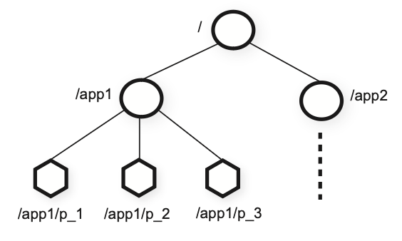
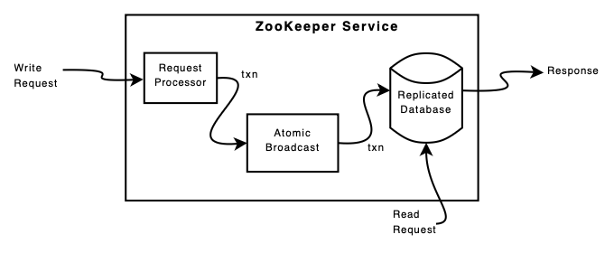

## ZooKeeper

ZooKeeper is a service for coordinating processes of distributed applications. It provides a **wait-free** coordination service with relaxed consistency guarantees. It incorporates elements from group messaging, shared registers, and distributed lock services in a replicated, centralized service. The interface exposed by ZooKeeper has the wait-free aspects of shared registers with an event-driven mechanism similar to cache invalidations of distributed file systems to provide a simple, yet powerful coordination service.

### Coordination in distributed systems

Large-scale distributed applications require different forms of coordination e.g. configuration, group membership, leader election, locks for mutual exclusion to critical resources, etc.

One approach to coordination is to develop services for each coordination needs e.g. SQS, Chubby, etc.

For ZooKeeper, we moved away from implementing specific primitives on the server side, and instead we opted for exposing an API that enables application developers to implement their own primitives. Also, we **moved away from blocking primitives** such as locks. Blocking primitives for a coordination service can cause slow or faulty clients to impact negatively the performance of faster clients.

Although the wait-free property is important for performance and fault tolerance, it is not sufficient for coordination. Hence, ZooKeeper guarantees the following:

- **FIFO client ordering** of all operations: Enables clients to submit operations asynchronously
- **Linearizable writes**: Implemented using a leader-based atomic broadcast protocol called Zab

## Service

### znodes

ZooKeeper provides to its clients the abstraction of a set of data nodes (znodes), organized according to a hierarchical name space. The znodes are data objects that clients manipulate through ZooKeeper API.

There are two types of znodes that a client can create:

- **Regular**: Created and deleted explicitly
- **Ephemeral**: Can be deleted explicitly or let the system remove automatically when the session that created it terminates

Unlike files in file systems, znodes are not designed for general data storage. Instead, they can be used to store metadata used for coordination purposes.



### Watches

ZooKeeper implements watches to allow clients to receive timely notifications of changes without requiring polling. When a client issues a read operation with a watch flag set, the operation completes as normal except that the server promises to notify the client when the information returned has changed. **Watches are one-time triggers associated with a session**.

### Sessions

A client connects to ZooKeeper and initiates a session. Sessions have an associated timeout. Sessions enable a client to move transparently from one server to another within a ZooKeeper ensemble, and hence persist across ZooKeeper servers.

## API

- **create(path, data, flags)**: Creates a znode with pathname and stores data in it
- **delete(path, version)**: Deletes the znode if it is at the expected version
- **getData(path, watch)**: Returns data and metadata
- **setData(path, data, version)**: Writes data to znode path if the version number is the current version of the znode
- **getChildren(path, watch)**: Returns the set of names of the children of a znode
- **sync(path)**: Waits for all updates pending at the start of operation to propagate to the server that client is connected to

ZooKeeper does not use handles to access znodes. Instead, each request includes the **full path** of the znode being operated on. This simplifies the API (no open() or close()) and eliminates extra state that the server would need to maintain.

## Primitives

### Configuration management

ZooKeeper can be used to implement dynamic configuration in a distributed application:

- Configuration is stored on a znode zc
- Processes start up with the full pathname of zc, and obtain their configuration by reading zc with watch flag set to true
- If configuration is updated, processes are notified and read the new configuration, again setting the watch flag to true

### Group membership

Ephemeral nodes can be used to implement group membership:

- A znode zg is designated to represent the group
- When a member starts, it creates an ephemeral child znode under zg
- Processes may put process information in the data of the child znode e.g. addresses, ports, etc.
- If the process fails, it is automatically removed
- Processes can obtain group information by getting the children of zg

### Simple locks

ZooKeeper can be used to implement simple locks:

- To acquire a lock, client creates an ephemeral znode
- If create succeeds, it holds the lock. Otherwise, it can read the znode with the watch flag set to true
- Other clients that are waiting for the lock try again once they observe the znode being deleted

However, this suffers from **herd effect**: if there are many clients waiting to acquire a lock, they will all vie for the lock when it is released.

### Simple locks without herd effect

All clients requesting the lock are lined up, and each client obtains the lock in order of request arrival. Thus, clients wishing to obtain the lock do the following:

```
1 n = create(l + “/lock-”, EPHEMERAL|SEQUENTIAL)
2 C = getChildren(l, false)
3 if n is lowest znode in C, exit (holds the lock)
4 p = znode in C ordered just before n
5 if exists(p, true) wait for watch event (wait for lock before it)
6 goto 2
```

The use of SEQUENTIAL orders the client attempt to acquire the lock with respect to all other attempts. If the client's znode has the lowest sequence number, it holds the lock. Otherwise, it waits for the deletion of the lock before the client's znode, until it is the first child.

By only watching the znode that precedes the client’s znode, we avoid the herd effect by only **waking up one process when a lock is released or a lock request is abandoned**.

## Implementation



### Read/write requests

Requests that change the state of the service, write requests, are processed by an agreement protocol, and are forwarded to the leader. Followers receive message proposals consisting of state changes from the leader and agree upon state changes.

Read requests are serviced from the local replica of each server database. By processing reads locally, we obtain excellent read performance because it is just an in-memory operation on the local server, and there is no disk activity or agreement protocol to run. However, one drawback is that precedence order for read operations is not guaranteed i.e. **read requests may return a stale value**.

### Atomic broadcast

All requests that update ZooKeeper state are forwarded to the leader. The leader executes the request and broadcasts the change to the ZooKeeper state through **Zab**, an atomic broadcast protocol.

Zap uses by default simple majority quorums to decide on a proposal. Also, Zab provides stronger order guarantees than regular atomic broadcast: Zab guarantees that changes broadcast by a leader are delivered in the order they were sent and all changes from previous leaders are delivered to an established leader before it broadcasts its own changes.

### Replication

The replicated database is an in-memory database containing the entire data tree. Each znode in the tree stores a maximum of 1MB of data by default.

For recoverability, updates are logged to disk before they are applied to the in-memory database. A replay log is kept for committed operations and periodic snapshots are generated for replaying delivered messages to a server upon recovery.

### Client-server interactions

Servers process writes in order and **do not process other writes or reads concurrently**. This ensures strict succession of notifications. Only the server that a client is connected to tracks and triggers notifications for that client.

Unlike Chubby, ZooKeeper allows clients to connect to any ZooKeeper server, not just the leader.

The ZooKeeper uses timeouts to detect client session failures. The leader determines that there has been a failure if no other server receives anything from a client session within the session timeout.

If the client cannot communicate with a server to send a request or
heartbeat, it connects to a different ZooKeeper server to re-establish its session.
