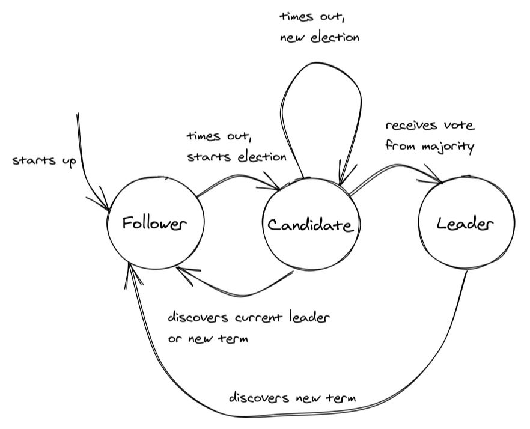

## Raft

Raft is a consensus algorithm used to manage a replicated log in distributed systems. It is designed to be easy to understand and implement while providing a strong guarantee of consistency.

### Logs and consensus

Each server maintains a **log of operations**, some of which have already been executed, as well as pending operations. Consensus is expressed in terms of these logs: committed operations have the same position in each of the respective server’s logs.

Raft achieves consensus by electing a leader among the nodes (servers). This leader is responsible for managing the log and ensuring that all nodes (followers) are kept up to date. The algorithm handles leader election, log replication, and safety guarantees. The system continues to function correctly even if some nodes fail, as long as a majority (quorum) of nodes remain operational.

Raft guarantees that operations that have been registered as committed, have been performed by a majority of the servers, and that the result has been returned to the original client.

### Election

Raft's leader election algorithm is implemented with a state machine in which a process is in one of the three states:

- Follower: The process recognizes another one as the leader
- Candidate: Process starts a new election proposing itself as the leader
- Leader: The process is the leader

In Raft, time is divided into election terms of arbitrary length. An election term is represented with a **logical clock**, a numerical counter that can only increase over time. A term begins with a new election, during which one or more candidates attempt to become the leader. The algorithm guarantees that for any term there is at most one leader.

How an election is triggered is as follows:

1.  When the system starts up, all processes begin their journey as followers
2.  A follower expects to receive a periodic heartbeat from the leader containing the election term the leader was elected in
3.  If the follower doesn’t receive any heartbeat within a certain time period, a timeout fires and the leader is presumed dead
4.  The follower starts a new election by incrementing the current election term and transitioning to the candidate state
5.  It then votes for itself and sends a request to all the processes in the system to vote for it, stamping the request with the current election term
6.  The process remains in the candidate state until one of the following happens:
    - The candidate wins the election if the majority of the processes in the system vote for it
    - Another process wins the election if the candidate receives a heartbeat from another process that claims to be leader with a term greater than or equal to the candidate's term
    - A period of time goes by with no winner when multiple followers become candidates simultaneously; election will timeout randomly from a fixed interval to reduce the likelihood of another split vote

### Re-election

When a leader crashes, a new one is elected, and its log is the collective state of the server group. However, if that log misses committed operations, then it is not representative for what the majority of servers has decided on.

For this reason, during an election, a server S will not vote for a candidate if it turns out that its log is more up to date than the candidate's.

### Clusters

Manager nodes implement this algorithm to manage global cluster state to ensure all Managers are storing the same consistent state. Having the same consistent state across cluster means in failure, any Manager node can pick up tasks and restore services to stable state.
