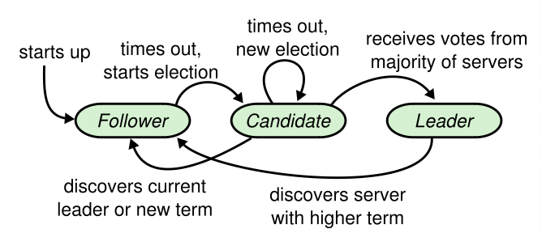
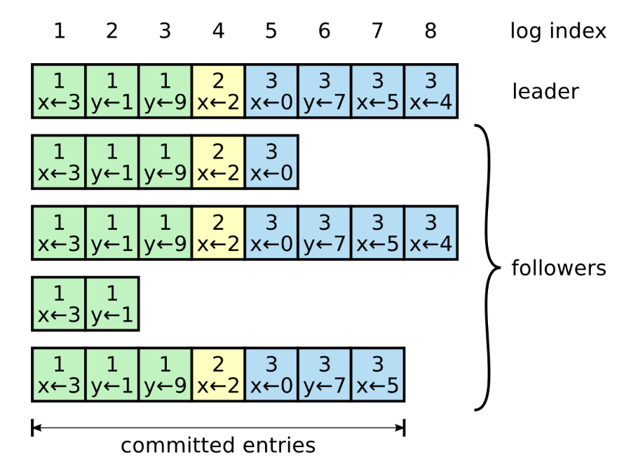

## Raft

Raft is a consensus algorithm used to manage a replicated log in distributed systems. It is designed to be easy to understand and implement while providing a strong guarantee of consistency. It is more understandable than Paxos and provides a better foundation for building practical systems.

Raft **separates the key elements of consensus** including leader election, log replication and safety, and it enforces a stronger degree of coherency to reduce the degree of nondeterminism and the ways servers can be inconsistent with each other.

### Novel features

- **Strong leader**: Log entries only flow from the leader to other servers
- **Leader election**: Randomized timers are used to elect leaders
- **Membership changes**: Uses a joint consensus approach where the majorities of two different configurations overlap during transitions

## Design

### Cluster state

A Raft cluster typically consists of five servers, which allows the system to tolerate two failures. At any given time, each server is in one of three states:

- **Leader**: Handles all client requests
- **Follower**: Passive and redirects client to leader if contacted. Does not issue requests on their own but respond to requests from leaders and candidates
- **Candidate**: Process starts a new election proposing itself as the leader

### Terms as logical clock

Raft divides time into terms of arbitrary length. Terms are numbered with consecutive integers. Each term begins with an election, in which one or more candidates attempt to become leader. If a candidate wins the election, then it serves as leader for the rest of the term. In situations with a split vote, the term will end with no leader; a new term will then begin shortly.

Different servers may observe the transitions between terms at different times. Terms act as a **logical clock** and allow servers to detect obsolete information such as stale leaders. Each server stores a current term number, which increases monotonically over time. Current terms are exchanged whenever servers communicate:

- If one server's term is smaller than another, it updates to the larger value
- If a leader discovers its term is out-of-date, it reverts to follower state
- If a server receives a request with a stale term number, it rejects the request

### Leader election

If a follower receives no communication over a period of time (election timeout), it assumes there is no viable leader begins an election. An election is triggered is as follows:

1.  When the system starts up, all processes begin their journey as followers
2.  A follower expects to receive a **periodic heartbeat** from the leader containing the election term the leader was elected in. Leaders send periodic heartbeats (AppendEntries RPCs that carry no log entries) to all followers in order to maintain their authority
3.  If the follower doesn’t receive any heartbeat within a certain time period, an **election timeout** is fired and the leader is presumed dead
4.  The follower starts a new election by incrementing its current election term and transitioning to the candidate state
5.  It then votes for itself and sends a request to all the processes in the system to vote for it, stamping the request with its current election term
6.  The process remains in the candidate state until one of the following happens:
    - The candidate wins the election if the majority of the processes in the system vote for it. It becomes the leader
    - Another process wins the election if the candidate receives a heartbeat from another process that claims to be leader with a term greater than or equal to the candidate's term. It returns to follower state
    - A period of time goes by with no winner when multiple followers become candidates simultaneously; election will timeout randomly from a fixed interval to reduce the likelihood of another split vote. A new election is then started

### Log replication

The leader handles all client request. Each log entry stores:

- A state machine command
- Term number (used to detect inconsistencies between logs)
- Integer index identifying its position in the log

A log entry is replicated and committed as follows:

1. Leader creates log entry and issues AppendEntries RPCs in parallel to all replicas
2. When a majority of servers has replicated, the leader commits the log entry. Raft guarantees **committed entries are durable (safe)** and will eventually be executed by all of the available state machines. If followers crash, the leader retries indefinitely until all followers eventually store all log entries
3. Leader applies the entry to its local state machine and returns the result of that execution to the client

### Managing inconsistencies

A leader never overwrites or deletes entries in its own log. If two entries in different logs have the same index and term, Raft maintains the following two properties:

- They store the same command
- All logs are identical in all preceding entries

The leader handles inconsistencies by forcing the followers’ logs to duplicate its own. This means that conflicting entries in follower logs will be overwritten with entries from the leader’s log. This is performed during the consistency check in AppendEntries by the follower:

1. The leader maintains a nextIndex of the next log entry for each follower
2. If the follower does not find an entry in its log with the same index and term, then it refuses the new entries (fails the request)
3. The leader decrements the index and retries AppendEntries until it succeeds (RPCs are idempotent)
4. A success operation means the leader has found the latest log entry where both logs agree, delete any entries in the follower's log after that point, and send the follower all of the subsequent entries after that point

The protocol can be optimized by including the term of the conflicting entry and the first index the follower stores for that term. However, in practice, this optimization may not be necessary as failures happen infrequently.

### Re-election

When a leader crashes, a new one is elected, and its log is the collective state of the server group. However, if that log misses committed operations, then it is not representative for what the majority of servers has decided on. To provide safety, a restriction is added on which servers may be elected leader.

Raft guarantees that all committed entries from previous terms are present on each new leader from the moment of its election, without the need to transfer those entries to the leader. This means that **log entries only flow in one direction from leader to follower**.

During a voting process, a candidate must contact a majority of the cluster, which means that **every committed entry must be present in at least one of those servers**. A server S will not vote for a candidate if it turns out that its log is more up to date than the candidate's by comparing the index and term of the last entry:

- If the logs have different terms, the log with the later term is more up-to-date
- If equal, the index that is larger is more up-to-date

## Cluster membership changes

Configuration changes are automated and incorporated into Raft. Hence, it is not necessary to take the cluster down, nor to introduce manual steps which may risk operator error.

For the configuration change mechanism to be safe, there must be no point during the transition where it is possible for two leaders to be elected for the same term i.e. **no disjoint majorities**. Unfortunately, any approach where servers switch directly from the old configuration to the new configuration is unsafe. For example, a cluster switching from three to five servers may have one leader with majority of old configuration (two votes) and another with majority of new configuration (three votes).

To ensure safety, configuration changes must use a **two-phase approach**:

1. Joint consensus
2. Transitioning to new configuration

### Two-phase approach

The joint consensus combines both the old and new configurations:

- Log entries are replicated to all servers in both configurations
- Any server from either configuration may serve as the leader
- Agreement requires separate majorities from both the old and new configuration i.e. there is no time when C1 or C2 can make unilateral decisions (guarantees safety)

The joint consensus allows individual servers to transition between configurations at different times without compromising safety:

1. Leader receives request to change configuration from C1 to C2
2. Leader stores C1,2 as a log entry and replicates to all servers. It uses the rules of C1,2 to determine whether it is committed
3. Once a given server adds the new configuration entry to its log, it will use that configuration for all future decisions **regardless of whether the entry is committed**
4. If the leader crashes, a new leader may be chosen under either C1 or C1,2, depending on whether the winning candidate has received majority votes from C1,2 (C2 cannot make unilateral decisions during this period)
5. Once C1,2 has been committed, neither C1 or C2 can make decisions without approval of the other
6. Leader creates log entry for C2 and replicates to the cluster
7. C2 is committed and C1 is made irrelevant

## Log compaction

As the log grows longer, it occupies more space and takes more time to replay. This will eventually cause availability problems.

**Snapshotting** is the simplest approach to compaction. This is used in Chubby and ZooKeeper. In snapshotting, the entire current system state is written to a snapshot on stable storage, then the entire log up to that point is discarded.

Although servers normally take snapshots independently, the leader must occasionally send snapshots to followers that lag behind. This happens when the leader has already discarded the next log entry that it needs to send to a follower. This only happens when there is an exceptionally slow follower or a new server joining the cluster.

Two issues that impact snapshotting performance:

- Servers must decide when to snapshot: a simple strategy is to take it when the log reaches a fixed size in bytes to not waste disk bandwidth
- Writing snapshots are costly: Use **copy-on-write** techniques so that new updates can be accepted without impacting the snapshot being written

## Client interaction

**Clients send all their requests (read/write) to the leader**. When a client first starts up, it connects to a randomly-chosen server. If the client’s first choice is not the leader, that server will reject the client’s request and supply information about the most recent leader it has heard from.

To ensure Raft implements **linearizable semantics** i.e. each operation appears to execute instantaneously and exactly once:

- Clients are assigned unique serial numbers to every command
- If leader fails after committing log entry but before responding to client, subsequent retries from client will be responded immediately without re-execution of request

Read-only operations can be handled without writing anything into the log. However, this would run the risk of returning stale data, since the leader responding to the request may be superseded by a new leader of which it is unaware. Linearizable reads must not return stale data, and Raft implements two extra precautions to guarantee this:

1. A leader must have the latest information on which entries are committed; however, at the start of the term, it may not know which those are. Raft handles this but having each leader commit a **blank no-op entry** at the start of the term
2. A leader must check whether it has been deposed before processing a readonly request e.g. by exchanging heartbeats to cluster before responding
