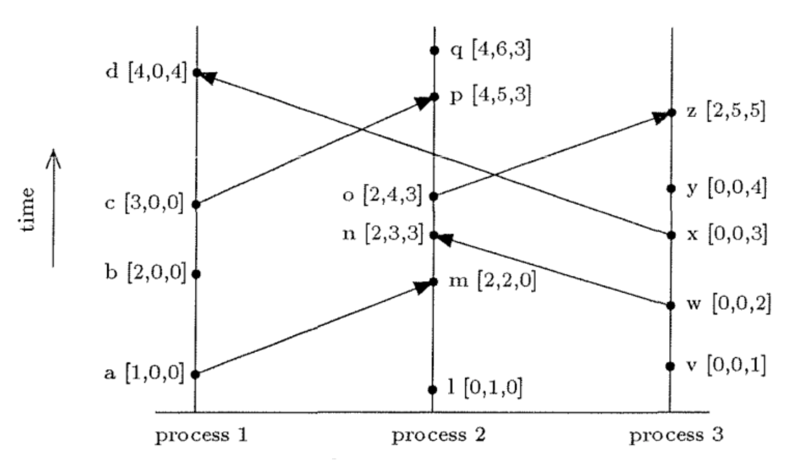

## Vector clocks

Vector clocks are an extension of Lamport clocks and is a fundamental concept in distributed systems, used to **track the partial ordering of events and maintain causality** across different nodes. Unlike traditional timestamps, vector clocks provide a way to determine the order of events **even in the absence of a global clock**, making them crucial for conflict detection and resolution.

The key idea behind vector clocks is that they allow a system to determine whether one event happened before another, whether two events are concurrent, or whether they are causally related. This enables effective conflict resolution and ensuring consistency.

### Use cases

- Conflict resolution in distributed databases
- Version control in collaborative editing
- Detecting causality in event-driven systems
- Distributed debugging and monitoring
- Ensuring consistency in distributed file systems e.g. HDFS
- Concurrency control in distributed transactions

### How it works

Each process in the system maintains a vector (array) of logical clocks, with each element in the vector representing the state of that process’s clock.

```
[C1,C2,C3,...Cn] where n = number of nodes
```

When events occur, these clocks are incremented, and the vectors are exchanged and updated during communication between processes:

1. Initially, all the clocks are set to zero

2. Before executing an event (e.g. database write, sending a message), process i increments the i-th element of its local vector clock by one

```
V[i] = V[i] + 1
```

3. When a process sends a message, it includes a copy of its own timestamp vector

4. When a process receives a message:

- It increments its own logical clock in the vector by one
- For each element in the vector of the received message, update its value by taking the maximum of its own vector clock and the value itself

```
V[i] = V[i] + 1
V[j] = max(V[j], Vmsg[j]) for j != i
```

This simple algorithm maintains consistency among the peers since the sending of a message is always set to “happen before” the receipt of the message.

### Example



For the following events:

```
a -> m
Increment local clock: [0,2,0]
Take max(1, 2): [2,2,0]

w -> n
Increment local clock: [2,3,0]
Take max(3, 2): [2,3,3]
```

For events in the same process:

- In process 1, b -> c since 2 < 3
- In process 2, l -> p since 1 < 5
- In process 3, w -> y since 2 < 4

For events separated by intervening communication between processes:

- b -> q since 2 < 4
- w -> n since 2 < 3
- c -> q since 3 < 4
- a -> z since 1 < 2

## Benefits

### Causality tracking

Vector clocks allow distributed systems to accurately track the causal relationships between events. This helps in understanding the sequence of operations across different nodes, which is critical for maintaining consistency and preventing conflicts.

### Conflict resolution

Vector clocks provide a systematic way to detect and resolve conflicts that arise due to concurrent updates or operations in a distributed system.

### Event ordering

Vector clocks efficiently manage event ordering **without the need for a central coordinator**, which can be a bottleneck in distributed systems.

### Fault tolerance

Vector clocks enhance fault tolerance by enabling the system to handle network partitions or node failures gracefully. Since each node maintains its own version of the clock, the system can continue to operate and later reconcile differences when nodes are reconnected.

### Scalability

Vector clocks scale well in large distributed systems because they do not require global synchronization or coordination. Each process only needs to keep track of its own events and those of other relevant processes.

### Accuracy in versioning

Vector clocks provide precise versioning by capturing the history of events, which is crucial for systems where multiple versions of data or states can exist simultaneously.

## Drawbacks

### Scalability issues

In systems with a large number of nodes, the size of the vector clock **grows linearly** with the number of nodes. This can lead to significant overhead in terms of memory usage and communication costs. Moreover, the entire vector clock will all node timestamps is sent even if only two nodes are interacting.

### Complexity in dynamic systems

Vector clocks assume a relatively stable set of nodes. In highly dynamic systems where nodes frequently join and leave, or where network partitions are common, managing vector clocks becomes challenging and can lead to inconsistencies.

### Partial ordering

Vector clocks only provide a partial ordering of events, meaning they can determine the causal relationship between some events but not all. This can lead to ambiguity in determining the exact order of events.

### Communication overhead

Every time a message is sent between nodes, the vector clock must be included, which increases the size of messages.
