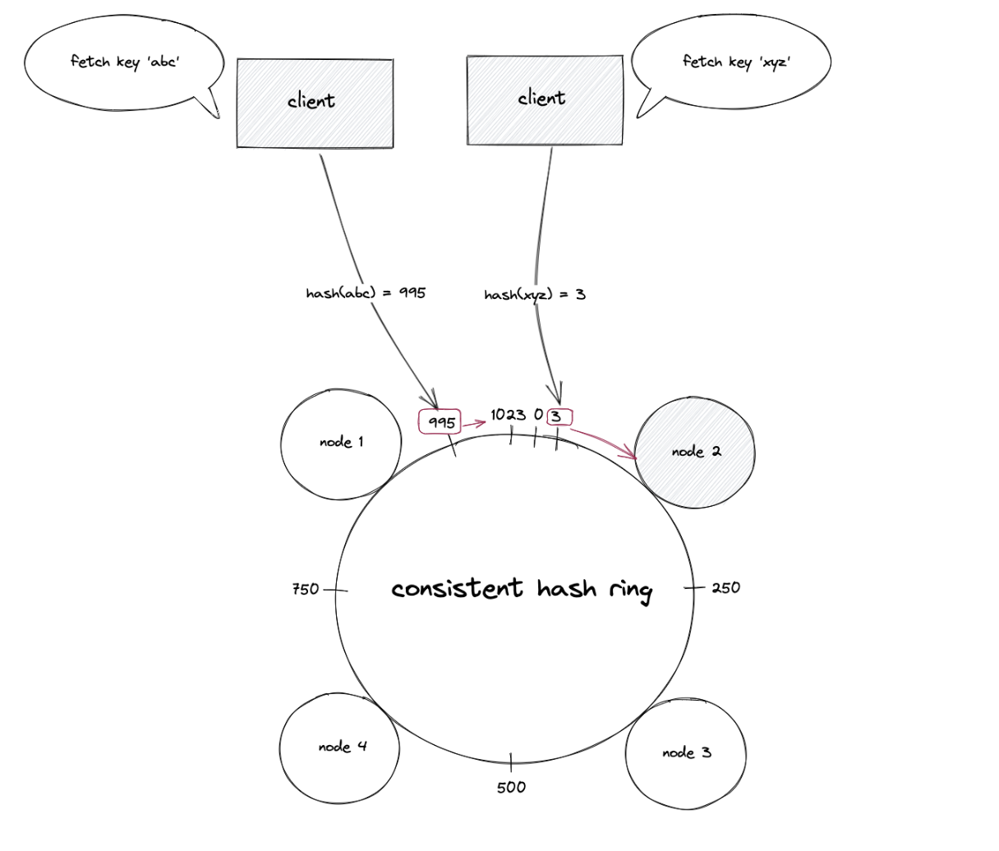
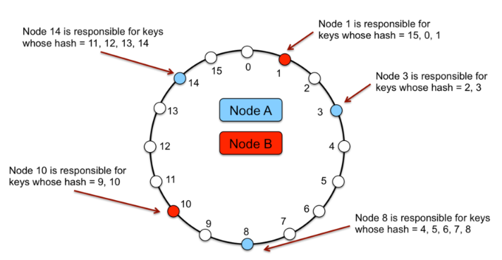
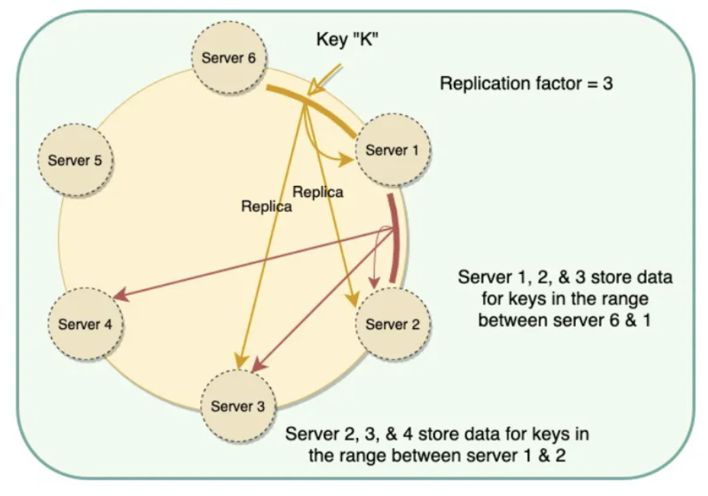

## Challenges of hash-based partitioning

With this approach, setting up the initial shards for a new service is relatively straightforward. However, it effectively fixes the total number of DB servers.

This is because when you want to change the number of shards, it often becomes a complicated process, as the hashing function would route to a different shard than the one they were previously mapped to. This would require redistribution of data and downtime for the service.

```
# for 10 shards
hash(Req) % 10

# for 11 shards
hash(Req) % 11
```

## Consistent hashing

To resolve these kinds of problems, many sharding functions use **consistent hashing functions**. They are special hash functions that are guaranteed to only remap # keys / # shards, when being resized to # shards. Consistent hashing minimizes the number of keys to be remapped when the total number of nodes changes.

The principle advantage of consistent hashing is incremental stability; the departure or arrival of a node into the cluster only affects its immediate neighbours and other nodes remain unaffected.

Consistent Hashing is a distributed hashing scheme that operates independently of the number of servers or objects in a distributed hash table. It powers many high-traffic dynamic websites and web applications.

### How it works

1. The output of the hash function is placed on a virtual ring structure (known as the hash ring)
2. The hashed IP addresses of the nodes are used to assign a position for the nodes on the hash ring
3. The key of a data object is hashed **using the same hash function** to find the position of the key on the hash ring
4. The hash ring is traversed in the clockwise direction starting from the position of the key until a node is found
5. The data object is stored or retrieved from the node that was found



### Addition of node

When a new node is provisioned and added to the hash ring, the keys (data objects) that fall within the range of the new node are moved out from the immediate neighboring node in the clockwise direction.

### Deletion of node

The failure (crash) of a node results in the movement of data objects from the failed node to the immediate neighboring node in the clockwise direction. The remaining nodes on the hash ring are unaffected.

## Virtual nodes (vnodes)

Adding and removing nodes in any distributed system is quite common. Existing nodes can die and may need to be decommissioned. Similarly, new nodes may be added to an existing cluster to meet growing demands. However, there are potential issues associated with a manual and fixed division of ranges:

- **Adding or removing nodes**: Recomputing of tokens results in rebalancing and distributing of data to all other nodes (moving a lot of data); this causes a significant administrative overhead for a large cluster
- **Hotspots**: Since each node is assigned one large range, if the data is not evenly distributed, some nodes can become hotspots
- **Node rebuilding**: Since each node's data might be replicated (for fault-tolerance) on a fixed number of other nodes, when we need to rebuild a node, only its replica nodes can provide the data; this puts a lot of pressure on the replica nodes and can lead to service degradation

To handle these issues, Consistent Hashing introduces a new scheme of distributing the tokens to physical nodes. Instead of assigning a single token to a node, the hash range is divided into multiple smaller ranges, and **each physical node is assigned several of these smaller ranges**. Each of these subranges is considered a vnode.

Vnodes are **randomly distributed** across the cluster and are generally **non-contiguous** so that no two neighbouring vnodes are assigned to the same physical node or rack.

### Benefits

- If a node becomes unavailable, the load handled by this node is evenly dispersed across the remaining available nodes; speeds up rebalancing process
- When a node becomes available again, or a new node is added to the system, the newly available node accepts a roughly equivalent amount of load from each of the other available nodes i.e. many nodes participate in the rebuild process
- The number of virtual nodes that a node is responsible can decided based on its capacity, accounting for heterogeneity in the physical infrastructure
- Having smaller ranges decreases the probability of hotspots



## Replication

Each key is assigned to a coordinator node (generally the first node that falls in the hash range), which first stores the data locally and then replicates it to clockwise successor nodes on the ring. This results in each node owning the region on the ring between it and its predecessor. In an eventually consistent system, this replication is done asynchronously.

The list of nodes that is responsible for storing a particular key is called the **preference list**. To account for node failures, preference list contains more than N nodes.



## Partitioning schemes

### T random tokens per node and partition by token value

In this strategy, each node is assigned T tokens that are chosen uniformly at random from the hash space i.e. key ranges are generated at random. The tokens of all nodes are ordered according to their values in the hash space. Every two consecutive tokens define a range. As nodes join and leave the system, the token set changes and consequently the ranges change.

However, this strategy posed a few problems:

- When a new node joins the system, it needs to "steal" key ranges from other nodes. This is a resource intensive operation as existing nodes have to scan their local persistence store to retrieve the appropriate set of data items. As such, they need to be executed in the background with the lowest priority
- When a node joins/leaves the system, the key ranges handled by many nodes change and the Merkle trees for the new ranges need to be recalculated, which is a non-trivial operation to perform on a production system
- There is no easy way to take a snapshot of the entire key space due to the randomness in key ranges

The fundamental issue with this strategy is that the schemes for **data partitioning and data placement are intertwined** i.e. it is not possible to add nodes without affecting data partitioning.

### T random tokens per node and equal-sized partitions

In this strategy, the hash space is divided into Q equally sized partitions/ranges and each node is assigned T random tokens. Q is usually set such that Q >> N and Q >> `S*T`, where S is the number of nodes in the system.

The tokens are only used to build the function that maps values in the hash space to the ordered lists of nodes and not to decide the partitioning.

### Q/S tokens per node and equal-sized partitions

This strategy divides the hash space into Q equally sized partitions and the placement of partition is decoupled from the partitioning scheme. Moreover, each node is assigned Q/S tokens where S is the number of nodes in the system.

When a node leaves the system, its tokens are randomly distributed to the remaining nodes such that these properties are preserved. Similarly, when a node joins the system it "steals" tokens from nodes in the system in a way that preserves these properties.

This strategy achieves the **best load balancing efficiency** and reduces the size of membership information maintained at each node by three orders of magnitude. Other benefits include:

- Faster bootstrapping and recovery as a partition can be relocated by transferring without random accesses needed to locate specific items
- Ease of archival
