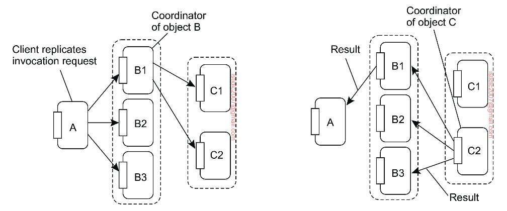

## Replicated invocations

Replicated invocations happen when an object A calls another object B, which calls another object C. If B is replicated, each replica of B will call C independently. The problem is that C is now called multiple times instead of only once.

One solution to this problem is to simply forbid it, which makes sense when performance is at stake.

Another solution is to provide a replication-aware communication layer on top of which replicated objects execute. When a replicated object B invokes another replicated object C, the invocation request is first assigned the same, unique identifier by each replica of B. At that point, a coordinator of the replicas of B forwards its request to all the replicas of object C, while the other replicas of B hold back their copy of the invocation request.

The same mechanism is used to ensure that only a single reply message is returned to the replicas of B. A coordinator of the replicas of C notices it is dealing with a replicated reply message that has been generated by each replica of C. However, only the coordinator forwards that reply to the replicas of object B, while the other replicas of C hold back their copy of the reply message.

