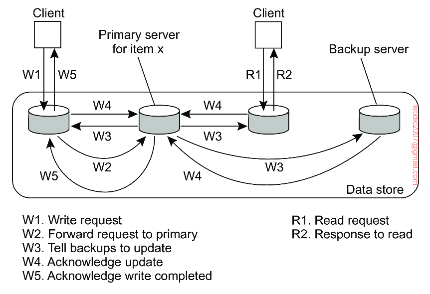
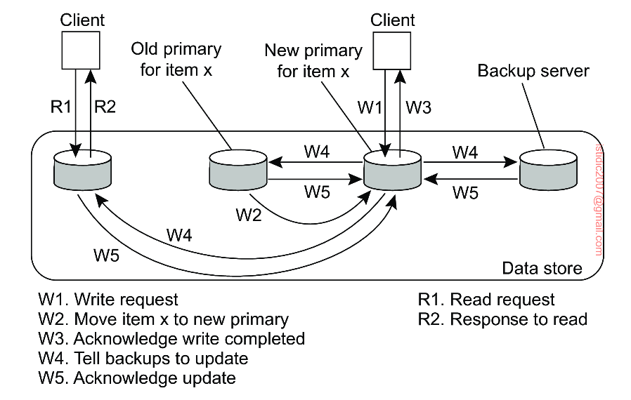

## Protocols

A distinction can be made whether the primary is fixed at a remote server or if write operations can be carried out locally after moving the primary to the process where the write operation is initiated.

## Remote-write protocols

The simplest primary-based protocol that supports replication is the one in which all write operations need to be forwarded to a fixed single server. Read operations can be carried out locally. Updates can be propagated to replicas from primary either synchronously or asynchronously.

## Local-write protocols

A variant of primary-backup protocols is one in which the **primary copy migrates between processes** that wish to perform a write operation.

The main advantage of this approach is that multiple, successive write operations can be carried out locally, while reading processes can still access their local copy. However, such an improvement can be achieved only if a non-blocking protocol is followed by which updates are propagated to the replicas after the primary has finished with locally performing the updates.

