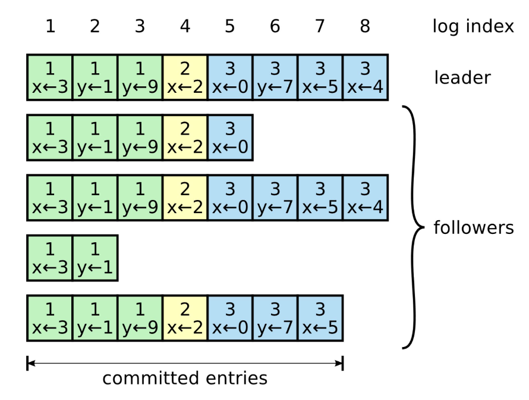

## Raft replication

Raft is one of the algorithms that provide the strongest consistency guarantee possible. It is based on a technique known as **state machine replication**. he main idea behind it is that a single process, the leader, broadcasts the operations that change its state to other processes (followers). If the followers execute the same sequence of operations as the leader, then the state of each follower will match the leader’s. However, the leader can't simply broadcast operations to the followers, as any process can fail at any time.

### State machine replication

When the system starts up, a leader is elected using Raft’s leader election algorithm. The leader is the only process that can make changes to the replicated state. It does so by storing the sequence of operations that alter the state into a local ordered log.

A log is an ordered list of entries where each entry includes:

- The operation applied to the state i.e. 3 to x
- Index of the entry's position in the log
- Term number

How state machine replication works:

1. The leader first appends a new log entry for the operation into its local log
2. Leader sends AppendEntries request to each follower with the new entry to be added
3. The message is sent out periodically, even in the absence of new entries, as it acts as a heartbeat for the leader
4. When a follower receives the request, it appends the entry it received to its log and sends back an acknowledgement
5. When the leader hears back successfully from a majority of followers, it considers the entry to be committed and executes its operation on its local state

### Leader failure (failover)

One of the followers need to be promoted to be the new leader, clients need to be reconfigured to send their writes to the new leader, and other followers need to start consuming data changes from the new leader.

As there are many things that can wrong i.e. crashes, power outages, network issues, there is no foolproof way of detecting what has gone wrong. Instead, nodes frequently bounce messages off between each other, and assumed to be dead after a certain timeout.

It is possible that when a leader fails, some processes are not up-to-date. To avoid that an out-of-date process becomes the leader, a process can’t vote for one with a less up-to-date log i.e. to win an election, the process must contain all committed entries. To determine which of two processes’ logs is more up-to-date, the **index and term** of their last entries are compared.

### Manual failover

Some operation teams prefer to do failover manually due to the following issues:

- If asynchronous replication is used, the new leader may not have received all the writes from the old leader. Most common solution is to discard un-replicated writes, but may violate clients' durability expectations
- Two nodes believe that they are the leader (split brain) and is dangerous as there is no process for resolving conflicts
- Deciding on the right timeout before the leader is declared dead

### Follower failure

If an AppendEntries request can’t be delivered to one or more followers, the leader will retry sending it indefinitely until a majority of the followers successfully appended it to their logs. Retries are harmless as AppendEntries requests are idempotent, and followers ignore log entries that have already been appended to their logs.

When a follower that was temporarily unavailable comes back online, it will eventually receive the latest AppendEntries request. However, if the last log entry does not immediately precede the one to be appended, it will reject the request.

When the request is rejected, the leader retries and sends a message including the last two log entries. This process is repeated until the follower finally accepts a list of log entries that can be appended to its log **without creating a hole**.
