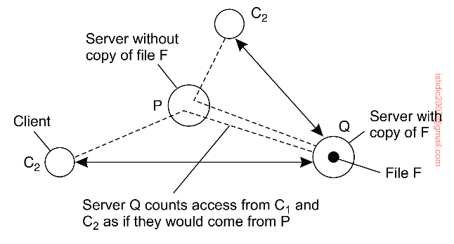

## Replica management

A key issue for any distributed system that supports replication is to decide where and when replicas should be placed, and subsequently which mechanisms to use for keeping the replicas consistent.

## Finding the best server location

There are various ways to compute the best placement of replica servers, but virtually all boil down to an optimization problem in which the best K out of N locations need to be selected (K < N). These problems are known to be computationally complex and can be solved only through **heuristics**.

## Content replication and placement

When it comes to content replication and placement, three different types of replicas can be distinguished.

### Permanent replicas

Permanent replicas can be considered as the initial set of replicas that constitute a distributed data store. Often, the number of permanent replicas is small.

### Server-initiated replicas

Server-initiated replicas are copies of a data store that exist to enhance performance, and created at the initiative of the data store i.e. replication is on-demand.

For example, a Web server placed in New York. Normally, this server can handle incoming requests effortlessly, but it may happen that over a couple of days a sudden burst of requests come in from an unexpected location far from the server. In that case, it may be worthwhile to install a number of temporary replicas in regions where requests are coming from.

### Client-initiated replicas (client caches)

A cache is a local storage facility that is used by a client to temporarily store a copy of the data it has just requested. In principle, managing the cache is left entirely to the client.

Client caches are used only to improve access times to data. Such a cache could be located on the client’s machine, or on a separate machine in the same local-area network as the client.

Data are generally kept in a cache for a limited amount of time to prevent extremely stale data from being used, or simply to make room for other data.

### Dynamic content placement with cooperative caching

Historically, web hosting services offered an often relatively static collection of servers spread across the internet that maintained and provided access to web files. To provide optimal facilities, such hosting services dynamically replicated files to servers where those files are needed to enhance performance i.e. closer to groups of clients.

The algorithm for dynamic replication takes two issues into account:

- Replication can take place to reduce the load on a server
- Specific files can be migrated/replicated to servers placed in the proximity of clients that issue many requests for those files

How the algorithm works:

- Each server keeps track of access counts per file, and where access requests come from
- When the number of requests for a specific file F at server S drops below a deletion threshold del(S,F), the file can be removed from S; however, special measures must be taken to ensure that at least one copy of each file exists
- A replication threshold rep(S,F) is always chosen higher than the deletion threshold
- If the number of requests lies between deletion and replication thresholds, the file is allowed to be only migrated
- Migration may not always succeed, as the server may be heavily loaded or is out of disk space; replication to other servers is then performed
- Replication takes place only if the total number of access requests exceeds the replication threshold

