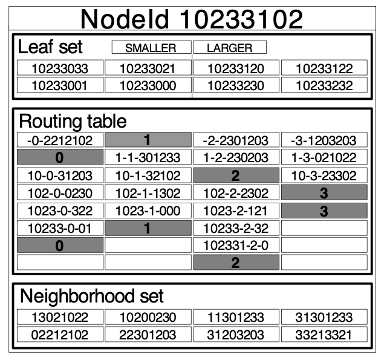

## PAST

PAST is a large-scale peer-to-peer persistent storage utility. The storage nodes form a **self-organizing, internet-based overlay network** that cooperatively route file queries, store multiple replicas of files, and cache additional copies of popular files.

Each PAST node is capable of initiating and routing client requests to insert or retrieve files i.e. acts as an access point for the user. Optionally, nodes may also contribute storage to the system.

In the PAST system, storage nodes and files are each assigned uniformly distributed identifiers, and replicas of a file are stored at nodes whose identifier matches most closely the file’s identifier. The set of nodes over which a file is replicated is diverse in terms of geographic location, ownership, administration, network connectivity, rule of law, etc.

### Storage semantics

While PAST offers persistent storage services, its semantics differ from that of a conventional filesystem. Files stored in PAST are associated with a **quasi-unique fileId** that is generated at the time of insertion. Hence, files stored are **immutable** since a file cannot be inserted multiple times with the same fileId.

### Nodes

Each PAST node is assigned a 128-bit node identifier, called a nodeId. The nodeId indicates a node’s position in a **circular namespace** i.e. similar to a hashing ring.

The nodeId assignment is **quasi-random** and cannot be biased by a malicious node operator. This process ensures that there is no correlation between the value of the nodeId and the node’s geographic location, network connectivity, ownership, or jurisdiction. It follows then that a set of nodes with adjacent nodeIds are highly likely to be **diverse** in all these aspects.

During an insert operation, PAST stores the file on the k PAST nodes whose nodeIds are **numerically closest** to the 128 most significant bits (msb) of the file’s fileId. This invariant is maintained over the lifetime of a file, despite the arrival, failure and recovery of PAST nodes.

## Pastry

Pastry is a peer-to-peer routing substrate that is efficient, scalable, fault resilient and self-organizing. It is an efficient routing scheme that ensures client requests are reliably routed to the appropriate nodes. Client requests to retrieve a file are routed with high probability to a node that is close in the network to the client, among the live nodes that store the requested file. Hence, Pastry **integrates content location and routing**.

Assuming a PAST network of N nodes, Pastry can route to the numerically closest to the 128 msbs of the fileId, among all live nodes, in less than log2bN steps.

### Configuration parameters

The tables required in each PAST node have only `(2^b −1)*⌈log2bN⌉+2l` entries. The typical values of configuration parameters are:

- b: 4
- l: 32

### Routing

Each node maintains IP addresses for the nodes in its leaf set, neighborhood set, and routing table.



#### Routing table

Entries in the routing table are chosen to refer to a nearby node, in terms of the proximity metric, with the appropriate nodeId prefix.

At each level n of the routing table, the entries refer to a node whose nodeId shares the present's nodeId in the first n digits, but whose n+1th digit has one of the 2^b-1 possible values other than the n+1th digit in the present node's id.

```
10233102 - next digit - rest of nodeId

level 0:
-0-2212102
N/A
-2-2301203
-3-1203203

level 1:
N/A
1-1-3011233
1-2-2302303
1-3-021022

level 3:
102-0-0230
-102-1-1302
-102-2-2302
N/A
```

#### Leaf set

The leaf set is the set of nodes relative to the present nodeId:

- l/2 nodes with numerically closest smaller nodeIds
- l/2 numerically closest larger nodeIds

#### Neighborhood set

The neighborhood set is a set of l nodes that are near the present node, according to the proximity metric. It is not used in routing, but is useful during node addition/recovery.

#### Heuristic

In each routing step, a node normally forwards the message to a node whose nodeId shares with the fileId a prefix that is at least one digit (or b bits) longer than the prefix that the fileId shares with the present node’s id.

If no such node is known, the message is forwarded to a node whose nodeId shares a prefix with the fileId as long as the current node, but is numerically closer to the fileId than the present node’s id. Such a node must be in the leaf set unless the message has already arrived at the node with numerically closest nodeId. And, unless ⌊l/2⌋ adjacent nodes in the leaf set have failed simultaneously, at least one of those nodes must be live.

This local heuristic obviously cannot achieve globally shortest routes, but simulations have shown that the average distance traveled by a message (proximity metric) is only 50% higher than the corresponding 'distance' of the source and destination in the underlying network.

Moreover, since Pastry repeatedly takes a locally “short” routing step towards a node that shares a longer prefix with the fileId, messages have a tendency to first reach a node, among the k nodes that store the requested file, that is near the client, according to the proximity metric.

### Node addition and failure

A key design issue in Pastry is how to efficiently and dynamically maintain the node state, i.e., the routing table, leaf set and neighborhood sets, in the presence of node failures, node recoveries, and new node arrivals.

An arriving node with the newly chosen nodeId X can initialize its state as follows:

1. It contacts a “nearby” node A (according to the proximity metric) and asks A to route a special message with the destination set to X
2. This message is routed to the existing node Z with nodeId numerically closest to X
3. X then obtains the leaf set from Z, the neighborhood set from A, and the ith row of the routing table from the ith node encountered along the route from A to Z

To handle node failures, neighboring nodes in the nodeId space **periodically exchange keep-alive messages**. If a node is unresponsive for a period T, it is presumed failed. All members of the failed node’s leaf set are then notified and they update their leaf sets to restore the invariant i.e. removes the failed node from its leaf set and instead includes the live node with the next closest nodeId.

When a node has recovered, a similar adjustment of the leaf set occurs in the nodes that constitute the leaf set of the joining node. The recovering node:

1. Contacts the nodes in its last known leaf set
2. Obtains their current leafs sets and updates its own leaf set
3. Notifies the members of its new leaf set of its presence i.e. joining node is included and another node is dropped from each of the previous leaf sets

### Security

Each PAST node and each write user of the system holds a smartcard, which consists of a private/public key pair. Each smartcard’s public key is signed with the smartcard issuer’s private key for certification purposes.

The smartcards ensure the integrity of nodeId and fileId assignments, thus preventing an attacker from controlling adjacent nodes in the nodeId space, or directing file insertions to a specific portion of the fileId space.

Pastry is deterministic and thus vulnerable to malicious or failed nodes along the route that accept messages but do not correctly forward them i.e. causing DDoS. This would cause repeated queries to fail each time. To overcome this problem, the routing is **randomized**.

To avoid routing loops, a message must always be forwarded to a node that shares at least as long a prefix with, but is numerically closer to the destination node in the namespace than the current node. The choice among multiple such nodes is random.

## Storage management

Given typical file size distributions and non-uniform storage node capacities, to achieve high global storage utilization, a storage management scheme needs to be implemented.

The responsibilities of the storage management are to:

1. Balance the remaining free storage space among nodes in the PAST network as the system-wide storage utilization is approaching 100%
2. Maintain the invariant that copies of each file are maintained by the k nodes with nodeIds closest to the fileId

Both goals appear to be conflicting, since requiring a file to be stored on k nodes leaves no room for any explicit load balancing. This can be resolved using **replica diversion**.

### Replica diversion

The purpose of replica diversion is to balance the remaining free storage space among the nodes in a leaf set, in the event the kth node closest to the fileId is full. Replica diversion is accomplished as follows:

1. When an insert request message first reaches a node with a nodeId among the k numerically closest to the fileId, it checks to see if it can accommodate a copy of the file in its local disk
2. If it can, it stores the file, issues a store receipt, and forwards the message to the other k-1 nodes with nodeIds closest to the fileId
3. Each of these nodes in turn attempts to store a replica and returns a store receipt
4. If a node A cannot accommodate a copy locally, it considers replica diversion by choosing a node B that is not among k closest and does not hold a diverted replica of the file
5. Node A enters an entry for the file with a pointer to B

Care must be taken to ensure that a diverted replica contributes as much towards the overall availability of the file as a locally stored replica:

1. Failure of node B causes the creation of a replacement replica
2. Failure of node A does not render the replica stored on B inaccessible

Condition 2 can be achieved by entering a pointer to the replica stored on B into the file table of the node C with the **k+1th closest** nodeId to the fileId.

### File diversion

When a file insert operation fails because the k nodes closest to the chosen fileId could not accommodate the file nor divert the replicas locally within their leaf set, a negative acknowledgment is returned to the client node. The client node in turn **generates a new fileId** using a different salt value and retries the insert operation.

A client node then repeats this process for up to three times. If, after four attempts the insert operation still fails, the operation is aborted and an insert failure is reported to the application. Such a failure indicates that the system was not able to locate the necessary space to store k copies of the file. In such cases, an application may choose to retry the operation with a smaller file size or smaller number of replicas.

### Maintaining replicas

PAST maintains the invariant that k copies of each inserted file are maintained on different nodes within a leaf set.

When a node enters or leaves, adjustments are made in the corresponding leaf sets. To maintain storage invariant, replicas need to be re-created that were previously held by failed nodes. Similarly, a node may cease to be one of the k nodes for certain files; the invariant allows a node to discard such copies.

Given the current ratio of disk storage versus wide-area Internet bandwidth, it is time-consuming and inefficient for a node to request replicas of all files for which it has just become one of the k numerically closest nodes.

To solve this problem, the joining node may instead **install a pointer** in its file table, referring to the node that has just ceased to be one of the k numerically closest to the fileId, and requiring that node to keep the replica. The affected files can then be gradually migrated to the joining node as part of a background operation.

### File encoding

Storing k complete copies of a file is not the most storage-efficient method to achieve high availability. Instead, Reed-Solomon encoding can be employed.
