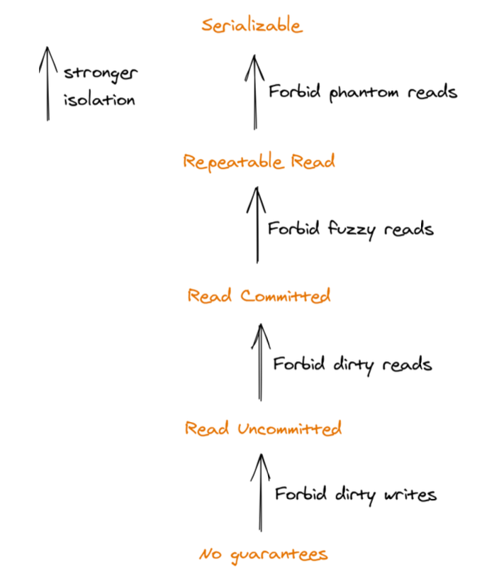

## Isolation

A set of concurrently running transactions that access the same data can run into all sorts of race conditions.

To protect against these race conditions, a transaction needs to be **isolated** from others. An isolation level protects against one or more types of race conditions and provides an abstraction that we can use to reason about concurrency. The stronger the isolation level is, the more protection it offers against race conditions, but the less performant it is.

**Serializability** is the only isolation level that guards against all possible race conditions. It guarantees that the side effects of executing a set of transactions appear to be the same as if they had executed sequentially, one after the other. However, there are many possible orders that the transactions can appear to be executed in, as serializability doesn’t say anything about which one to pick.

