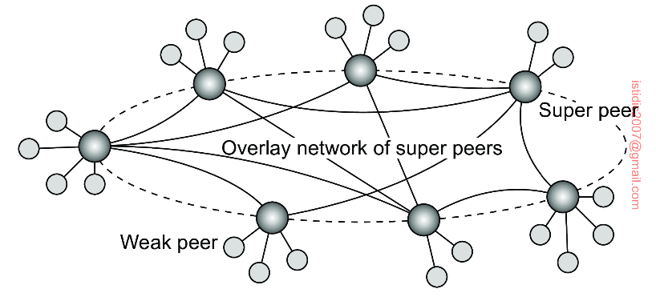

## Hierarchically organized peer-to-peer networks

In unstructured peer-to-peer systems, locating relevant data items can become problematic as the network grows. As an alternative, many peer-to-peer systems have proposed to make use of **special nodes that maintain an index of data items**.

For example, in CDN, nodes may offer storage for hosting copies of data. What is needed is a means to find out where documents can be stored best. In that case, making use of a **broker** that collects data on resource usage and availability for several nodes that are in each other’s proximity allows selecting a node quickly with sufficient resources.

Nodes such as those maintaining an index or acting as a broker are generally referred to as **super peers**. Super peers are often also organized in a peer-to-peer network, leading to a hierarchical organization. In this organization, every regular peer (weak peer) is connected as a client to a super peer. All communication from and to a weak peer proceeds through that peer’s associated super peer.

### Association

Often, the association between a weak peer and its super peer is fixed: whenever a weak peer joins the network, it attaches to one of the super peers and remains attached until it leaves the network.

To compensate for potential unstable behavior of a super peer, backup schemes can be deployed, such as pairing every super peer with another one and requiring weak peers to attach to both.

However, having a fixed association may not always be the best solution. For instance, in file-sharing networks, it may be better for a weak peer to attach to a super peer that maintains an index of files that the weak peer is currently interested in.

### Selecting super peer

Leader-election can be used to select the node that is eligible to become super peer.
