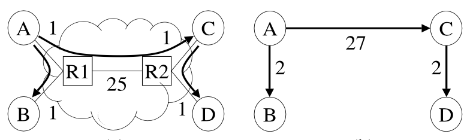
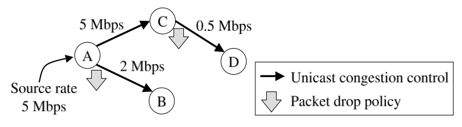

## End System Multicast

An alternate architecture called End System Multicast is proposed, where all multicast related functionality, including group management and packet replication, is implemented at **end systems**.

In End System Multicast, nodes participating in a multicast group, or proxies that operate on their behalf, organize themselves into overlay spanning trees for data delivery. In this architecture, end systems participating in a multicast group **self-organize into an overlay structure using a completely distributed protocol**. Further, end systems attempt to optimize the efficiency of the overlay by adapting to network dynamics and considering application level performance.

### Benefits

A key feature of End System Multicast is that it enables application customizable protocols and architectural decisions. Also, the performance penalty of using overlays can be acceptably low.

### Self-organizing protocols

A fundamental challenge is providing a method for nodes to self-organize into an overlay network that efficiently forwards multicast packets. The self-organizing protocols primarily consist of two components:

- **Group management**: Ensures that the overlay remains connected in the face of dynamic group membership and failure of members
- **Overlay optimization**: Ensures that the quality of the overlay remains good over time by monitoring network performance

## Architecture

End System Multicast occurs in two distinct architectural flavors.

### Peer-to-peer

All functionality is pushed to the end hosts participating in the multicast group i.e. decentralized. An attractive property is that it is completely distributed and supports scaling as each host keeps state only for the small number of groups in which it participates.

### Proxy

In proxy architecture, end hosts attach themselves to proxies near them and receive data using plain unicast. Proxy based architectures have several advantages including:

- Multiple multicast groups may share the same proxy service, which enables sharing of network performance information across groups and hence, reducing the number of active measurements needed in constructing overlays
- Proxies are persistent beyond the lifetime of individual groups
- Proxy environments have more stable network performance and can leverage QoS infrastructure on the network more easily

## Implementation

### Direct construction of tree

One approach is to construct the tree directly i.e. members explicitly select their parents from among the members they know.

### Two-step process

Another approach is to adopt a two-step process:

1. Construct a richer connected graph called a mesh using protocols like **Narada protocol**
2. Construct shortest path spanning trees of the mesh, with each tree rooted at the corresponding source using well-known routing algorithms

When network congestion occurs, overlays need to adapt by making appropriate topology changes in a timely fashion to ensure good and stable application performance. Basic mechanisms in Narada protocol can be retained to improve the quality of the mesh itself:

- Members probe non-neighbors at random, and may add a new link to the mesh if the utility gain of adding the link exceeds a threshold
- Members monitor existing links, and drop them if the cost of dropping the link falls below a threshold

## Congestion control

For streaming media applications, congestion control is ensured on each individual overlay link by running some TCP-friendly protocol. An overlay node adapts to a bandwidth mismatch between the upstream and downstream links by dropping packets.

## Dealing with metrics

Internet environments are dynamic, heterogenous and unpredictable. In order to meet stringent performance requirements, it is necessary for self-organizing protocols to **adapt to both latency and bandwidth metrics**, yet remain resilient to network noise and inaccuracies inherent in the measurement of these quantities.

Constructing an overlay optimized for both latency and bandwidth can be difficult.

The simplest way is to create a function of both metrics. However, it is not clear how this function can reflect the bandwidth and latency accurately.

A second approach is to **treat the two metrics explicitly** and with equal importance. Thus, a change would be made to the overlay if either the bandwidth or the latency improves as a result of that change. However, this approach could lead to oscillations when confronted with two conflicting options, one with better latency, and the other with better bandwidth but poorer latency. Instead, we can prioritize one over another i.e. bandwidth over latency.

### Latency

Latencies of links can be determined by periodically exchanging packets with neighbors and estimating the round trip time (RTT). Link latency is assumed to be half of RTT.

Alternatively, when the underlying transport protocol allows, you can directly obtain RTT estimates by querying the transport protocol.

### Bandwidth

Bandwidth can be estimated by monitoring the performance of links when there is data flow between them. Members periodically advertise the rates at which they are transferring data to their neighbors along a mesh link. You can treat the estimate as the **lower bound** of advertised and actual rates.

Bandwidth estimates of links not in the mesh are currently determined using active end-to-end measurements. This involves transferring data using the underlying transport protocol for a fixed period of time, but at a rate bounded by the maximum source rate.

As active measurements can have a high overhead, there are simple techniques that can be employed to minimize the number of such measurements:

1. If a member is receiving poor performance because of congestion on its local access link, it does not probe any other member. A simple heuristic to determine congestion is to **ping the first hop router** on the member's path and check if it exceeds a threshold
2. Member A conducts an active measurement only if member B gets good performance from others, but has the potential to improve A's performance
