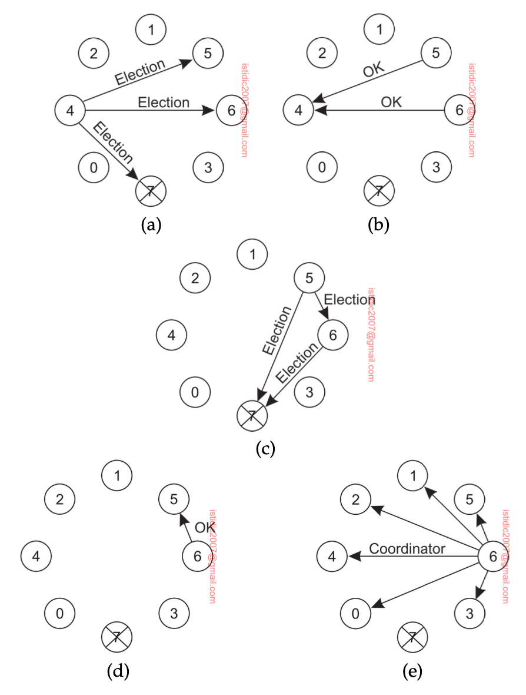

## Election algorithms

Many distributed algorithms require one process to act as coordinator, initiator, or otherwise perform some special role. In general, election algorithms attempt to locate the process with the highest identifier and designate it as coordinator.

### Bully algorithm

A well-known solution for electing a coordinator is the bully algorithm. When any process notices that the coordinator is no longer responding to requests, it initiates an election as follows:

1. Process sends an ELECTION message to all processes with higher identifiers
2. If no one responds, that process wins the election
3. If one of the higher-ups answers, it takes over the election process and repeats the steps
4. Once a new coordinator is elected, it sends a COORDINATOR message and bully the other processes into submission

### Raft

Raft operates in a setting in which a handful of known replicated servers (typically five) collaborate by ensuring that each server executes the same set of operations, and all in the same order. To this end, one of the servers is elected as leader to tell the others what the exact order is of those operations.

## Elections in large-scale systems

Many leader-election algorithms apply to only relatively small distributed systems. However, it becomes nasty when there are potentially many processes to choose from e.g. permissionless blockchains.

### Proof of work

A relatively simple yet heavily criticized solution is to have candidates run a computational race, referred to as **proof of work**. This involves solving a computational puzzle that is possible but difficult. The first process solving the puzzle, wins, and may proceed as leader to append a block of validated transactions to the existing blockchain.

### Proof of stake

As a reaction to the waste of computational resources found in proof-of-work systems, much effort has been spent on alternative leader-election algorithms for permissionless blockchains. An important class is formed by **proof-of-stake** systems.
