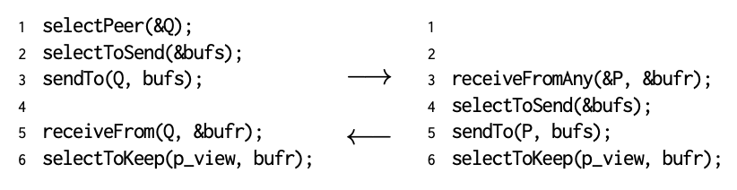

## Gossip-based coordination

Gossiping can be used to discover nodes that have a few outgoing wide-area links, to subsequently apply directional gossiping.

### Aggregation

An application area of gossiping is aggregating information such as the average:

1. Every node chooses an arbitrary number, Vi
2. When node Pi contacts node Pj, they each update their value as:

```
Vi, Vj <- (Vi + Vj) / 2
```

3. Eventually, all nodes will have the same value, which is the average of all initial values

Computing the average may be useful for **estimating the size of the system**. If there are N nodes, and all nodes Pi have Vi set to 0 except for P1 who has set it as 1, eventually each node will compute the average, which is 1/N.

However, computing the average may be difficult when nodes regularly join and leave the system. One practical solution is to introduce epochs. Assuming that node P1 is stable, it simply starts a new epoch now and then. When node Pi sees a new epoch for the first time, it resets its own variable vi to zero and starts computing the average again.

Other results can also be computed including maximum and minimum.

### Large-scale peer sampling

An important aspect in epidemic protocols is the ability of a node P to choose another node Q at random from all available nodes in the network. Each node maintains a list of c neighbors (**partial view**), where, ideally, each of these neighbors represents a randomly chosen live node from the current set of nodes.

There are many ways to construct a partial view. One solution is to assume that nodes regularly exchange entries from their partial view. Two threads are used, active and passive threads.

Selection operations are as follows:

- selectPeer: Randomly select a neighbor from the local partial view
- selectToSend: Select some other entries from partial view, and add to the list intended for the selected neighbor
- selectToKeep: Add received entries to the partial view, remove repeated items, and shrink the view to c items



The active thread:

1. Takes the initiative to communicate with another node
2. It selects a node from its current partial view
3. It constructs a new list containing c/2 + 1 entries, including an entry identifying itself
4. It sends the list to the selected neighbor and waits for a response
5. Runs an exchange algorithm to refresh its partial view

The passive thread:

1. Receives a response from the active thread of another node
2. Constructs a similar list of its partial view and sends to the node that contacted it
3. Runs an exchange algorithm to refresh its partial view

As long as peers regularly run the exchange algorithm (i.e. refreshed regularly and randomly), selecting a random peer from a thus dynamically changing partial view, is statistically indistinguishable from randomly selecting a peer from the entire network.

### Overlay construction

One key observation is that by carefully exchanging and selecting entries from partial views, it is possible to construct and maintain specific topologies of overlay networks.

## Secure gossiping

Gossiping is an attractive means for coordination. However, the speed by which a large collection of nodes manages to synchronize, is also an **inherent vulnerability**. The time it takes to exchange and disseminate proper information is also the time it takes to spread false information.

An example of an attack could be such that each attacker node also maintains a partial view, but when returning c/2 references, only references to other colluding attackers are returned. Gradually, the partial view of each benign node in the network is polluted by references to the attackers.

For a benign node to detect that it is under attack, and countermeasures it can take to mitigate the effects of an attack, a solution is to use **peer sampling**. Eventually, many nodes will be referencing a very small set of nodes, and for most nodes, the indegree will be low (or zero), and others will be extremely high.

When a benign node initiates an exchange of links with a selected node, it will process the returned links either for updating its own partial view, or for gathering statistics. Moreover, to accelerate the process of discovering attackers, a node will **initiate several link exchanges simultaneously**, and process only one of the replies. A malicious node is now faced with a dilemma: always returning references to its colluders will quickly reveal the attackers. The only thing that it can do, is occasionally play by the rules and return links to other, benign nodes. As it turns out, this dilemma is enough to force the attackers to behave decently enough, effectively rendering an attack useless.
