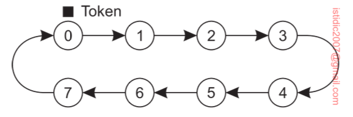

## Mutual exclusion

Fundamental to distributed systems is the concurrency and collaboration among multiple processes. In many cases, this also means that processes will need to simultaneously access the same resources. To prevent that such concurrent accesses corrupt the resource, or make it inconsistent, solutions are needed to grant mutual exclusive access by processes.

## Token-based

In token-based solutions mutual exclusion is achieved by passing a special message between the processes, known as a **token**. There is only one token available, and who ever has that token is allowed to access the shared resource. When finished, the token is passed on to a next process.

### Token-ring algorithm

In software, we construct an overlay network in the form of a logical ring in which each process is assigned a position in the ring. All that matters is that each process knows who is next in line after itself. The token circulates around the ring.

When the ring is initialized, process P0 is given a token. The token circulates around the ring. When a process acquires the token from its neighbor, it checks to see if it needs to access the shared resource. If so, the process goes ahead, does all the work it needs to, and releases the resources. After it has finished, it passes the token along the ring. If a process is handed the token by its neighbor and is not interested in the resource, it just passes the token along.

Benefits of using token-ring include:

- Ensures that every process will get a chance at accessing the resource
- Provides guarantees for safety by avoiding starvation
- Avoids deadlocks

However, there are a couple of drawbacks:

- When token is lost, a complex distributed procedure needs to be started to ensure that a new token is created, and that only one is created
- Detecting a lost token is difficult, since the amount of time between successive appearances of the token on the network is unbounded

## Permission-based

In this case, a process wanting to access the resource first requires the permission from other processes. There are many ways toward granting such permission.

### Centralized algorithm

A straightforward way to achieve mutual exclusion in a distributed system is to simulate how it is done in a one-processor system. One process is elected as the coordinator e.g. Zookeeper.

Whenever a process wants to access a shared resource, it sends a request message to the coordinator stating which resource it wants to access and asking for permission. If no other process is currently accessing that resource, the coordinator sends back a reply granting permission.

However, this approach has shortcomings. The coordinator is a single point of failure, so if it crashes, the entire system may go down. If processes normally block after making a request, they cannot distinguish a dead coordinator from “permission denied” since in both cases no message comes back. Also, in a large system, a single coordinator can become a performance bottleneck.

### Fencing token

Having distributed locks is not sufficient to guarantee that there can’t be more than one leader in your application writing to a shared database. This is demonstrated as follows:

- Client 1 acquires lock but encounters GC pause i.e. reading an address not loaded into memory, reading from congested network, SIGSTOP signal to process, etc.
- The lock timeouts from lease expiry
- Client 2 acquires lock and writes to the database
- Client 1 wakes up and makes an unsafe write to the database

You cannot fix this problem by inserting a check on the lock expiry just before writing back to storage as it does not eliminate the race condition, but makes it less likely. Instead, the solution is to include a **fencing token** with every write request to the storage service.

A fencing token is a number that increases every time distributed lock is acquired i.e. a **logical clock**. When the leader writes to the store, it passes down the fencing token to it. The store remembers the value of the last token and accepts only writes with a greater value.

### Distributed algorithm

Using Lamport's logical clocks, this solution requires a total ordering of all events in the system. For any pair of events, such as messages, it must be **unambiguous** which one actually happened first.

How this algorithm works:

1. When a process wants to access a shared resource, it builds a message containing the name of the resource, process number, and current logical time
2. The process sends the message to all other processes
3. When the receiver receives a request message, the action it takes depends on its own state regarding the shared resource:
   - If the receiver is not accessing the resource, it sends OK message
   - If the receiver already has access to the resource, it does not reply and queues the request
   - If the receiver wants to access the resource, it compares the timestamp, where lowest one wins

After sending out requests asking permission, a process sits back and waits until everyone else has given permission. As soon as all the permissions are in, it may go ahead. When it is finished, it sends OK messages to all processes in its queue and deletes them all from the queue.

With this algorithm, mutual exclusion is guaranteed without deadlock or starvation. If the total number of processes is N, then the number of messages that a process needs to send and receive before it can enter its critical region is `2*(N-1)`.

However, this algorithm has N points of failure. If any process crashes, it will fail to respond to requests. This silence will be interpreted (incorrectly) as denial of permission, thus blocking all subsequent attempts by all processes to enter any of their respective critical regions. Also, all processes are involved in all decisions concerning accessing the shared resource, which may impose a burden on processes running on resource-constrained machines.

### Decentralized algorithm

This solution proposes to use a voting algorithm. ach resource is assumed to be replicated N times. Every replica has its own coordinator for controlling the access by concurrent processes.

Whenever a process wants to access the resource, it will simply need to get a majority vote from m > N/2 coordinators.

If permission to access the resource is denied, it is assumed that it will back off for some randomly chosen time, and make a next attempt later. The problem with this scheme is that if many nodes want to access the same resource, it turns out that the utilization rapidly drops. In that case, there are so many nodes competing to get access that eventually no one can get enough votes, leaving the resource unused.

## Application

Virtually all algorithms suffer badly in the event of crashes. Special measures and additional complexity must be introduced to avoid having a crash bring down the entire system. It is somewhat ironic that distributed algorithms are generally more sensitive to crashes than centralized ones.

In this sense, **centralized mutual exclusion with fencing token is widely applied**: it is simple to understand the behavior, and relatively easy to increase the fault tolerance of the centralized server.

## Record append

In a traditional write, clients specify the location/offset at which a mutation is performed. However, this requires additional complicated and expensive lock synchronization for concurrent operations e.g. distributed lock manager.

Instead, a record append can be employed, whereby the client specifies only the data to append. Concurrent writes can be reconciliated by the primary replica using logical clocks and last-write-wins method. All secondary replicas will then follow the record append from the primary.

To improve performance, record appends can be buffered before writing to disk.
