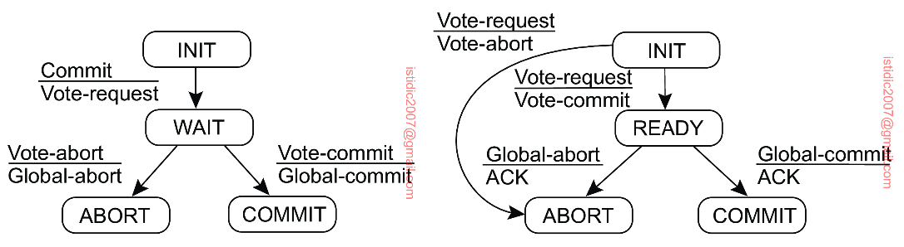

## Distributed commit

The distributed commit problem involves having an operation being performed by each member of a process group, or none at all. Distributed commit is often established by a coordinator.

## 2PC (Two-Phase Commit)

2PC is an algorithm used in distributed databases for achieving atomic transaction commit across multiple nodes i.e. ensures all nodes commit or abort.

The coordinator is often implemented as a library within the same application process that is requesting the transaction, but can be a separate process or service. Examples include Narayana, JOTM, BTM or MSDTC.

### How it works

The protocol consists of two phases, voting phase and decision phase:

1. Coordinator sends a VOTE-REQUEST message to all participants
2. When a participant receives a VOTE-REQUEST message, it returns either a VOTE-COMMIT or VOTE-ABORT message back to the coordinator
3. The coordinator collects all votes from the participants and if all have voted to commit, so will the coordinator. If one participant aborts, the coordinator will abort the transaction and multicasts a GLOBAL-ABORT message
4. Each participant that voted for a commit waits for the final reaction by the coordinator

### Why it works

Although the prepare and commit requests can just as easily be lost, 2PC ensures atomicity:

1. When the application begins a distributed transaction, it requests a transaction ID from the coordinator
2. Application begins a single-node transaction on each node
3. When application is ready to commit, the coordinator sends a prepare request to all nodes, tagged with the global transaction ID. If any of the requests fails, the coordinator sends an abort request to all nodes
4. When a participant receives the prepare request, it makes sure it can definitely commit under all circumstances (crash, power failure, insufficient disk space are not acceptable excuses)
5. When the coordinator has received all responses, it makes a definitive decision to commit or abort the transaction. It must write that decision to its transaction log on disk (known as the commit point or 'point of no return')
6. Coordinator sends commit request to all participants. If request fails, the coordinator must retry forever until it succeeds and there is no more going back

### Drawbacks

Several problems arise when this basic 2PC protocol is used in a system where failures occur.

The main drawback of this protocol is that it cannot generally efficiently handle the failure of the coordinator.

Moreover, both the coordinator as well as the participants have states in which they block waiting for incoming messages. If the coordinator crashes, it may be possible that a participant will need to block until the coordinator recovers.

Consequently, the protocol can easily fail when a process crashes, as other processes may be indefinitely waiting for a message from that process. For this reason, timeout mechanisms are used.

## 3PC

A problem with the 2PC protocol is that when the coordinator has crashed, participants may not be able to reach a final decision. Consequently, participants may need to remain blocked until the coordinator recovers.

A solution to is a variant of 2PC called 3PC that avoids blocking processes in the presence of fail-stop crashes. Although 3PC is widely referred to in the literature, it is not applied often in practice, as the conditions under which 2PC blocks rarely occur.

## Distributed transactions in practice

Although 2PC helps to provide an important safety guarantee, distributed transactions are often criticized for causing operational problems, killing performance, and promising more than they can deliver. Hence, many cloud services choose not to implement distributed transactions.
