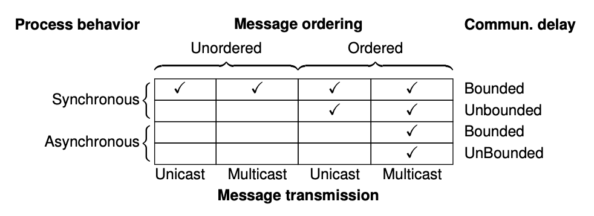

## Limitations on realizing fault tolerance

Organizing replicated processes into a group helps to increase fault tolerance. However, there is a price to pay, which is the potential loss of performance.

### Reaching consensus

There are three requirements for reaching consensus:

1. Processes produce the same output value
2. Every output value must be valid
3. Every process must eventually provide output

Some examples where reaching consensus is necessary include electing a coordinator, deciding whether to commit a transaction, and dividing up tasks among workers. When the communication and processes are all perfect, reaching consensus is often straightforward, but when they are not, problems arise.

The general goal of distributed consensus algorithms is to have all the non-faulty processes reach consensus on some issue, and to establish that consensus within a finite number of steps. Such cases include:

- Synchronous (lock-step mode) vs asynchronous systems
- Bounded vs unbounded communication delay; bounded is when every message is delivered with a globally and pre-determined maximum time
- Ordered vs unordered message delivery
- Unicasting vs multicasting message transmission

Most distributed systems assume that process behave asynchronously, message transmission is multicast, and communication delays are unbounded. As a consequence, ordered (reliable) message delivery is needed, such as TCP.

### CAP theorem

In a network subject to communication failures, it is impossible to realize an atomic read/write shared memory that guarantees a response to every request. The CAP theorem is all about reaching a trade-off between safety and liveness, based on the observation that obtaining both in an inherently unreliable system cannot be achieved. Practical distributed systems are inherently unreliable.
