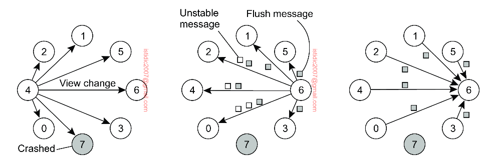

## Atomic multicast

What is often needed in a distributed system is the guarantee that a message is delivered to either all (nonfaulty) group members or to none i.e. all-or-nothing. This is also known as the **atomic multicast problem**. An atomic multicast is the strongest form of reliable delivery.

### Why atomicity is important

Consider a replicated database constructed as an application on top of a distributed system. Update operations are always multicasted to all replicas and subsequently performed locally. If replica P multicasts an update but crashes before it completes, it will lead to an **inconsistent** replicated database.

Hence, we need a way to do reliable multicast in the presence of process failures. To achieve this, we make a distinction between receiving and delivering a message. In particular, we adopt a model in which the distributed system consists of message-handling components (middleware).

## Virtual synchrony

Virtual Synchrony is a mechanism or algorithm tackling the atomic multicast problem.

Atomic multicasting can be precisely formulated in terms of a virtual synchronous execution model. In essence, this model introduces boundaries between which group membership does not change and which messages are reliably transmitted. A message can never cross a boundary.

Virtually synchrony guarantees that a message multicast to group view G is delivered by each nonfaulty process in G. If the sender of the message crashes during the multicast, the message is either delivered to all remaining processes, or ignored by each of them. Virtually synchronous reliable multicasting offering **totally ordered delivery of messages** is called atomic multicasting.

Group membership changes are an example where each process needs to agree on the same list of members. Such agreement can be reached through a commit protocol, of which the **2PC** protocol is the most widely applied.

### Group view and membership

Reliable multicast in the presence of process failures can be accurately defined in terms of process groups and **changes to group membership**. The whole idea of atomic multicasting is that a multicast message M is uniquely associated with a list of processes that should deliver it. This delivery list corresponds to a **group view**.

Virtual synchrony defines a **group view** as the set of processes that are currently in the group. These are live processes that are capable of communication. Each group multicast message is associated with a group view and every process in the system has the same group view. There will never be the case where one process will see a different set of group members than another.

Whenever a process joins or leaves a group, the group view changes. This change information needs to be propagated to all group members. Group view information is shared with a **view change message**.

### Group membership events

Group members may receive any of three types of events:

- **Regular message**: An input to the program i.e. state machine
- **View change**: Informs the process of a group membership change
- **Checkpoint request**: If a process joins a group, it needs to bring its state up-to-date. To do this, a process may send a checkpoint request message to any other process in the group

### Ensuring message delivery

**TCP** is used as the point-to-point protocol to send a message to each member reliably. Although each transmission is guaranteed to succeed, this by no means guarantees that all group members receive m because the sender may fail before having transmitted m to each member.

A message that has been received by all group members is considered to be **stable**. If a sending process died partway through a multicast, any messages that it has sent are **unstable**. Stable messages can be delivered to applications; unstable messages cannot be delivered.

If a process died either partway through multicasting a message or before it was able to inform the group members that the message was successfully received by every group member, we may have unstable messages sitting in the holdback queue at some processes in the group.

During a view change, each process sends unstable messages to all group members (prior to the new group) and waits for acknowledgements. Effectively, each process takes over the delivery from the original, failed, sender. Note that we may have a flurry of activity with several processes sending identical messages to all group members. **Logical clock** such as a sequence number can be used to uniquely identify duplicate messages. Any messages that a process receives that are not duplicates are considered stable and are delivered to the application.

Finally, each process sends a **flush message** to the group. A group member acknowledges the flush when it has delivered all messages to the application. When all flushes are acknowledged, the view change is complete. At this time we know that there are no undelivered messages that were sent during the previous group view. Any messages sent from this point on will be sent to the new group.

When each process is done transmitting its unstable messages, it sends a flush message to each group member and waits for an acknowledgement. An acknowledgement means that the receiver has delivered all messages to the application. The view change is complete when the flush message from each group member has been acknowledged.

An illustration is as follows:

1. Process 4 notices that process 7 has crashed and sends a view change
2. Process 6 sends out all its unstable messages, followed by a flush message
3. Process 6 installs the new view when it has received a flush message from everyone else

### Challenges

The major flaw in the protocol described so far is that it cannot deal with process failures while a new view change is being announced. This problem is solved by announcing view changes for any view Gi+k even while previous changes have not yet been installed by all processes.
