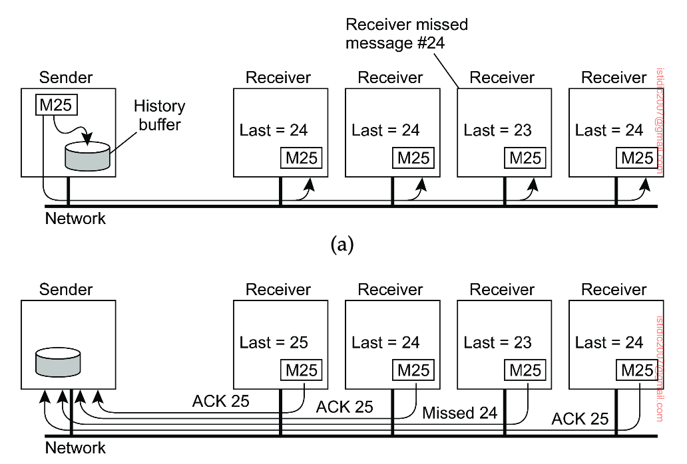

## Reliable group communication (multicasting)

Reliable multicast services guarantee that messages are delivered to all members in a process group. Unfortunately, reliable multicasting turns out to be surprisingly tricky.

Most transport layers offer reliable point-to-point channels; however, they rarely offer reliable communication to a group of processes.

A simple solution to reach reliable group communication is for the **sending process to assign a sequence number** to each message it multicasts, and store the message locally in a history buffer. The sender simply keeps the message in its history buffer until each receiver has returned an acknowledgement. A receiver can suspect it is missing a message M with sequence number S when it has received messages with sequence numbers higher than S. In that case, it returns a negative acknowledgement to the sender, requesting for a retransmission of M.

### Piggybacking

To reduce the number of messages returned to the sender, acknowledgements could possibly be piggybacked with other messages.
