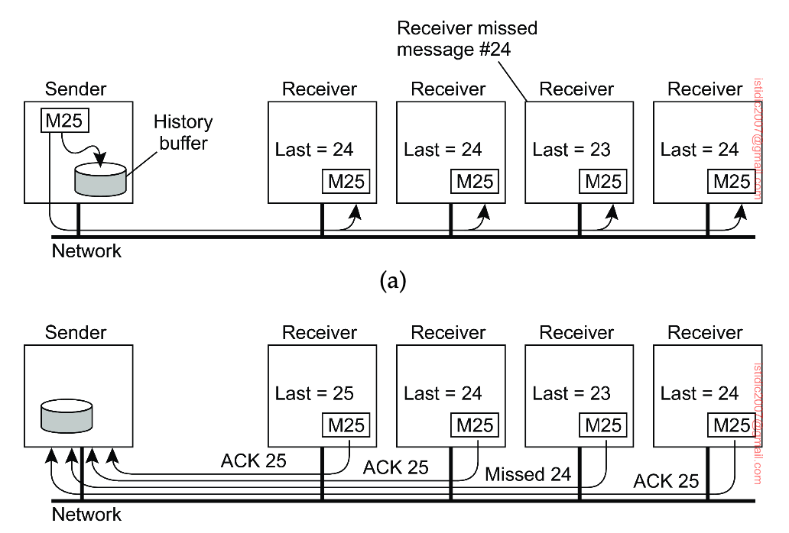
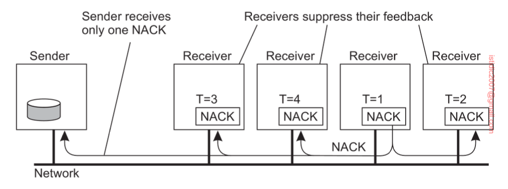
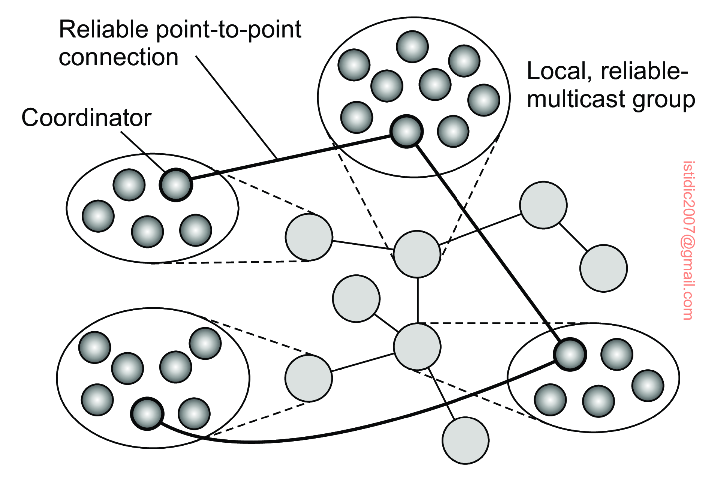

## Reliable group communication (multicasting)

Reliable multicast services guarantee that messages are delivered to all members in a process group. Unfortunately, reliable multicasting turns out to be surprisingly tricky.

Most transport layers offer reliable point-to-point channels; however, they rarely offer reliable communication to a group of processes.

A simple solution to reach reliable group communication is for the **sending process to assign a sequence number** to each message it multicasts, and store the message locally in a history buffer. The sender simply keeps the message in its history buffer until each receiver has returned an acknowledgement. A receiver can suspect it is missing a message M with sequence number S when it has received messages with sequence numbers higher than S. In that case, it returns a negative acknowledgement to the sender, requesting for a retransmission of M.

### Piggybacking

To reduce the number of messages returned to the sender, acknowledgements could possibly be piggybacked with other messages.

## Scalability

As long as groups are relatively small, it turns out that implementing reliability is feasible. However, the main problem with the reliable multicast scheme is that it cannot support large number of receivers. With many receivers, the sender may be swamped with such feedback messages, which is also referred to as a **feedback implosion**.

### Scalable Reliable Multicasting (SRM)

SRM is a non-hierarchical solution that is also known as **feedback suppression**. In SRM, receivers never acknowledge the successful delivery of a multicast message, but instead, report only when they are missing a message i.e. negative acknowledgements. Whenever a receiver notices that it missed a message, it **multicasts its feedback** to the rest of the group.

Multicasting feedback allows another group member to suppress its own feedback. Suppose several receivers missed message M. Each of them will need to return a negative acknowledgement to the sender, S, so that M can be retransmitted. However, if we assume that retransmissions are always multicast to the entire group, it is sufficient that only a single request for retransmission reaches S.

Feedback suppression has shown to scale reasonably well, and has been used as the underlying mechanism for a number of collaborative Internet applications, however, it also introduces a number of problems.

Ensuring that only one request for retransmission is returned to the sender requires a reasonably **accurate scheduling of feedback messages** at each receiver. Otherwise, many receivers will still return their feedback at the same time.

Another problem is that multicasting feedback also interrupts those processes to which messages have been successfully delivered i.e. forced to receive and process message that are useless.

To enhance the scalability of SRM, it is useful to let receivers assist in local recovery. In particular, if a receiver to which message M has been successfully delivered, receives a request for retransmission, it can decide to multicast M even before the retransmission request reaches the original sender.

### Hierarchical approach

Achieving scalability for large groups of receivers requires that hierarchical approaches are adopted as follows:

- The group of receivers is partitioned into a number of subgroups, which are subsequently organized into a tree
- Within each subgroup, any reliable multicasting scheme that works for small groups can be used
- Each subgroup appoints a local coordinator, which represents that group in the multicast tree
- A link in the tree between two nodes corresponds to a reliable connection between the coordinators of the respective subgroups
- The coordinator forwards incoming messages to all its neighboring coordinators and handles retransmission requests

In an ACK-based scheme, if a coordinator C of group G sends a message M to coordinator C' of another neighboring group G', it will keep M in its history buffer at least until C' has sent an acknowledgement. In a NACK-based scheme, a NACK message will only be sent if G' detects it has missed M.

### Hybrid

The nonhierarchical feedback control can be used to improve the scalability of a single multicast group. Together with hierarchical feedback control, we would combine relatively large reliable-multicast subgroups into potentially large trees, thus being able to support reliable multicasting for large groups of processes.

## Atomic multicast

What is often needed in a distributed system is the guarantee that a message is delivered to either all (nonfaulty) group members or to none. This is also known as the **atomic multicast problem**.

### Why atomicity is important

Consider a replicated database constructed as an application on top of a distributed system. Update operations are always multicasted to all replicas and subsequently performed locally. If replica P multicasts an update but crashes before it completes, it will lead to an inconsistent replicated database.

### Virtual synchrony

Reliable multicast in the presence of process failures can be accurately defined in terms of process groups and **changes to group membership**. The whole idea of atomic multicasting is that a multicast message M is uniquely associated with a list of processes that should deliver it. This delivery list corresponds to a **group view**.

Atomic multicasting can be precisely formulated in terms of a virtual synchronous execution model. In essence, this model introduces boundaries between which group membership does not change and which messages are reliably transmitted. A message can never cross a boundary.

If the sender of the message crashes during the multicast, the message is either delivered to all remaining processes, or ignored by each of them. Such a reliable multicast is said to be virtually synchronous.

Virtually synchronous reliable multicasting offering totally ordered delivery of messages is called atomic multicasting.

Group membership changes are an example where each process needs to agree on the same list of members. Such agreement can be reached through a commit protocol, of which the **2PC** protocol is the most widely applied.
