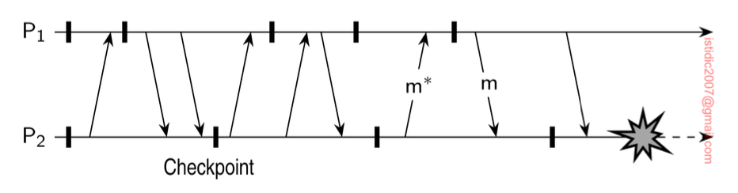

## Recovery

A recovery from error is to replace an erroneous state with an error-free state. There are two forms:

- **Backward recovery**: Bringing the system back into a previously correct state (checkpoint)
- **Forward recovery**: Bringing the system to a correct new state from which it can continue to execute

By and large, backward error recovery techniques are widely applied as a general mechanism for recovering from failures in distributed systems. The major benefit of backward error recovery is that it is a generally applicable method independent of any specific system or process.

However, backward error recovery also introduces some problems. First, restoring a system or process to a previous state is generally a relatively costly operation in terms of performance.

Second, because backward error recovery mechanisms are independent of the distributed application for which they are actually used, no guarantees can be given that once recovery has taken place, the same or similar failure will not happen again.

Finally, although backward error recovery requires checkpointing, some states can simply never be rolled back to i.e. irreversible.

## Checkpointing

In a fault-tolerant distributed system, backward error recovery requires that the system regularly saves its state. We need to record a consistent global state, also called a **distributed snapshot**.

To recover after a process or system failure requires that we construct a consistent global state from local states as saved by each process. In particular, it is best to recover to the most recent distributed snapshot, also referred to as a **recovery line**.

### Coordinated checkpointing

In coordinated checkpointing all processes synchronize to jointly write their state to local storage. The main advantage of coordinated checkpointing is that the saved state is automatically globally consistent.

A simple solution is to use a two-phase blocking protocol:

1. A coordinator first multicasts a checkpoint-request message to all processes
2. When a process receives such a message, it takes a local checkpoint, queues any subsequent message handed to it by the application it is executing, and acknowledges to the coordinator that it has taken a checkpoint
3. When the coordinator has received an acknowledgment from all processes, it multicasts a checkpoint-done message to allow the (blocked) processes to continue

#### Incremental snapshot

An improvement to this algorithm is to send a checkpoint request only to those processes that depend on the recovery of the coordinator, and ignore the other processes. A process is dependent on the coordinator if it has received a message that is directly or indirectly causally related to a message that the coordinator had sent since the last checkpoint.

To take an incremental snapshot:

1. The coordinator sends a checkpoint request only to those processes it had sent a message to since it last took a checkpoint
2. When a process P receives such a request, it forwards the request to all those processes to which P itself had sent a message since the last checkpoint
3. Step 2 is repeated until all processes have been identified
4. A second multicast is used to actually trigger checkpointing and to let the processes continue where they had left off

### Independent checkpointing

Each process simply records its local state from time to time in an uncoordinated fashion. To discover a recovery line, requires that each process is rolled back to its most recently saved state. If these local states jointly do not form a distributed snapshot, further rolling back is necessary. This process of a cascaded rollback may lead to what is called the **domino effect**.

The domino effect is as follows:

1. When P2 crashes, we need to restore its state to the most recently saved checkpoint
2. As a consequence, P1 will also need to be rolled back
3. If both local checkpoint states do not form a consistent global state, they both will have to be rolled back further until they reach a consistent state

Calculating the recovery line requires an analysis of the interval dependencies recorded by each process when a checkpoint was taken. It turns out that such calculations are fairly complex. Hence, coordinated checkpointing is more popular than independent checkpointing.

## Message logging

Checkpointing allows the recovery to a previous, correct state. However, taking a checkpoint is often a costly operation and may have a severe performance penalty. To reduce the number of checkpoints, many fault-tolerant distributed systems **combine checkpointing with message logging**.

The basic idea underlying message logging is that if the transmission of messages can be replayed, we can still reach a globally consistent state, but without having to restore that state from local storage. Instead, a checkpointed state is taken as a starting point, and all messages that have been sent since are simply retransmitted and handled accordingly.

In order to correctly replay messages, each message is considered to have a header that contains all information necessary to retransmit it i.e. sender, receiver, sequence number, etc.

After a checkpoint has been taken, there are two forms of performing message logging:

- **Sender-based**: A process logs its messages before sending them off
- **Receiver-based**: The receiving process first logs an incoming message before delivering it to the application it is executing

When a receiving process crashes, it is necessary to restore the most recently checkpointed state, and from there on replay the messages that have been sent.
