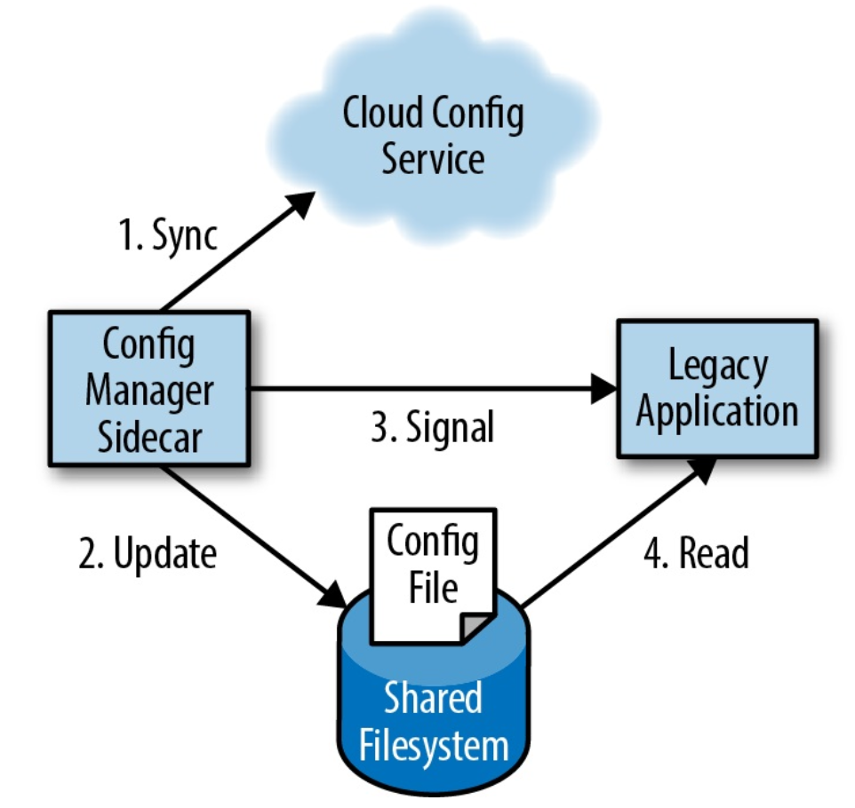

## Sidecar pattern

The sidecar pattern is a single-node pattern made up of two containers: the application and the sidecar containers. The role of the sidecar is to augment and improve the application container, often without the application container's knowledge.

### Features

- Add functionality to a container that might be otherwise difficult to improve
- Co-scheduled onto the same machine via an atomic container group e.g. Kubernetes Pod
- Shared resources including filesystem, hostname, network, namespaces

## Examples

### Adding HTTPS to a legacy service

- Legacy web service is configured to serve on localhost
- Nginx used as a sidecar container that can terminate HTTPS traffic and proxy them to the legacy web application with HTTP
- As the unencrypted traffic is sent via the local loopback adapter inside the container group, data is safe

### Dynamic configuration synchronization

Many applications use a configuration file for parameterizing the application e.g. JSON, XML, YAML. Many pre-existing applications were written to assume that this file was present on the filesystem and read their configuration from there. However, in cloud-native environments, it is often useful to use an API for updating configuration instead of manually logging into every server and updating the file using imperative commands. The desire for an API is driven by both ease of use and ability to add automation rollback.

New applications can be written with the expectation that configuration is a dynamic property that should be obtained using a cloud API, but adapting and updating an existing application can be significantly more challenging.

Fortunately, this can be solved with sidecar pattern:

- When legacy application starts, it loads its configuration from the filesystem
- When configuration manager starts, it examines the configuration API and looks for differences between the local filesystem and configuration stored in the API
- If there are differences, the manager downloads the new configuration to the local filesystem and signals to the legacy application that it should reconfigure itself
- In extreme cases, the configuration manager may send a SIGKILL signal to abort the legacy application and allow the container orchestration system to restart it

