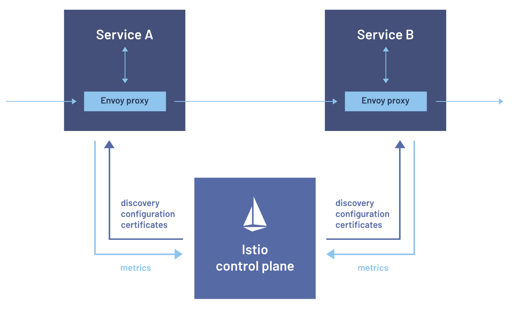

## Why need service mesh?

In modern application architecture, you can build applications as a collection of small, independently deployable microservices. Different teams may build individual microservices and choose their coding languages and tools. However, the microservices must communicate for the application code to work correctly.

Application performance depends on the speed and resiliency of communication between services. Developers must monitor and optimize the application across services, but it’s hard to gain visibility due to the system's distributed nature. As applications scale, it becomes even more complex to manage communications.

In general, your organization can benefit from a service mesh if you have large-scale applications composed of many microservices. As application traffic grows, requests between these services can increase exponentially, requiring sophisticated routing capabilities to optimize the flow of data between the services and ensure the application continues to perform at a high level.

There are two main drivers to service mesh adoption.

### Service-level observability

As more workloads and services are deployed, developers find it challenging to understand how everything works together. For example, service teams want to know what their downstream and upstream dependencies are. They want greater visibility into how services and workloads communicate at the application layer.

### Service-level control

Administrators want to control which services talk to one another and what actions they perform. They want fine-grained control and governance over the behavior, policies, and interactions of services within a microservices architecture. Enforcing security policies is essential for regulatory compliance.

## Service mesh

A service mesh is a dedicated infrastructure layer built into an application that controls service-to-service communication in a microservices architecture. It controls the delivery of service requests to other services, performs load balancing, encrypts data, and discovers other services. This functionality is added at the **platform layer rather than the application layer**.

Service mesh is independent of each service’s code, which allows it to work across network boundaries and with multiple service management systems.

### Sidecar

Although you can code the logic that governs communication directly into the microservices, they are non-business logic which provide no added profit. Instead, a service mesh abstracts that logic into a parallel layer of infrastructure using a **proxy called a sidecar**, which runs alongside each service. The proxies comprise the service mesh’s data plane, and are controlled as a whole by its control plane.

The service mesh acts as a proxy that intercepts all network communication between microservices in the cluster, and can be used to implement networking features i.e. encryption, load-balancing, retries, logging, circuit breaker, monitoring, etc.

### Application

Currently, the **service mesh concept applies mainly to container orchestrators** e.g. Kubernetes, rather than serverless architectures. Service mesh is also an example of the Ambassador pattern i.e. a helper service that sends network requests on behalf of the application.

## Sidecar pattern

The Sidecar pattern allows governance groups like enterprise architects a reasonable restraint over too many polyglot environments. One of the advantages of microservices is a reliance on integration rather than a common platform, allowing teams to choose the correct level of complexity and capabilities on a service-by-service basis. However, as the number of platforms proliferates, unified governance becomes more difficult. Therefore, teams often use the consistency of the service mesh as a driver to support infrastructure and other cross-cutting concerns across multiple heterogeneous platforms.

Without a service mesh, if enterprise architects want to unify around a common monitoring solution, then teams must build a sidecar per platform that supports that solution.

## How does a service mesh work?

Sidecar proxies make up a service mesh’s data plane, which manages the exchange of data between services. Management processes make up the control plane, which coordinates the proxies’ behavior. The control plane also provides an API so operators can easily manage traffic control, network resiliency, security and authentication, and custom telemetry data for each service.

### Data plane

The data plane is a network proxy replicated alongside each microservice (known as a sidecar), which manages all inbound and outbound network traffic on behalf of the microservice. As part of this, it may perform service discovery, load balancing, security and reliability functions. The service and sidecar should be deployed on the same host and if your deployment is containerized in the same pod.

The sidecar proxy takes these actions:

1. The sidecar intercepts the request
2. It encapsulates the request in a separate network connection
3. It establishes a secure and encrypted channel between the source and destination

### Control plane

The control plane acts as the central management and configuration layer of the service mesh, and injects the proxy in every Kubernetes pod automatically.

With the control plane, administrators can define and configure the services within the mesh. For example, they can specify parameters like service endpoints, routing rules, load balancing policies, and security settings. Once the configuration is defined, the control plane distributes the necessary information to the service mesh's data plane.

The proxies use the configuration information to decide how to handle incoming requests. They can also receive configuration changes and adapt their behavior dynamically. You can make real-time changes to the service mesh configuration without service restarts or disruptions.

## Benefits

### Service discovery

Service meshes provide automated service discovery, which reduces the operational load of managing service endpoints. They use a service registry to dynamically discover and keep track of all services within the mesh. Services can find and communicate with each other seamlessly, regardless of their location or underlying infrastructure. You can quickly scale by deploying new services as required.

### Load balancing

Service meshes use various algorithms (round-robin, least connections, weighted load balancing) to distribute requests across multiple service instances intelligently. Load balancing improves resource utilization and ensures high availability and scalability. You can optimize performance and prevent network communication bottlenecks.

### Centralized traffic management

A service mesh allows for fine-grained control over communication between services, including advanced routing capabilities, retries, and failovers. This can be crucial in ensuring high availability and resilience.

### Security at scale

Security is paramount in microservices architecture, and service mesh addresses this by providing a uniform layer for implementing security measures like encryption (mTLS), authentication, and authorization. It ensures that communication between services remains secure without burdening individual services with security concerns.

For instance in a Kubernetes cluster, without a service mesh, communication within the cluster is not secured. Also, every service can talk to one another.

### Request mirroring

You can duplicate traffic to a test or monitoring service for analysis without impacting the primary request flow. When you mirror requests, you gain insights into how the service handles particular requests without affecting the production traffic.

### Traffic splitting and canary deployment

You can direct a small subset of users or traffic to a new service version, while most users continue to use the existing stable version. With limited exposure, you can experiment with the new version's behavior and performance in a real-world environment. This provides a smooth transition and minimizes the impact of changes.

### Resilience and fault tolerance

Service mesh introduces capabilities for implementing circuit breaking, retries, and timeouts, promoting resilience in the face of failures. It enables applications to gracefully handle faults, preventing cascading failures and ensuring optimal user experiences.

### Enhanced observability

Service mesh provides unparalleled visibility into the interactions between microservices. With features like distributed tracing and monitoring, organizations can gain insights into the performance and behavior of their applications, facilitating efficient troubleshooting and optimization.

## Drawbacks

### Increased complexity

Introducing service mesh can add a layer of complexity to the architecture. Organizations must invest time and effort in understanding, implementing, and maintaining the mesh, potentially impacting the agility of development teams.

### Performance overhead

While service mesh provides invaluable features, it comes with a performance cost. The additional layer of proxies handling communication can introduce latency, impacting the application’s overall performance. Organizations must carefully balance the benefits against this overhead.

### Steep learning curve

Adopting service mesh requires a learning curve for development and operations teams. Understanding the intricacies of the mesh, configuring policies, and troubleshooting issues demand expertise, necessitating training and upskilling initiatives.

### Vendor lock-in

Some service meshes are tightly coupled with specific platforms or technologies. Choosing an open source, vendor-neutral solution can mitigate this risk.

## Vendors

Linkerd, Conduit, Istio, and Envoy.

## Istio configuration

Istio can be configured with Kubernetes YAML files using CRD.
