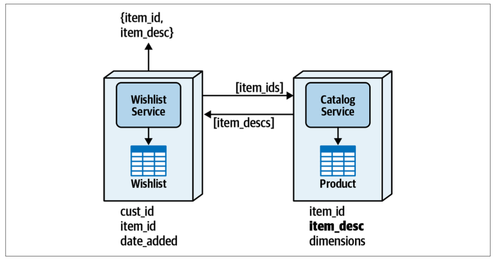
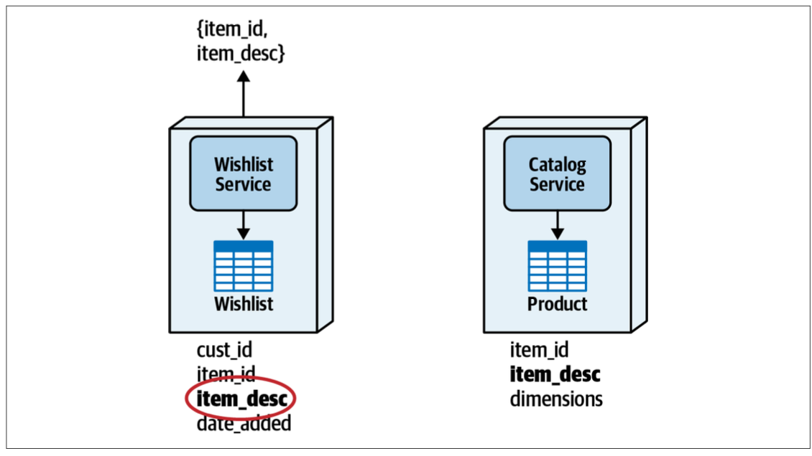
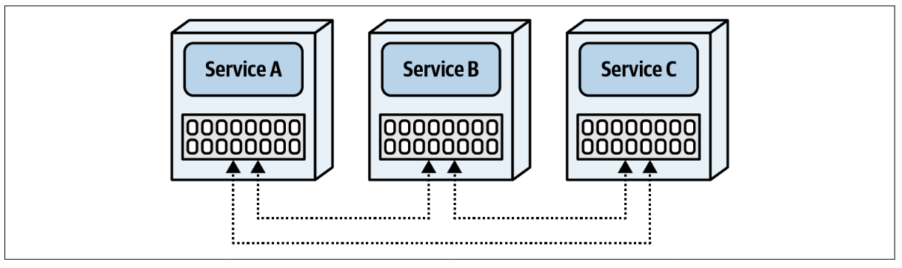
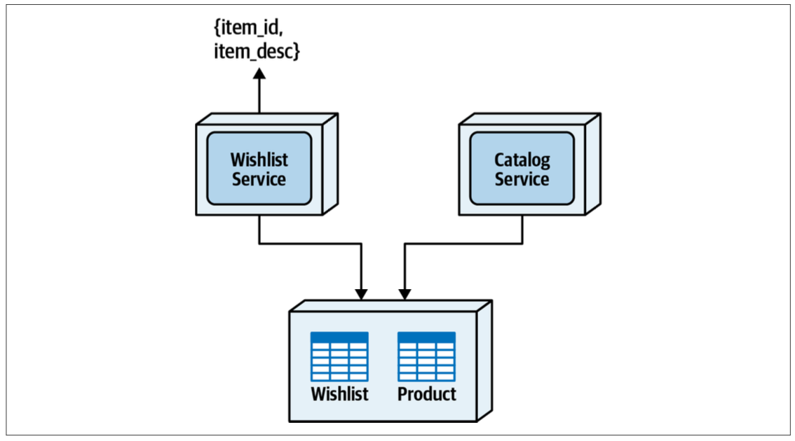

## Distributed data access

In most monolithic systems, developers don't give a second thought to reading database tables. However, when data is broken into separate databases or schemas owned by distinct services, data access for read operations starts to become hard.

## Inter-service communication pattern

This is the most common pattern for accessing data in a distributed system.

<table>
<tr>
<th>Advantages</th>
<th>Disadvantages</th>
</tr>
<tr>
<td>Simplicity</td>
<td>Network, data and security latency</td>
</tr>
<tr>
<td>No data volume issues</td>
<td>Scalability and throughput issues</td>
</tr>
<tr>
<td></td>
<td>No fault tolerance</td>
</tr>
<tr>
<td></td>
<td>Requires contracts between services (static service coupling)</td>
</tr>
</table>

## Column schema replication pattern

With this pattern, columns are replicated across tables, therefore replicating the data and making it available to other bounded contexts.

Data synchronization and consistency are the two biggest issues associated with this pattern. This is usually done through asynchronous communications using queues, topics, or event streaming.

Another challenge is that it is sometimes difficult to govern data ownership. As the data is replicated, those services can update the data, even though they don't officially own the data.

<table>
<tr>
<th>Advantages</th>
<th>Disadvantages</th>
</tr>

<tr>
<td>Good data access performance</td>
<td>Data consistency issues</td>
</tr>

<tr>
<td>No scalability and throughput issues</td>
<td>Data ownership issues</td>
</tr>

<tr>
<td>No fault-tolerance issues</td>
<td>Data synchronization is required</td>
</tr>

<tr>
<td>No service dependencies</td>
<td></td>
</tr>

</table>

## Replicated caching pattern

Caching can be an effective tool for distributed data access and sharing. By storing data within an in-memory cache, the data can be made available to other services without having to ask for it.

A replicated cache differs from other caching models in that data is held in-memory within each service and is continuously synchronized so that all services have the same exact data at all times.

Having a distributed cache model whereby data is held externally within a caching server and not in each service **is not effective** for the following:

- No benefit to fault-tolerance issues (dependency has merely shifted to the caching server)
- Breaks bounded context as cache data is centralized and shared
- Network and latency issues

With replicated caching, **each service has its own in-memory data that is kept in sync between the services**, allowing the same data to be shared across multiple services. Each cache instance communicates with another so that when an update is made to a cache, that update is immediately asynchronously propagated to other services using the same cache.

The clear advantages are responsiveness, fault tolerance, and scalability. As no explicit interservice communication is required, data is readily available in-memory, providing the fastest possible access to data a service doesn't own.

However, there is a service dependency with regard to the cache data and startup timing. The service that is responsible for populating the cache must be running when the other service starts up.

Another trade-off is of data volumes. If the volume of data is too high, the feasibility of this pattern diminishes quickly, particularly with regard to multiple instances of services needing the data.

A third trade-off is that the replicated caching model usually cannot keep the data fully in-sync between services if the update rate is too high i.e. this pattern is not well suited for highly volatile data.

The last trade-off is that of configuration and setup management. Services know about each other in the replicated caching model through TCP/IP broadcasts and lookups. If the TCI/IP broadcast and lookup range is too broad, it can take a long time to establish the socket-level handshake between services. Cloud-based and containerized environments make this particularly challenging because of the lack of control over IP addresses and the dynamic nature of IP addresses associated with these environments.

<table>
<tr>
<th>Advantages</th>
<th>Disadvantages</th>
</tr>

<tr>
<td>Good data access performance</td>
<td>Cloud and containerized configuration can be hard</td>
</tr>

<tr>
<td>No scalability and throughput issues</td>
<td>Not good for high data volumes</td>
</tr>

<tr>
<td>Good level of fault tolerance</td>
<td>Not good for high update rates</td>
</tr>

<tr>
<td>Data remains consistent</td>
<td>Initial service startup dependency</td>
</tr>

<tr>
<td>Data ownership is preserved</td>
<td></td>
</tr>

</table>

## Data domain pattern

Similarly with joint ownership, the same pattern for using a single schema for sharing tables can be used for data access. The tables are no longer owned by individual services, but rather shared between them, forming a broader bounded context. Gaining access to the data is a simple SQL join.

While data sharing is discouraged, this pattern has **huge benefits over other data access patterns**. Services are completely decoupled from each other, thereby resolving any availability dependency, responsiveness, throughput, and scalability issues.

Both data consistency and data integrity rate are very high. Data does not need to be transferred, replicated, or synchronized. Foreign-key constraints can also be enforced between tables.

However, this pattern forms a broader bounded context, requiring multiple services to possibly change when the structure to any of the tables in the data domain changes. Also, this can possibly open up security issues associated with data access, as both services have complete access to the data within the data domain.

<table>
<tr>
<th>Advantages</th>
<th>Disadvantages</th>
</tr>

<tr>
<td>Good data access performance</td>
<td>Broader bounded context to manage data changes</td>
</tr>

<tr>
<td>No scalability and throughput issues</td>
<td>Data ownership governance</td>
</tr>

<tr>
<td>No fault tolerance issues</td>
<td>Data access security</td>
</tr>

<tr>
<td>No service dependency</td>
<td></td>
</tr>

<tr>
<td>Data remains consistent</td>
<td></td>
</tr>

</table>
