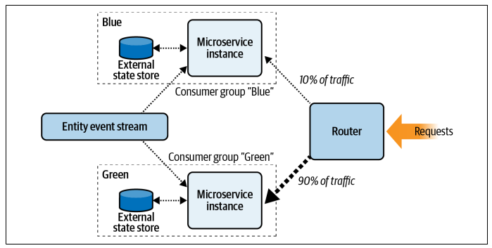

## Blue-green deployment pattern

Main goal is to provide zero downtime while deploying new functionality. This pattern is predominantly used in synchronous request-response microservice deployments, as it allows for synchronous requests to continue while the service is updated.

### Workflow

A full copy of the new microservice (blue) is brought up in parallel with the old microservice (green). The blue service has a fully isolated instance of its external data store, its own event stream consumer group, and its own IP addresses for remote access.

The switchover traffic is performed by the router in front of the services. A small amount of traffic is diverted to the new instance, such that the deployment can be validated in real time. If the deployment process detects no failures or abnormalities, more traffic can be diverted until the green side is no longer receiving traffic.

