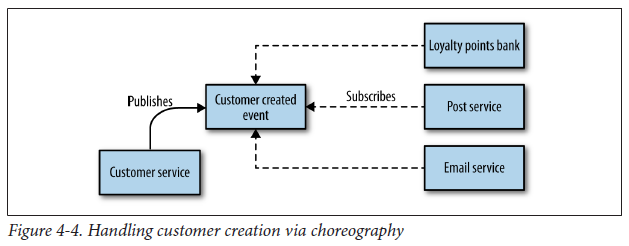

## Choreography

Choreography is a way to coordinate communication where participants exchange events without a centralized point of control. With choreography, you inform each part of the system of its job, and let it work out the details. An event broker handles messaging in an asynchronous, loosely coupled manner.

Downside is that the explicit view of the business process is only implicitly reflected in your system. This means additional work is needed to ensure that you can monitor and track that the right things have happened. This can be done by building a monitoring system that explictly matches the view of the business process, but then tracks what each of the services does as independent entities. Nonetheless, this approach is more loosely coupled, flexible and amenable to change.

For example, an e-commerce site completing a customer's checkout process can include sending an email to customer, sending order to the warehouse and creating points balance for rewards program. These tasks do not necessarily have to happen in any particular order, and asynchronous flow suits this process.

### Benefits

- Good for simple workflows that require few participants and don't need a coordination logic
- Doesn't require additional service implementation and maintenance
- Doesn't introduce a single point of failure as responsibilities are distributed across participants
- Good support for flexibility and reducing service dependencies

### Drawbacks

- Workflow can become confusing when adding new steps
- Risk of cyclic dependency between participants
- No simple entry point for accessing the BP context as they are distributed across services (lack of localization of business process context)
