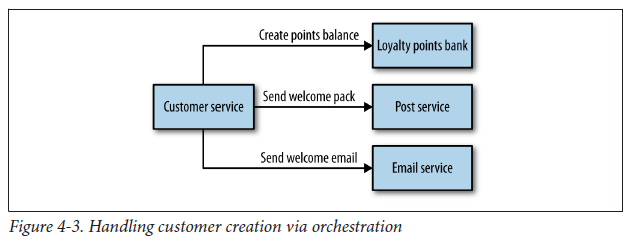
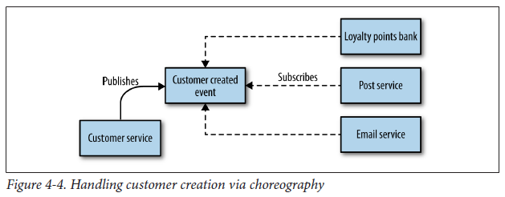

## Overview

Before diving into the specifics of different technology choices for communication, first decide on how services should collaborate with each other: synchronous and asynchronous.

Both modes of communication can enable two different idiomatic styles of collaboration: request/response and event-based. Nonetheless, you are free to mix-and-match as some technologies would fit more naturally into one style or another.

## Synchronous

Service calls an API that another service exposes, using a protocol such as HTTP or gRPC. This option is synchronous as the caller waits for a response from the receiver. Hence, client code block their thread, until the response reach from the server.

### Request/Response

Client initiates a request and waits for the response. Aligns well to synchronous communication, but can also work for asynchronous communication. For longer-lived processes, could initiate asynchronous requests and wait for callbacks.

Two technologies that fit well when considering this are RPC and REST.

## Asynchronous

The caller doesn't wait for the operation to complete before returning, and may not even care whether or not the operation completes at all. Can have one or more services to process the message asynchronously. Can be useful for long-running jobs or if you require low latency to ensure UI remains responsive even if the network is laggy.

Most popular protocol is AMQP whereby the client sends the message to message broker systems like Kafka and RabbitMQ queue. Can be implemented in a one-to-one mode (queue) or one-to-many mode (topic).

It is important to distinguish between asynchronous I/O and asynchronous protocol. Asynchronous I/O means the calling thread is not blocked while the I/O completes (for performance reasons) which is an implementation detail. An asynchronous protocol means the sender doesn't wait for a response.

### Event-Based (Pub-Sub)

Instead of a client initiating requests asking for things to be done, it instead says "this thing happened" and expects other parties to know what to do. Business logic is not centralized but instead pushed out more evenly to the various collaborators. Highly decoupled as the client that emits an event doesn't have any way of knowing who or what will react to it (subscribers).

## Implementation Styles

When considering between request/response and event-based, need to consider how well they are suited for solving a complex problem of handling processes that span across service boundaries and may be long running.

### Orchestration

With orchestration style, you rely on a central brain to guide and drive the process through a series of request/response calls. Downside is that the orchestrator can become too much of a central governing authority.

### Choreography

With choreography, you inform each part of the system of its job, and let it work out the details. Downside is that the explicit view of the business process is only implicitly reflected in your system. This means additional work is needed to ensure that you can monitor and track that the right things have happened. This can be done by building a monitoring system that explictly matches the view of the business process, but then tracks what each of the services does as independent entities. Nonetheless, this approach is more loosely coupled, flexible and amenable to change.

