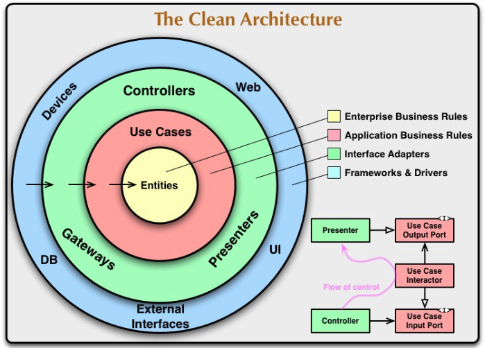

## Clean architecture

Clean architecture is a system architecture guideline proposed by Robert C. Martin, derived from many architectural guidelines including hexagonal, onion, etc.



### Benefits

- Independent of frameworks
- Testable
- Independent of UI
- Independent of database
- Independent of any external agency

### Dependency rule

The concentric circles represent different areas of software. In general, the further in you go, the higher level the software becomes. The outer circles are mechanisms. The inner circles are policies.

The Dependency Rule states that the source code dependencies can only point inwards. This means nothing in an inner circle can know anything at all about something in an outer circle. i.e. the inner circle shouldn’t depend on anything in the outer circle.

By the same token, **data formats used in an outer circle should not be used by an inner circle**, especially if those formats are generate by a framework in an outer circle. We don’t want anything in an outer circle to impact the inner circles.

## Layers

### Entities (Domain)

Entities encapsulate **Enterprise wide business rules**. An entity can be an object with methods, or it can be a set of data structures and functions.

If you don’t have an enterprise, and are just writing a single application, then these entities are the business objects of the application. They encapsulate the most general and high-level rules. They are the least likely to change when something external changes.

Entities:

- Represent your domain object
- Apply-only logic that is applicable in general to the whole entity
- Plain objects i.e. no frameworks

### Use Cases

The software in this layer contains **application specific business rules**. It encapsulates and implements all of the use cases of the system. These use cases orchestrate the flow of data to and from the entities, and direct those entities to use their enterprise wide business rules to achieve the goals of the use case.

When you create use cases, you should be thinking about business transactions, not CRUD methods e.g. sell an item to a customer, print an invoice. Couple code that change together for one reason into use-cases.

We expect that changes to the operation of the application will affect the use-cases and therefore the software in this layer.

Use Cases:

- Are often not reused more than once in an application; each use case addresses a very specific business scenario
- Represent your business actions i.e. what you can do with the application
- Pure business logic
- Does not know who triggered it and how the results are going to be presented
- Must not throw exceptions as no component up the caller's stack has any means to deal with exceptions
- May access any external services using any of output ports made available to it
- Often loads one or several aggregates and invokes business logic on them

### Interfaces/Adapters

The software in this layer is a set of adapters that convert data from the format most convenient for the use cases and entities, to the format most convenient for some external agency such as the Database or the Web, and vice versa.

```
Use Case -> Adapter <- Web
```

Interfaces/Adapters:

- Implement the interfaces defined by the use case
- Retrieve and store data from and to a number of sources
- Trigger a use case and convert the result to the appropriate format for the delivery mechanism
- Controller that takes input from the user and create output for the user
- Presenter accepts a response from use case and formats it in away that can be presented to the output device

### Frameworks and Drivers

The outermost layer is generally composed of frameworks and tools such as database, web, devices, etc.

## Control flow

### Presenter and Use Case

https://medium.com/unil-ci-software-engineering/clean-ddd-lessons-use-cases-e9d11f64a0e9

Multiple approaches to the problem:

- The presenter is called by the use case itself through some sort of output interface
- The use case returns the response model and the controller (which originally called the use case) passes this model to the presenter

### Presenter and Controller

https://medium.com/unil-ci-software-engineering/clean-ddd-lessons-presenters-6f092308b75e#:~:text=As%20we%20have%20already%20discussed,finally%2C%20exits%20through%20a%20presenter.

For REST APIs, it is difficult to implement a Controller and Presenter, as the Presenter depends on the Controller i.e. you can not completely separate Controller and Presenter because you need to send a response to the microservice using the same interface you've used to get the input from the microservice to the Controller. Moreover, there is no presenting in the API itself.

### Repository

The Use Case should have a dependency to the repository interface and hence, the **interface** should be defined in the **domain layer** (or application core layer).

The implementation of the repository interface will reside in the **infrastructure layer**.

Both the Use Case and the repository implementation should depend only on the repository interface to achieve dependency inversion.

Sometimes the repository **may have persistence models that differ from the domain models**. A little duplication is better than having your application depend entirely on persistence models which may change in the future.

## Crossing boundaries

If the use case needs to call the presenter, the call must not be direct as it would violate the Dependency Rule. This contradiction can be resolved using **Dependency Inversion Principle**. For example, we have the use case call an **interface** (shown here as Use Case Output Port) in the inner circle, and have the presenter in the outer circle implement it.

### Data

Typically the data that crosses the boundaries is simple data structures such as DTO. The important thing is that isolated, simple, data structures are passed across the boundaries. We don’t want to cheat and pass Entities or Database rows. We don’t want the data structures to have any kind of dependency that violates The Dependency Rule.
