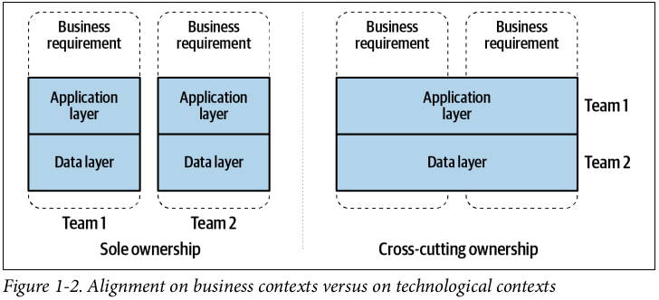

## Domain

The problem space that a business occupies and provides solutions to. This encompasses everything that the business must contend with, including rules, processes, ideas, business-specific terminology, and anything related to its problem space. The domain exists regardless of the existence of the business.

## Subdomain

Each subdomain focuses on a specific subset of responsibilities and typically reflects some of the business's organizational structure i.e. Warehouse, Sales, Engineering, etc.

## Domain logic

Domain logic is the purpose of your modeling. This is where your business rules define the way dat gets created, stored, and modified.

## Domain model

An abstraction of the actual domain useful for business purposes. The pieces and properties of the domain that are most important to the business are used to generate the model i.e. ideas, knowledge, data, metrics, goals. It contains all the rules and patterns that will help you deal with complex business logic. Models often need to be refined as the domain changes and as business priorities shift.

## Domain events

Domain events are described as something that happens in the domain and is important to domain experts. Such events typically occur regardless of whether or to what extent the domain is implemented in a software system. They are also independent of technologies i.e. a user being registered, an order received, payment deadline being expired.

Domain events are relevant **both within a bounded context and across bounded contexts** for implementing processes within the domain. Domain events are also ideally suited to inform other bounded contexts about specific business-related events that have occurred in the own bounded context and thus to integrate several bounded contexts in an event-driven way.

## Design patterns

Design patterns are all about reusing code. No matter the complexity of the problem you encounter, someone who’s been doing object-oriented programming has probably already created a pattern that will help you solve it. Breaking down your problem into its initial elements will lead you to its solution.

## Bounded context

The logical boundaries, including the inputs, outputs, events, requirements, processes, and data models that are relevant to the subdomain. While ideally a bounded context and a subdomain will be in complete alignment, legacy systems, technical debt, and third-party integrations often create exceptions.

Bounded contexts should be highly cohesive. The internal operations of the context should be intensive and closely related, with the vast majority of communication occurring internally rather than cross-boundary.

**Connections between bounded contexts should be loosely coupled**, as changes made within one bounded context should minimize or eliminate the impact on neighboring contexts.

It is common for business requirements of a product to change during its lifetime, but it is rare for a company to need to change the underlying implementation of any given product without accompanying business changes. Hence, bounded contexts should be **built around business requirements and not technological requirements**.

Modelling around business requirements is preferred, but there are tradeoffs. Code may be replicated a number of times, and many services may use similar data access patterns. Product developers may try to reduce repetition by sharing data sources with other products or by coupling on boundaries. However, the subsequent tight coupling may be far more costly in the long run than repeating logic and storing similar data.

## Ubiquitous language

The ubiquitous language is the channel for all information to flow between developers, domain experts and the software. Characteristics include:

- Expressed in the domain model
- Unites the people of the project team
- Eliminates inaccuracies and contradictions from domain experts
- Not a business language imposed by domain experts
- Not a language used in industries
- Evolves over time
