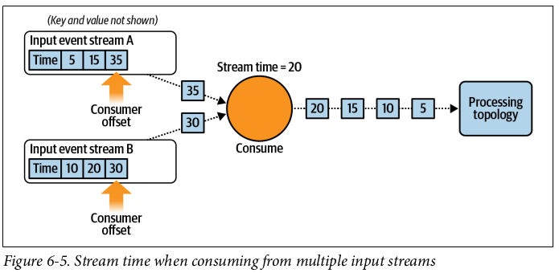
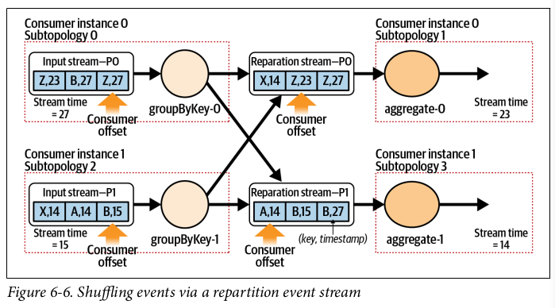

## Stream Time

Another option for maintaining time in a stream processor, whereby this approach is favoured by Kafka. A consumer application reading from one or more event streams maintains a stream time for its topology, which is the highest timestamp of processed events.

### Process Flow

The consumer instance:

1. Consumes and buffers events from each event stream partition assigned to it
2. Applies the event-scheduling algorithm to select the next event to process
3. Updates the stream time if it is larger than the previous stream time

### Example

The consumer node maintains a single stream time based on the highest event-time value it has received. The next event to be processed is the smallest value of the two input buffers (30). The event is dispatched down to the processing topology, and the stream time will be updated to its value.

## Parallel Processing

Kafka streams approach sends the repartitioned events back to the event broker using an internal event stream. This stream is then reconsumed by the instances, will all repartitioned data colocated by key within single partitions.

Events from the input stream are repartitioned according to their key and are written into the repartition event stream i.e. events keyed on A/B end up in P1, while X/Z end up in P0. Event time has also been maintained for each event, and not overwritten by the current wall-clock time.

Because of the repartition event stream, the processing topology is effectively cut in half, meaning the work on each subtopology can be done in parallel. Subtopologies 1 and 3 consume from the repartition stream, while subtopologies 0 and 2 produce the repartitioned events.

Each subtopology maintains its own stream time, since both are consuming from independent event streams.

