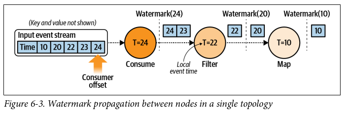
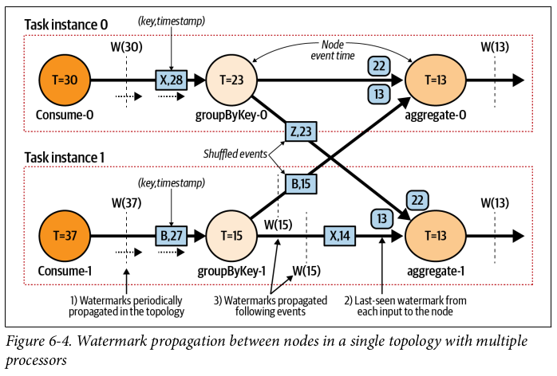

## Watermark

Watermarking is used to track the progress of event time through a processing topology and to declare all data of a given event time (or earlier) has been processed. This is a common technique used by many of the leading stream-processing frameworks including Apache Spark, Apache Flink, Apache Samza and Apache Beam.

A watermark is a **declaration to downstream nodes within the same processing topology (series of functions performed for a given event)** that all events of time t and prior have been processed/arrived i.e. notifying nodes that events with a timestamp earlier than the watermark is late. The node receiving the watermark can then update its own internal event time and propagate its own watermark downstream to its dependent topology nodes.

Consumer node will have the highest watermark time as it will be consuming from the source event stream. New watermarks are generated periodically, such as after a period of event time, or after a minimum number of events has been processed.

## Parallel Processing

Watermarks are particularly useful for coordinating event time between multiple independent consumer instances.

As the watermarks flow through the streaming program, they advance the event time at the operators where they arrive. Whenever an operator advances its event time, it generates a new watermark downstream for its successor operators.

For nodes that consume events and watermarks from multiple upstream inputs, the node's event time is the minimum of all its input sources' event times, which the node keeps track of internally.

