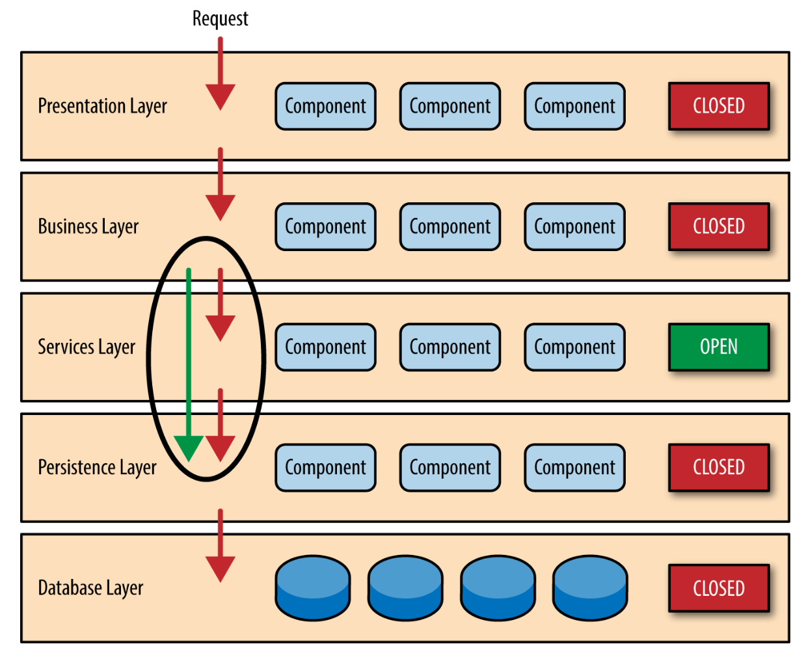

## Layered Architecture (n-tiered)

Domain-driven design isolates the domain with layered architecture. The essential principle is that an element of a layer has dependencies only on other elements in the same layer or on elements of the layers beneath it. Communication upward must be through some indirect mechanism. Most successful architectures have four conceptual layers.

This style is the de facto standard for most applications, primarily because of its simplicity, familiarity, and low cost. However, it also falls into several architectural anti-patterns, including 'architecture by implication' and 'accidental architecture' anti-patterns.

Layers, modules and microservices solve different problems. Microservices are formed around separate functionalities. A layered architecture refers more generally to how one might design the **internal components of an application**. Though a layered architecture style is inherently monolithic, **any microservice application that uses layers should be deployed as a single monolithic unit**.

## Layers

### Presentation (User Interface)

Responsible for showing information to the user and interpreting user's commands.

### Application

Defines the jobs the software is supposed to do and directs the expressive domain objects to work out problems. The tasks this layer is responsible for are meaningful to the business or necessary for interaction with the application layers of other systems.

This layer is kept thin and does not contain business rules or knowledge, but only coordinates tasks and delegates work to collaborations of domain objects in the next layer down.

### Domain (Business)

Responsible for representing concepts of the business, information about the business situation, and business rules. State that reflects the business situation is controlled and used here.

### Data Access

Provides easy and simplified access to data stored in persistent storage, such as an entity-relational database or any database for that matter. It is layer that exists between the Business Logic Layer (BLL) and the Storage layer.

### Persistence (Storage)

The database layer is where the system stores all the data. It's the lowest tier in the software architecture and houses not only data but indexes and tables as well. Search, insert, update and delete operations occur here frequently. Application data can store in a file server or database server, revealing crucial data but keeping data storage and retrieval procedures hidden.

### Infrastructure

Provide generic technical capabilities that support the higher layers i.e. persistence for the domain, drawing widgets for UI, message sending for the application, etc.

The infrastructure layer may also support the pattern of interactions between the four layers through an architectural framework.

## Concepts

### Closed

A closed layer means that as a request moves from layer to layer, it **must** go through the layer right below it to get to the next layer below that one. The reason is to implement **layers of isolation**.

Layers of isolation concept means that changes made in one layer generally don't impact or affect components in other layers i.e. the change is isolated to the components within that layer, and the layer above it. This helps with loose coupling and minimizing dependencies between components.

### Open

While closed layers facilitate layers of isolation and therefore help isolate change within the architecture, there are times when it makes sense for certain layers to be open.

For instance, if you add a shared Service Layer to be accessed by components within the Business Layer, you restrict its access by other layers. However, it presents a problem in that the Business Layer is now required to go through it to get to the layer beneath it, which makes no sense.

## Considerations

### Sinkhole

This pattern falls into the 'architecture sinkhole anti-pattern'. This anti-pattern describes the situation where requests flow through multiple layers of the architecture as simple pass-through processing with little or no logic performed within each layer.

### Monolithic

Another consideration with the layered architecture pattern is that it tends to lend itself toward monolithic applications, even if you split the presentation layer and business layers into separate deployable units. While this may not be a concern for some applications, it does pose some potential issues in terms of deployment, general robustness and reliability, performance, and scalability.

Also, it creates **tightly coupled objects** between layers i.e. Presentation Layer is coupled to Business Layer, and Business is coupled to Data Access.
