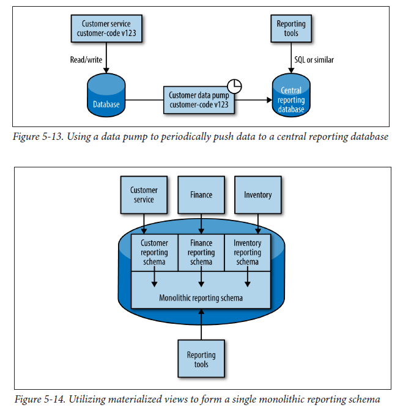

## Services as State Machines

When services are fashioned around bounded contexts, they should own all logic associated with the behavior in that context. Having the lifecycle of key domain concepts explicitly modeled is quite powerful. We would have one place to deal with collisions of state (updating a resource that has been deleted) and also a place to attach behavior based on those state changes.

## DRY and Perils of Code Reuse

One thing we want to avoid is overly coupling a microservice and consumers such that any small change to the microservice itself can cause unnecessary changes to the consumer. Sometimes, the use of shared code can create this very coupling.

General rule of thumb is don't violate DRY within a microservice, but be relaxed about violating DRY across all services.

## Access by Reference

When a microservice encompasses the lifecycle of core domain entities, sometimes when we retrieve the resource, it is possible that something else has changed it and we would be looking at the old and not the fresh state. This can be resolved by passing a reference to the original resource so that the new state can be retrieved when the logic is executed.

For example, when we are sending requests (customer's email, address, etc) to an email service, it might actually queue the requests and things might change while queuing. Hence, it might make more sense to send a URI for the resource, and let the service look it up when it is processing the request.

There are tradeoffs to be made as the load on the service can be too great since we are always looking up before processing the logic. By providing additional information, we can do a lot with caching to reduce load and HTTP supports this out of the box.

Nonetheless, making such services smart (insist on looking up the resource before processing) might increase coupling and others might argue that they should be more dumb (passing specific details of the resource directly). There is no hard and fast rule but in general, need to be aware of passing data in requests when you don't know its freshness.

## Versioning

Best way to reduce the impact of making breaking changes is to avoid making them in the first place.

### Encourage good behavior

One way is to encourage good behavior in your clients, and avoid binding them too tightly to your services. For example, when retrieving a resource, sometimes the fields of the resource change, or additional fields are added to cater for other services that might be in need of them. However, if consumers are extracting all fields out, it could cause them to break needlessly. This could be avoided by implementing a reader that can ignore changes we don't care about, also known as a **"Tolerant Reader"**.

### Use semantic versioning

Semantic versioning is a specification that comes in the form of MAJOR.MINOR.PATCH. When MAJOR number increments, it means backward incompatible changes have been made. When MINOR increments, it means that new functionality has been added and should be backward compatible. A change to PATCH states that bug fixes have been made to existing functionality.

### Coexist different endpoints

To limit impact of breaking changes, we can coexist both the new and old endpoints in the same running service. This allows us to get the new microservice out ASAP, along with the new interface, but give time for consumers to move over. Once all of the consumers are no longer using the old endpoint, you can remove it along with any associated code.

## Data Retrieval via Service Calls

For reporting systems that require data across databases and systems, multiple calls are required to assemble the data which can become a slow operation with higher loading when large volumes of data are involved. For instance, pulling an entire list of customers, and making separate API calls for each customer.

### Data Pump

Rather than having the reporting system pull the data, we could instead have the data pushed to the reporting system. As retrieving the data by standard HTTP calls can have high overhead, an alternative option is to have a standalone program like CRON that directly accesses the source database of the service, and pumps it into a separate reporting database. To minimize coupling, the service schema would not be open to outside, but it is between service and pump itself.

Another option is to make use of materialized views (virtual tables) provided by relational databases to create the aggregated view. Hence, the reporting schema would only be exposed to the data pump.

### Event Data Pump

For microservices emitting events based on state change, we have the option of writing our own event subscriber that pumps data into the reporting database. We can send data to the reporting system as we see an event, allowing data to flow faster to our reporting system, rather than relying on a scheduler with the data pump. The coupling on the underlying database of the source microservice is now avoided.
