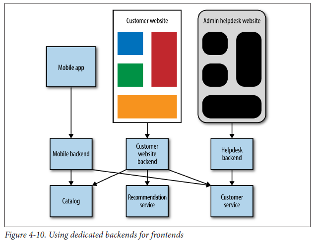

## API gateway

An API gateway is an API management tool that sits between a client and a collection of backend services. A service that makes it easy for developers to create, publish, maintain, monitor and secure APIs at any scale.

Acts as a reverse proxy and takes all API calls from clients, then routes them to the appropriate microservice with request routing, composition, and protocol translation. Typically, it handles a request by invoking multiple microservices and aggregating the results, to determine the best path. Handles all tasks involved in accepting/processing concurrent API calls, traffic management, CORS support, caching, authorization and access control, monitoring.

If there are failures in the backend services, the API gateway can mask them by returning cached or default data. API gateway supports containerized and serverless workloads.

Offers clients a simple and dependable experience, and decouples client interface from backend implementation. When a client makes a request, the API gateway breaks it into multiple requests, invokes multiple microservices and routes to the right places, aggregates the results, produces a response, and keeps track of everything.

## Backends for frontends (API gateway pattern)

A common solution to the problem of chatty interfaces with backend services, or the need to vary content for different types of devices, is to have server-side aggregation endpoint, or API gateway. This can marshal multiple backend calls, vary and aggregate content if needed for different devices, and serve it up. This pattern is a service that provides a single-entry point for certain groups of microservices.

Usually it is not a good idea to have a single API gateway aggregating all the internal microservices of your application (monolithic) which violates microservice autonomy. Another approach would be to restrict the use of these backends to one specific UI or application (mobile, desktop, tablet), whereby this pattern is referred to as "backends for frontends". If an API authentication and authorization layer is required, it can sit between BFFs and UIs.

Nonetheless, the danger with this approach is that it can take on logic it shouldn't. They should only contain behavior specific logic to deliver a particular user experience.

Overall, there is no one-size-fits-all, and sometimes a hybrid approach works too. Key point is to retain cohesion of the underlying capabilities that we offer our users.

## Why use an API gateway?

Most enterprise APIs are deployed via API gateways. It is common for API gateways to handle common tasks that are used across a system of API services such as user authentication, rate limiting and statistics. When hosting large-scale APIs:

- You want to protect your APIs from overuse and abuse, so you use an authentication service and rate limiting.
- You want to understand how people use your APIs by adding analytics and monitoring tools.
- If APIs are monetized, need to connect to a billing system.
- When adopting a microservice architecture, a single request could require calls to dozens of distinct applications.
- Over time new API services are added and others are retired, but clients will still want to find all services in the same place.

## Benefits

### Decoupling

If your clients (which may have no control of) communicated directly with many separate services, renaming or moving those services can be challenging as the client is coupled to the underlying architecture and organization. API gateways enables you to route based on path, hostname, headers, and other key information enabling you to decouple the publicly facing API endpoints from the underlying microservice architecture.

### Reduced Round Trips

Certain API endpoints may need to join data across multiple services. API gateways can perform this aggregration so that the client does not need complicated call chaining and reduce number of round trips.

### Security

API gateways provide a centralized proxy server to manage rate limiting, bot detection, authentication, CORS, and etc. Many API gateways allow setting up a datastore such as Redis to store session information.

### Cross Cutting Concerns

Logging, caching, and other cross cutting concerns can be handled in a centralized application rahter than deployed to every microservice.

## Vendors

### Kong

An open-source API gateway that is built on top of NGINX.

### Tyk.io

Open-source but less permissive than Kong's Apache 2.0 license that is built on top of Golang.

### AWS

AWS provides an API gateway which is a cloud-only option.

### Azure

Similar to AWS' offering.

### Express

New entry build by LunchBadger. Completely open-source and based on Node.js Express framework.
